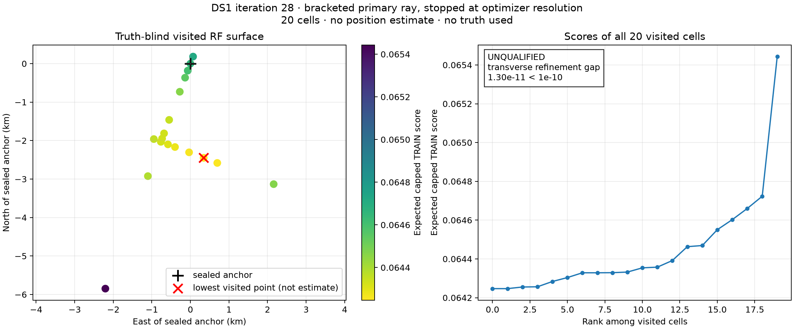
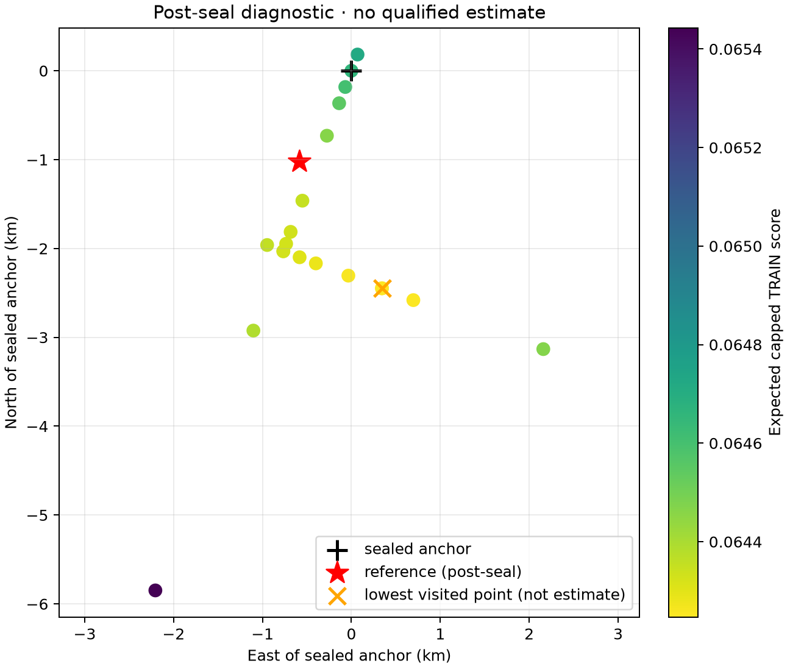

# DS1 iteration 28: truth-blind basin search

## Decision

**No-go.** Iteration 28 did not produce a position estimate and makes no sub-kilometre claim.
The sealed primary ray found an interior RF minimum, but the transverse optimizer generated two
nearly identical coordinates. Their score difference was smaller than the predeclared numerical
decision floor, so the search stopped before Powell correction, pattern closure, or stability
testing.

The inference used the original randomized TRAIN rows only. It froze iteration 27's identities,
group time offsets, group weights, per-track CFO profiling, rate posterior, robust energy, and
cap-800 session-balanced score. It read neither HELD rows nor the surveyed reference. The plan was
sealed before direction, equivalence, or search output existed.



## Worked

The exact iteration-27 phase-state cache transferred cleanly. A separately sealed fresh anchor
check recomputed all 250 source relations and matched iteration 27 exactly:

| Equivalence component | Result |
|---|---:|
| Pooled exact-material score difference | `0` |
| Pooled atlas score difference | `0` |
| Maximum group/session score or weight difference | `0` |
| Maximum atlas/direct Doppler error | `3.80734e-05 Hz` |
| Maximum posterior tail mass | `6.73997e-58` |

The sealed direction gate also passed. The full-data descent bearing was `200.65°`; every one of
the 12 leave-one-session gradients had a positive dot product with the full gradient, and all 13
local Hessians were positive definite.

The primary ray evaluated its complete predeclared bracket from `-195.3125 m` to `6250 m`. It
selected an interior coarse point and then narrowed the bracket to `[2080.84, 2171.45] m`. Its
final selected scalar coordinate was `2169.3797 m`, corresponding to `765.41 m` west and
`2029.87 m` south of the sealed anchor. The exact-material and atlas winners agreed at every
accepted decision.

Across all 20 visited cells:

| Numerical diagnostic | Result | Gate |
|---|---:|---:|
| Maximum atlas/direct Doppler error | `3.81922e-05 Hz` | `≤ 0.2 Hz` |
| Maximum posterior tail mass | `7.12224e-58` | `≤ 1e-4` |
| Largest decision-level pooled atlas/direct discrepancy | `2.10831e-13` | diagnostic |
| Runtime | `666.60 s` | `< 1800 s` |

## Failed

The transverse line initially moved toward the east-southeast and obtained a valid interior
bracket. Its first parabolic refinement preferred `-1184.9528937 m`. The next unconstrained
parabolic proposal was `-1185.0783372 m`, only `0.1254434 m` away. Their expected scores were:

| Transverse coordinate | Expected capped TRAIN score |
|---:|---:|
| `-1184.9528937 m` | `0.06424676459245293` |
| `-1185.0783372 m` | `0.06424676457949613` |

The apparent improvement was only `1.29568e-11`, below the sealed decision floor of `1e-10`.
Atlas and direct scoring still selected the same point; their maximum pooled discrepancy among the
three contenders was only `5.69128e-14`. The failure therefore came from asking a discrete winner
gate to distinguish two geometrically redundant proposals, rather than from orbit propagation,
posterior integration, or inconsistent winners.

The runner emitted `estimate: null`. The lowest-score visited cell is retained only as a search
diagnostic; it is not promoted to an estimate because the full closure and leave-one-session
stability gates never ran.

## Post-seal reference diagnostic

Only after `inference.json` and `qualification.json` were sealed did the evaluator read the surveyed
coordinate. The anchor error was `1.17929 km`. The lowest-score visited point was `1.70587 km` from
the reference, but it remains an unqualified path point. This shows that the local RF objective
continued beyond the reference in the sampled transverse direction; it cannot be used to tune or
reinterpret iteration 28.



## Learned

Iteration 27's south-southwest boundary trend was real enough to bracket a broad RF minimum, and
the exact cache remains numerically sound over a several-kilometre search. The scientific
bottleneck exposed here is optimizer resolution. A safeguarded parabolic method needs a minimum
proposal separation relative to its current bracket and an explicit interval-convergence rule.
Without those rules, a mathematically valid parabola can propose a practically duplicate point and
force the numerical winner gate to answer a meaningless question.

The post-seal diagnostic also warns that minimizing this frozen TRAIN objective alone is not yet
known to recover the surveyed location. A successful optimizer closure is necessary but not
sufficient; the final leave-one-session stability tile remains essential.

## Next iteration

Iteration 29 should prospectively seal these optimizer rules before scoring:

1. Reject a parabolic proposal when its distance from any existing coordinate is less than 10% of
   the nearer side of the active bracket; take the deterministic golden fallback instead.
2. Deduplicate coordinates at a declared physical resolution as well as by raw floating-point
   bits.
3. Declare convergence from bracket width before applying a winner-gap test to sub-resolution
   proposals.
4. Retain the same direct/atlas decision gate for genuinely distinct contenders and retain every
   no-boundary, pattern-closure, and leave-one-session stability requirement.
5. Run the frozen method on DS1 and a separately sealed DS3 all56 companion, followed by historical
   DS3 backfill, before reading either reference result.

## DS3 companion status

The paired-evaluation requirement arrived after the DS1 iteration-28 plan and run were sealed. DS3
was not silently substituted into DS1's cache: the cache contains only DS1's 12 sessions. A
machine-readable companion status lists the required DS3 inventory, association adapter, and exact
cache work. Iteration 28 therefore reports the DS1 half only and makes no DS3 claim.

## Reproduction and artifacts

```bash
env OPENBLAS_NUM_THREADS=1 MKL_NUM_THREADS=1 OMP_NUM_THREADS=1 NUMEXPR_NUM_THREADS=1 \
  .venv/bin/pytest -q reports/2026_09_25_ds1_iteration28_basin_search/test_run.py

env OPENBLAS_NUM_THREADS=1 MKL_NUM_THREADS=1 OMP_NUM_THREADS=1 NUMEXPR_NUM_THREADS=1 \
  timeout --signal=TERM 300s .venv/bin/python \
  reports/2026_09_25_ds1_iteration28_basin_search/equivalence.py

env OPENBLAS_NUM_THREADS=1 MKL_NUM_THREADS=1 OMP_NUM_THREADS=1 NUMEXPR_NUM_THREADS=1 \
  timeout --signal=TERM 1800s .venv/bin/python \
  reports/2026_09_25_ds1_iteration28_basin_search/launch_search.py
```

`plan.json`, `stage-0-direction.json`, `equivalence.json`, `cells.json`, `inference.json`,
`qualification.json`, and each stage record are sealed machine-readable artifacts. The post-seal
reference output is separately sealed under `evaluation/`.
