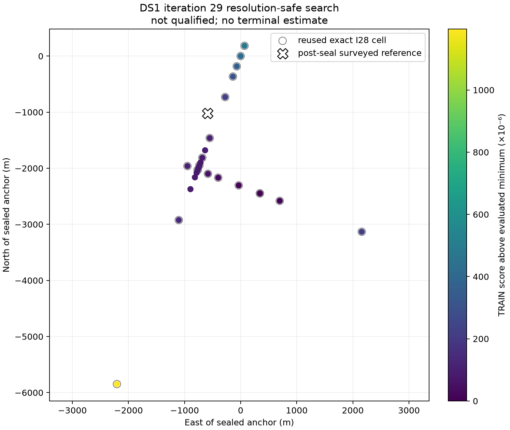

# DS1 iteration 29: resolution-safe line search

## Result

Iteration 29 is a **truth-blind no-go**, but it fixes the numerical ambiguity
that stopped iteration 28.  Every proposal was separated from all already
evaluated line coordinates by the prospectively declared resolution.  The
smallest achieved separation was 1.553 times the required separation, so the
iteration-28 pair only 0.125 m apart was not repeated.

The runner stopped at the primary-ray budget and therefore emitted no position
estimate.  This was caused by a narrow control-flow defect rather than by the
RF surface: the last allowed proposal reduced the actual adjacent-neighbour
bracket to **87.075 m**, already below the sealed **97.656 m** convergence
threshold, but the runner checked convergence only before each proposal and
did not perform a final post-proposal check.  I have not retroactively accepted
the result or continued to transverse/Powell search because that would violate
the sealed prospective procedure.



## What was tested

The model, hard associations, TRAIN partition, group timing, rate prior,
nuisance CFO profiling, score, direction, search caps and exact phase-state
cache are unchanged from iterations 27--28.  No surveyed coordinate or HELD
row entered inference.

The only scientific-procedure change was the one declared before output:

- reject a parabolic proposal within
  `max(12.20703125 m, 0.125 × current bracket width)` of any evaluated scalar
  coordinate or the current center;
- use a deterministic golden subdivision with maximum separation, then the
  midpoint of the largest interval if needed;
- assess score gaps only against resolution-separated contenders; and
- declare convergence only from an adjacent-neighbour bracket no wider than
  97.65625 m.

Twenty exact iteration-28 cells were reused.  Reuse required valid seals,
matching plan/runner/cache bindings, matching inference-to-cell digest, raw
IEEE-754 coordinate keys, finite scores and explicit no-truth/no-HELD fields.
Eight new exact cells were evaluated with four workers under the 1,800-second
stage wall.  Runtime was 461.6 seconds.

## Evidence

| Check | Result |
| --- | ---: |
| Near-duplicate proposal repeated | **No** |
| Proposals satisfying declared separation | **9 / 9** |
| Minimum separation / requirement | **1.553×** |
| Last pre-proposal bracket checked by runner | 108.048 m |
| Final adjacent bracket after last proposal | **87.075 m** |
| Declared convergence width | 97.656 m |
| Best primary-ray offset | 2,171.447 m |
| Best TRAIN score | 0.0643284737343 |
| Maximum atlas/direct Doppler error | 0.0000382 Hz |
| Maximum posterior tail mass | 7.12×10⁻⁵⁸ |
| Reused / new exact cells | 20 / 8 |
| Qualified terminal estimate | **No** |

The atlas/direct and posterior-tail gates passed.  The repeatability gate is
false only because no terminal estimate existed to repeat.  Post-seal reference
evaluation consequently reports no error and makes no sub-kilometre claim.

## What worked

The resolution-aware rule repaired the failure we intended to repair.  It
never compared effectively identical coordinates as independent contenders,
all exact/surrogate winner checks passed, and the primary objective remained
smooth and bracketed.  The final evaluated cells contain enough information to
meet the sealed width criterion without another RF score evaluation.

## What did not work

The refinement loop used the allowed final proposal and exited immediately.
It did not recompute the winner's adjacent bracket after that proposal.  The
machine-readable failure reason, `refinement budget exhausted`, is therefore
accurate for the runner as written but overly coarse scientifically: the
evaluated final bracket is already converged.

Because primary-ray qualification failed, transverse refinement, the Powell
cycle, multiscale pattern closure and leave-one-session stability were not run.
Iteration 29 cannot produce a position error or contribute a qualified DS1
point.

## DS3 companion

The sealed historical DS3 backfill snapshot has no exact iteration-29 adapter,
so DS3 was **not run**.  `ds3-companion.json` binds that exact registry, paired
plan and execution snapshot and records `not_run_adapter_unavailable`; it does
not substitute an older DS3 result or claim scientific equivalence.  A future
paired run must add an iteration-29/30 adapter prospectively and independently
seal DS3's anchor, cache and associations.

## Next iteration

Iteration 30 should preserve every iteration-29 model and separation rule.  Its
only line-search repair should be to recompute the adjacent-neighbour bracket
after the last permitted proposal and accept it if its width is at most
97.65625 m.  If it is still wider, it must fail without adding an unplanned
point.  That small prospective fix should allow the already demonstrated
87.075 m bracket to continue into transverse/Powell refinement and spatial
closure while retaining the numerical safety gained here.

## Reproduction

```bash
.venv/bin/pytest -q reports/2026_09_25_ds1_iteration29_resolution_safe_search/test_run.py
.venv/bin/ruff format --check reports/2026_09_25_ds1_iteration29_resolution_safe_search/*.py
.venv/bin/ruff check reports/2026_09_25_ds1_iteration29_resolution_safe_search/*.py
timeout 1800s .venv/bin/python reports/2026_09_25_ds1_iteration29_resolution_safe_search/run.py --stage direction --workers 4
timeout 1800s .venv/bin/python reports/2026_09_25_ds1_iteration29_resolution_safe_search/run.py --stage search --workers 4
.venv/bin/python reports/2026_09_25_ds1_iteration29_resolution_safe_search/evaluate_postseal.py
.venv/bin/python reports/2026_09_25_ds1_iteration29_resolution_safe_search/summarize.py
MPLBACKEND=Agg .venv/bin/python reports/2026_09_25_ds1_iteration29_resolution_safe_search/plot.py
```

The sealed run outputs are intentionally immutable.  Reproduction should use a
fresh output directory rather than overwrite this report's evidence.
