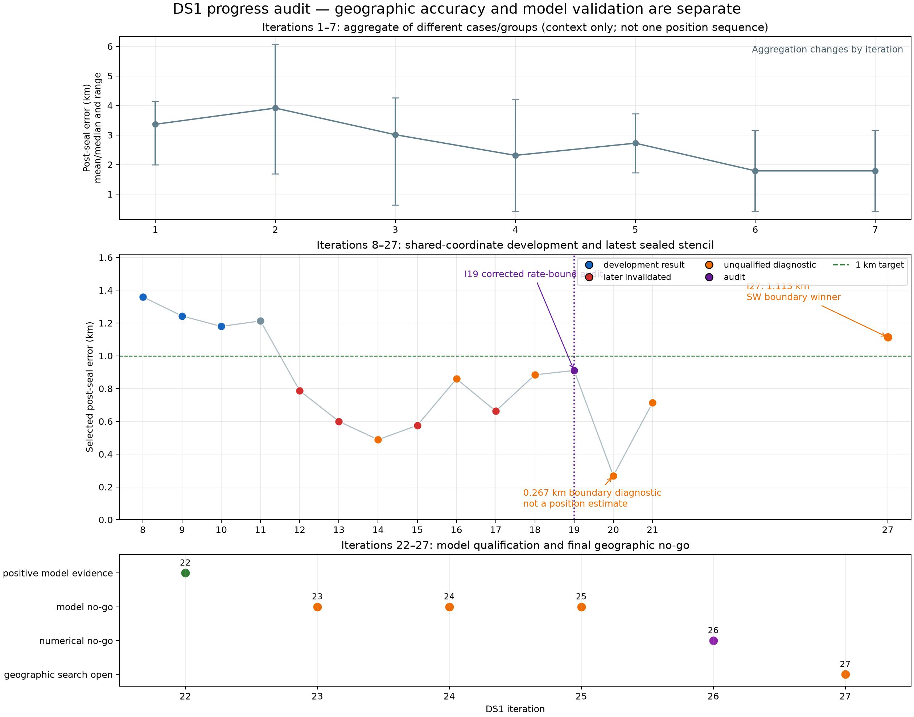

# DS1 improvement by iteration

## Answer

We are still making progress, but since iteration 19 it has been **model-validity
progress rather than a new qualified position improvement**. The early shared
coordinate sequence moved from 1.359 km at iteration 8 to a reported 0.576 km
at iteration 15. Iteration 19 then found that the old `+/-0.25 s/hour` rate
boundary detector was narrower than the optimizer tolerance and invalidated
that sub-kilometre qualification.

The closest later RF-selected point is 0.267 km at iteration 20, but it is on
the boundary of a still-descending search and is explicitly not a position
estimate. Iteration 21 passed even closer to truth at one visited cell
(0.173 km), but RF scoring continued away from it; using that cell would be
post-selection on truth. There is therefore **no current qualified sub-km DS1
result**. Iteration 27 repaired the numerical model, but its southwest
boundary won and all 12 leave-one-session reranks agreed. Its post-seal error
is 1.113 km versus 1.179 km at the center.



## What each phase established

| Iterations | Geographic result shown | Current interpretation |
|---|---:|---|
| 1–7 | Aggregate means or medians with ranges | Useful development context, but the cases and aggregation change; this is not one position trajectory. |
| 8–11 | 1.359 → 1.179 km, then 1.213 km | A coherent shared-coordinate refinement sequence on reused DS1 TRAIN data. |
| 12–15 | 0.787 → 0.600 → 0.576 km, with a 0.488 km boundary diagnostic at 14 | Historical sub-km evidence; the rate-bound audit later invalidated the qualified claims. |
| 16–18 | 0.860, 0.663, 0.884 km | Association and timing experiments; 16/18 are open-basin diagnostics. Iteration 17's persisted fit also contains rates only `9.57e-8 s/hour` inside the old guard, so it has not passed the corrected boundary rule. |
| 19 | 0.910 km boundary diagnostic | Found and documented the qualification defect. This was scientific progress even though the plotted distance worsened. |
| 20–21 | 0.267 and 0.714 km terminal boundary diagnostics | Strong evidence that a sub-km region exists, but neither search closed. |
| 22 | No geographic search | Per-NORAD rates improved randomized HELD loss in all 12 sessions. |
| 23–25 | No geographic search | Widened-rate, cross-fit, and source-admission controls rejected three tempting but unsupported model choices. |
| 26 | No geographic search | Rate marginalization was numerically stable around posterior mass; a remote-mode quartic extrapolation failed the exact 0.2 Hz gate. |
| 27 | 1.113 km boundary diagnostic | The exact cache passed at `3.81e-5 Hz`; atlas and direct scoring both selected southwest, and 12/12 leave-one-session reranks agreed. The search stayed open, so this is not a position estimate. |

## Are we still progressing?

**Yes, in a slower and more meaningful sense.** Iterations 22–26 progressively
separated real predictive rate structure from boundary effects, weak source
admission rules, and a surrogate extrapolation error. The immediate bottleneck
is no longer grid spacing: it is obtaining an exact, transferable nuisance
model whose geographic objective closes without looking at the reference
position.

Iteration 27 removed iteration 26's numerical blocker and showed that the
southwest slope is stable under all session omissions. The next iteration must
predeclare an expanded lattice before seeing its results and test whether this
slope reaches an interior minimum. A sub-kilometre point will count only if
that RF-selected search closes and passes corrected rate, exact-replay, and
leave-one-session gates.

## Reproducibility and provenance

`progress.json` contains all 27 rows, machine-readable dispositions, the main
interpretation, and SHA-256 provenance for every source artifact.
`progress.csv` is the flat equivalent. `build.py` regenerates both files and
the PNG. Geographic error is always kept separate from model-only metrics.

```bash
.venv/bin/python reports/2026_09_25_ds1_iteration_progress/build.py
.venv/bin/pytest -q reports/2026_09_25_ds1_iteration_progress/test_build.py
```

The plot deliberately does not draw the 0.173 km truth-nearest visited cell as
an estimate, and it does not convert iterations 22–27 into fictitious position
errors. Iteration 27 is shown as an open-search diagnostic because its selected
cell remained on the southwest boundary.
