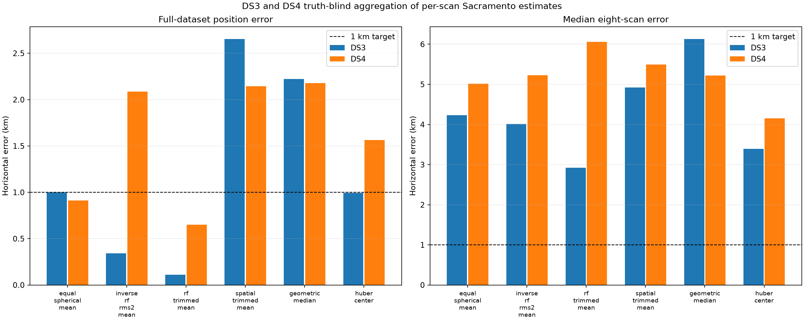

# DS3 + DS4 positioning iteration 1

## Question

Can repeated, truth-blind per-scan position estimates recover a more accurate receiver
position before the heavier joint satellite-association models finish?

This experiment aggregates the sealed Sacramento-prior result from each scan. The
surveyed receiver coordinate is absent from `inputs.json` and `inference.json`; it is
introduced only by `postseal.json` to score the already sealed estimates.

DS3 contains 56 scans and seven chronological groups of eight. DS4 contains 91 scans,
11 non-overlapping chronological groups of eight, and a three-scan remainder used only
by the full-data estimate. All units are evaluated; none are selected by position error.

## Results

Errors are horizontal great-circle distance in kilometres. The group columns show
median / p90 across the fixed eight-scan units.

| Truth-blind aggregation rule | DS3 full | DS4 full | DS3 group8 | DS4 group8 |
|---|---:|---:|---:|---:|
| Equal spherical mean | **0.999** | **0.911** | 4.231 / 5.850 | 5.015 / 16.901 |
| Inverse RF-RMS-squared mean | 0.342 | 2.087 | 4.010 / 6.055 | 5.227 / 12.782 |
| Lowest-RF-RMS 75% mean | **0.112** | **0.651** | **2.923** / 5.908 | 6.059 / 22.376 |
| Closest spatial 75% mean | 2.652 | 2.144 | 4.919 / 8.389 | 5.498 / 8.483 |
| Geometric median | 2.224 | 2.178 | 6.127 / 6.603 | 5.218 / 11.347 |
| Iterative Huber centre | 0.994 | 1.562 | 3.394 / **5.528** | **4.156** / **10.721** |

The equal spherical mean is the strongest simple result: it independently reaches
about one kilometre on both full datasets without a fitted quality threshold. The
RF-trimmed estimate is much closer on both full datasets, but its unstable DS4 group8
distribution shows that the apparent full-corpus gain depends on cancellation over a
long time span. It is an exploratory candidate, not yet a validated winner.

All aggregation rules collapse to the same input point for a single scan. Median
single-scan error is 6.719 km on DS3 and 13.444 km on DS4. The minimum possible error
among these selected grid points is 5.791 km, consistent with the source analyzer's
12.5 km final grid. Averaging repeated, differently displaced grid winners recovers
sub-cell information, but eight scans do not yet average away the association and
surface-selection errors reliably.



## Interpretation

The full-data improvement is real as a measurement of these two corpora, but it does
not establish an independently validated method because DS3 and DS4 are both being
used in this requested iteration loop. A future frozen corpus is still needed for a
confirmatory claim.

The main bottleneck is short-window bias, rather than arithmetic precision. RF RMS is
not a stable proxy for geographic accuracy: inverse-RMS weighting helps DS3/full and
hurts DS4/full. Spatial medians also preserve a displaced mode instead of averaging
the grid-selection error. A useful next model must combine the underlying track
likelihoods across scans and refit identities and nuisance timing jointly; it should
not merely choose among per-scan point estimates.

## Next iteration

1. Finish the managed DS3 I27–I29 chain without sharing its output paths or writer.
2. Extend the sealed I21 session-balanced basin until its geographic winner is
   interior, using 48.8 m, 24.4 m, and 12.2 m translated lattices and frozen hard
   identities, timing, CFO treatment, cap, and session weights.
3. Run a matched shared-time closure that reacquires identities at every position and
   time node, then freezes at most two structurally qualified methods for DS4.
4. Evaluate each method on singles, the exact groups of eight, and the full dataset.
   Each unit must fit its own identities, CFO, time offset, rates, and phase states.
5. Require deterministic replay, interior nuisance and geographic optima, complete
   track accounting, and exact SGP4 agreement before post-seal position scoring.

The target for the next qualified result is DS4/full below 1 km. A stronger short-span
claim requires at least 9 of 11 qualified DS4 groups, median below 1 km, and p90 below
2 km. This first iteration does not meet the group8 target.

## Reproduction

```bash
.venv/bin/python reports/2026_09_25_ds3_ds4_position_iteration1/run.py infer
.venv/bin/python reports/2026_09_25_ds3_ds4_position_iteration1/run.py postseal
.venv/bin/pytest -q reports/2026_09_25_ds3_ds4_position_iteration1/test_run.py
```

`inputs.json`, `inference.json`, `postseal.json`, `summary.csv`, and the PNG have
adjacent SHA-256 seals. `METHODS.md` records the fixed estimator definitions.
