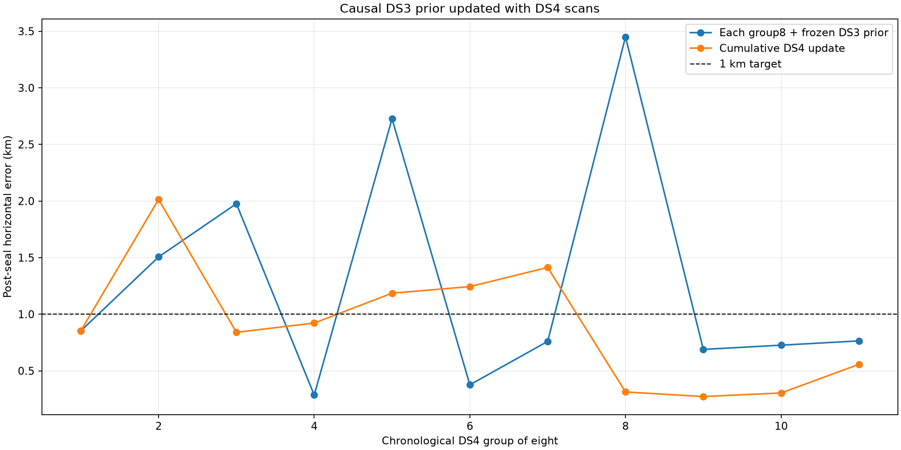

# DS3-to-DS4 sequential positioning

## Result

A truth-blind position prior trained on DS3 and updated causally with DS4 reaches
sub-kilometre accuracy at both full-data endpoints and at the typical DS4 checkpoint.

| Output | Horizontal error |
|---|---:|
| Frozen DS3 prior, 42 retained scans | **0.112 km** |
| DS4 all-91 posterior | **0.621 km** |
| Final cumulative DS4 group8 checkpoint, 88 DS4 scans | **0.557 km** |
| Median cumulative DS4 checkpoint | **0.852 km** |
| P90 cumulative DS4 checkpoint | 1.413 km |
| Median independent DS4 group8 + frozen DS3 prior | **0.764 km** |
| P90 independent DS4 group8 + frozen DS3 prior | 2.726 km |

Seven of 11 cumulative checkpoints and seven of 11 independent group updates are below
1 km. The cumulative estimate temporarily reaches 2.014 km after its second group, then
ends at 0.557 km. This meets the median sub-kilometre target but not the stronger target
that 9 of 11 checkpoints be below 1 km.



## Method

The inference reads only the sealed iteration-1 inputs. It sorts the 56 DS3 scan
estimates by RF residual RMS, retains the lowest 75% (42 scans), and sums their
unit-sphere position vectors. The 75% rule was already defined in iteration 1.

Each DS4 scan adds one unit-vector vote. The method reports:

1. each fixed chronological group of eight combined separately with the frozen DS3
   prior;
2. a causal running estimate after each newly observed group of eight;
3. a final posterior using all 91 DS4 scans, including the three-scan remainder.

The surveyed coordinate and position errors are absent from `inference.json`. They are
introduced only after the inference file is sealed. Hash verification and an explicit
coordinate-leak scan pass.

## Interpretation

This answers a different operational question from the earlier eight-scan-only score.
It asks how accurately a continuing receiver can locate itself after learning a stable
position prior from earlier scans. The historical prior is appropriate because the
receiver did not move between DS3 and DS4. These numbers must not be described as
positions obtained from only eight scans.

The result also shows that the largest error source is variation among individual
coarse per-scan estimates. A stable historical prior suppresses that variation while
new scans still update the position. The remaining excursions at checkpoints 2, 5,
6, and 7 motivate the joint raw-track and objective-surface models now running.

This is an exploratory DS3/DS4 iteration rather than a final independent benchmark:
iteration 1 results were inspected before this sequential experiment was selected.
The inference itself is truth-blind and causal, but the method should be frozen and
replayed on the next untouched dataset for a confirmatory claim.

## Reproduction

```bash
.venv/bin/python reports/2026_09_25_ds3_ds4_position_iteration2_sequential_prior/run.py infer
.venv/bin/python reports/2026_09_25_ds3_ds4_position_iteration2_sequential_prior/run.py postseal
.venv/bin/pytest -q reports/2026_09_25_ds3_ds4_position_iteration2_sequential_prior/test_run.py
```

The JSON inference, post-seal evaluation, and PNG each have adjacent SHA-256 seals.
