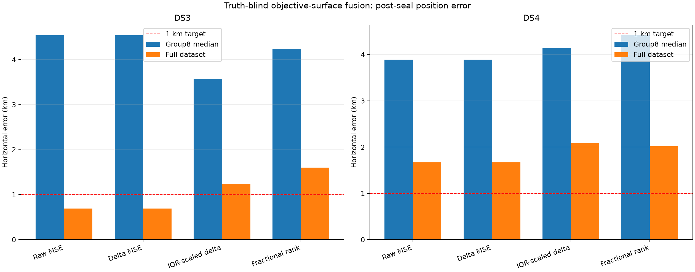
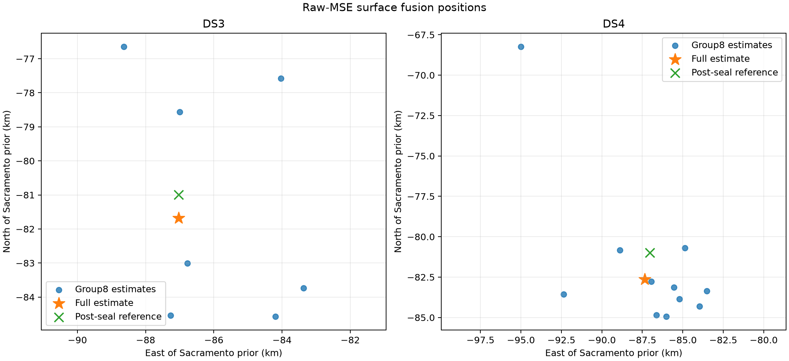

# DS3/DS4 truth-blind objective-surface fusion

## Finding

Fusing the complete per-scan objective surfaces, then fitting one local
quadratic, reaches **0.693 km on full DS3**. Full DS4 is **1.667 km**, and the
combined 147-scan DS3+DS4 estimate is **1.303 km**. The DS3 result is a real
sub-kilometre result under the frozen method, but this method does not yet
generalize below one kilometre on DS4.

The primary method uses equal scan weights and the mean squared capped RMS.
Inference is truth-blind and sealed before reference-position scoring. The
receiver coordinate and all source reference/error fields are absent from both
`inputs.json` and `inference.json`.

| Method | DS3 group8 median / p90 | DS3 full | DS4 group8 median / p90 | DS4 full | DS3+DS4 full |
|---|---:|---:|---:|---:|---:|
| Raw capped MSE | 4.545 / 4.605 km | **0.693 km** | **3.891 / 5.927 km** | **1.667 km** | **1.303 km** |
| Delta MSE | 4.545 / 4.605 km | **0.693 km** | **3.891 / 5.927 km** | **1.667 km** | **1.303 km** |
| IQR-scaled delta MSE | **3.567 / 4.405 km** | 1.240 km | 4.132 / 6.893 km | 2.082 km | 1.792 km |
| Fractional rank | 4.239 / 5.362 km | 1.598 km | 4.420 / 7.553 km | 2.020 km | 1.857 km |

Delta MSE is deliberately an invariance control. Subtracting one constant from
each scan cannot move an equal-weight aggregate minimum, and its bit-for-bit
matching outcomes confirm that behavior. The two scale-robust variants do not
improve full-corpus generalization. IQR scaling helps the typical DS3 group of
eight, but hurts DS4 and all full-corpus results.



## Why interpolation is required

Every scan contains exactly 400 Sacramento surface points, but the search is
adaptive, so most fine cells differ across scans.

| Unit | Sessions | Exact union | Exact all-scan intersection | Exact-intersection minimum |
|---|---:|---:|---:|---:|
| DS3 full | 56 | 1,672 | 48 | (-50, -50) km |
| DS4 full | 91 | 1,670 | 48 | (-50, -50) km |
| DS3+DS4 full | 147 | 1,676 | 48 | (-50, -50) km |

The 48-point intersection has no fine neighborhood near the solution. Its
aggregate minimum is about 48 km from the post-seal reference, so directly
averaging only exact shared points is not useful. The fixed estimator instead:

1. converts capped RMS to capped MSE;
2. piecewise-linearly interpolates each scan onto the same 6.25 km grid inside
   the Sacramento 243.75 km disk;
3. retains only cells supported by every scan in the unit;
4. averages surfaces with equal total weight per scan;
5. selects the discrete minimum; and
6. fits a quadratic to the nearest 25 common-grid cells.

The continuous solution is used only with positive curvature, a full-rank fit,
local R² at least 0.80, an interior discrete minimum, and a stationary point
inside the local support and prior disk. Full method details are frozen in
`METHODS.md`.

## Full-corpus diagnostics

| Unit | Discrete error | Refined error | Local R² | Hessian condition | Fit displacement | Interpolation support median / p90 / max |
|---|---:|---:|---:|---:|---:|---:|
| DS3 full | 5.792 km | **0.693 km** | 0.960 | 1.51 | 5.80 km | 6.25 / 6.25 / 18.75 km |
| DS4 full | 6.719 km | **1.667 km** | 0.980 | 2.30 | 6.56 km | 6.25 / 6.25 / 25.77 km |
| DS3+DS4 full | 6.719 km | **1.303 km** | 0.982 | 2.06 | 6.80 km | 6.25 / 6.25 / 25.77 km |

All three full fits pass every numerical qualification gate. The estimates are:

| Unit | Latitude | Longitude | East / north of prior |
|---|---:|---:|---:|
| DS3 full | 37.84280518° | -122.48553021° | -87.032 / -81.683 km |
| DS4 full | 37.83426640° | -122.48892339° | -87.340 / -82.630 km |
| DS3+DS4 full | 37.83731452° | -122.48538259° | -87.026 / -82.294 km |

Curvature and fit R² establish that the local interpolated objective is smooth
and has an interior minimum. They are **not calibrated position uncertainty**.
The frozen group-of-eight units provide the empirical stability check. All 18
primary group fits qualify numerically; DS3 has median 4.545 km, while DS4 has
median 3.891 km and p90 5.927 km. One DS4 group is a 15.046 km outlier.



The individual-scan medians are 6.525 km for DS3 and 9.458 km for DS4. This
confirms that the sub-cell full result comes from combining diverse scans, not
from precise individual estimates.

## Interpretation and bottleneck

This experiment extracts useful sub-cell information that was discarded when
each scan was reduced to one selected 12.5 km cell. Relative to the earlier
selected-point equal-mean aggregation, it improves DS3 full from 0.999 km to
0.693 km and DS4 group8 median from 5.015 km to 3.891 km. It does not improve
DS4 full, which changes from 0.911 km in the selected-point aggregation to
1.667 km here. A favorable cancellation in a single full-corpus estimate is not
enough to establish superiority; the group distributions are the stronger
generalization evidence.

The remaining bottleneck is upstream of the quadratic. These stored surfaces
already contain per-scan association choices, timing assumptions, adaptive
sampling, and an 800 Hz cap. Linear interpolation cannot recover likelihood
information that was never evaluated. The DS4 full estimate has a coherent
roughly 1.64 km northward residual even though its local fit is well behaved.
Reweighting surface scales does not remove it, which argues against objective
scale alone being the cause.

The next iteration should jointly fuse underlying track-level likelihoods on a
fine neighborhood, preserve each scan's real UTC, and fit constrained global
plus regularized per-scan timing offsets. This surface estimator provides a
fast initialization and an independent regression check for that more complete
model.

## Reproduction and validation

From the repository root:

```bash
sudo -n -u leo .venv/bin/python reports/2026_09_25_ds3_ds4_surface_fusion/run.py extract \
  --output /tmp/ds3-ds4-surface-inputs.json
.venv/bin/python reports/2026_09_25_ds3_ds4_surface_fusion/run.py infer \
  --inputs reports/2026_09_25_ds3_ds4_surface_fusion/inputs.json
.venv/bin/python reports/2026_09_25_ds3_ds4_surface_fusion/run.py postseal
.venv/bin/pytest -q reports/2026_09_25_ds3_ds4_surface_fusion/test_run.py
.venv/bin/ruff check reports/2026_09_25_ds3_ds4_surface_fusion/run.py \
  reports/2026_09_25_ds3_ds4_surface_fusion/test_run.py
```

Extraction took 2.78 seconds, inference took 9.82 seconds, and post-seal numeric
scoring took 0.01 seconds on this host. Ruff passed and all five focused tests
passed. The tests cover known sub-grid quadratic recovery, offset invariance,
scale invariance, monotonic-rank invariance, and grid-boundary construction.

Machine-readable artifacts:

- `inputs.json` and seal: sealed truth-blind source surfaces, membership, source
  digests, and exact-overlap audit.
- `inference.json` and seal: sealed truth-blind estimates and complete numerical
  qualification diagnostics.
- `postseal.json` and seal: reference-scored results for every single, group8,
  full, and combined-full unit.
- `summary.csv`: compact error and qualification table.
