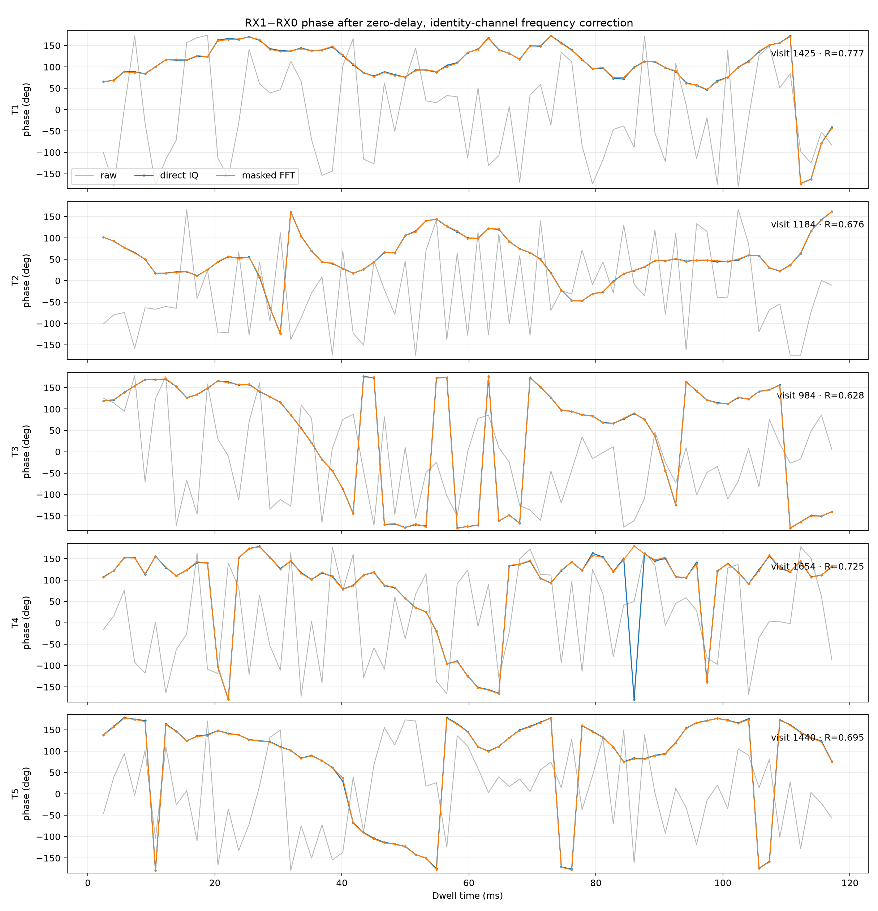
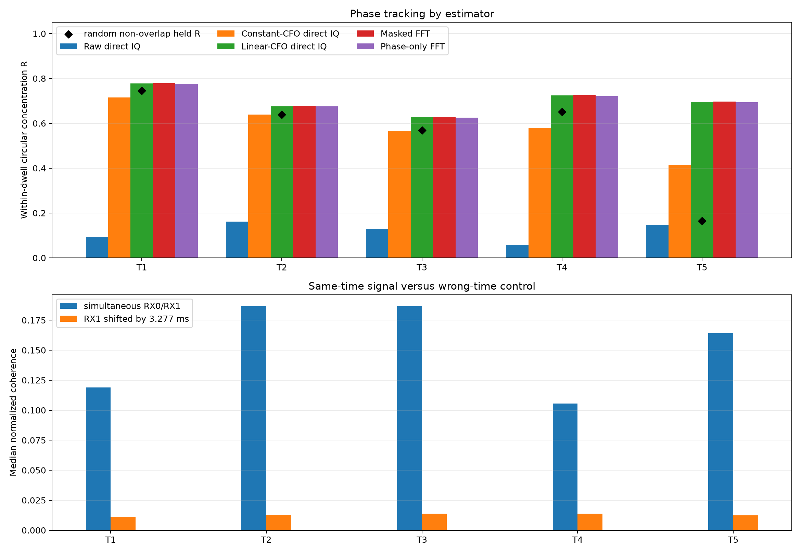
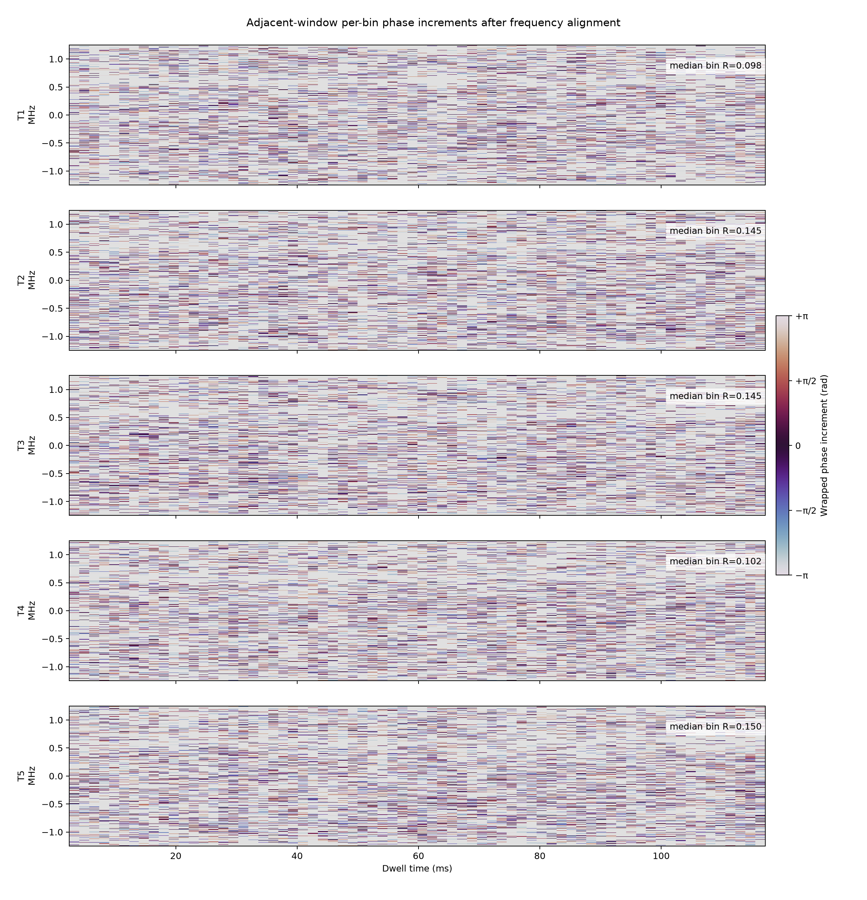
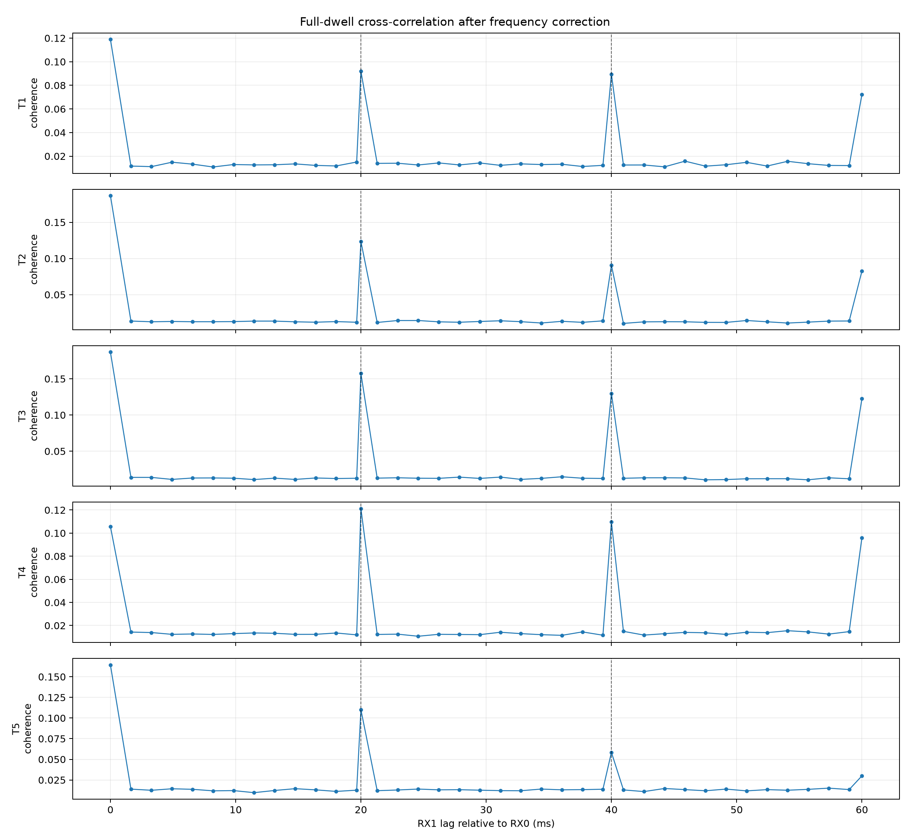

# Dual-acquisition phase tracking on five long September 24 tracks

Five dwells were frozen from five different long dual-receiver GLRT tracks and
replayed directly from their simultaneous RX0/RX1 IQ. With no timing-delay
fit, no complex channel response, and no phase intercept, a frequency-and-rate
correction raises median within-dwell phase concentration from **R = 0.129**
to **R = 0.695**. A random non-overlapping-window validation gives median held
**R = 0.639** and succeeds on four of five dwells. T5 does not generalize
(`held R = 0.165`), so the full-dwell result alone is optimistic.

Direct IQ and the independently implemented fractional-bin FFT method produce
nearly identical phase: their median unmasked phase discrepancy is only
**0.093° RMS**. Masking weak FFT bins and phase-only spectral weighting do not
materially improve concentration. Individual FFT-bin increments remain poorly
organized (`median R = 0.145`, falling to `0.100` for non-overlapping pairs),
so the recoverable observable is currently an aggregate broadband phase, not a
stable bank of per-subcarrier phases.

This establishes useful within-dwell dual-acquisition phase tracking and a
strong same-time shared-waveform gate. It does **not** establish calibrated
geometric phase, integer-cycle continuity across retunes, satellite identity,
or a tracking position improvement.

## Frozen selection

The source cohort is the five phase-blind tracks frozen in the September 24
late-track report. Those tracks were ranked by the smaller RX0/RX1 observation
count and phase-blind overlap support. Within each track, this report takes the
assessed dwell with the largest paired-GLRT `phase_blind_priority`. None of the
new direct-IQ or FFT results entered selection.

| Track | Capture suffix | Visit | Lane | RX0 / RX1 track observations | Paired-GLRT priority |
| --- | --- | ---: | --- | ---: | ---: |
| T1 | `62f406d45bb93b70` | 1425 | CH4 lower | 65 / 68 | 0.589 |
| T2 | `d3a96ccfa98a2ac5` | 1184 | CH4 lower | 85 / 50 | 0.568 |
| T3 | `feb2e6451d0727b3` | 984 | CH2 upper | 48 / 56 | 0.662 |
| T4 | `2485843ba12d930c` | 1654 | CH1 lower | 64 / 36 | 0.627 |
| T5 | `ed4502816d42c1d9` | 1440 | CH1 upper | 28 / 48 | 0.569 |

The exact authorities and source IQ digests are frozen in
[`selection.json`](selection.json). The pre-existing response-normalized
random-held analysis reports `R = 0.952–0.990` on these dwells. Those values
are useful context but are not numerically interchangeable with the raw
identity-channel statistic below.

## Protocol

Each 120 ms dwell contains 300,000 simultaneous samples per receiver at
2.5 MS/s. The primary schedule uses 8192-sample Hann windows with 4096-sample
stride, centered on the original 4096-sample grid. This gives 71 windows per
dwell.

The corrected RX1 signal is

\[
x'_1(t)=x_1(t)\exp\{-j2\pi[f_c t +
\tfrac12\dot f((t-0.060)^2-0.060^2)]\}.
\]

Only center frequency `f_c` and frequency rate `fdot` are fitted. The time
delay is exactly zero, the channel response is identity, and no global,
per-group, or per-window phase intercept is fitted. The frequency seed is the
previously persisted training-derived relative-CFO estimate. The descriptive
whole-dwell fit maximizes magnitude-weighted circular concentration over every
centered window.

The random validation constructs six independent 20 ms strata. Each stratum
contains six non-overlapping 8192-sample windows; three are randomly assigned
to training and three to held evaluation. Frequency is constrained within
100 Hz of its prior seed, while the rate correction may move by 2 kHz/s. This
is a random support holdout, not a time holdout, and no IQ sample is shared
between training and held windows.

The compared observables are:

1. Raw direct IQ: `arg(sum(conj(RX0) * RX1))`.
2. Direct IQ after a constant relative-frequency fit.
3. Direct IQ after relative frequency and rate fits.
4. An 8192-bin FFT cross-spectrum with 16× zero padding, fractional complex
   interpolation, and bins weaker than −15 dB in either receiver removed.
5. A phase-only FFT average over the same retained bins.

The wrong-time control offsets RX1 by 8192 samples (3.2768 ms). An exact
20 ms shift is deliberately not used: all five dwells exhibit strong 20 ms
recurrence, so it is another correlated waveform instance rather than a valid
null.

## Results

| Track | Visit | Raw R | Constant-CFO R | Frequency-rate R | Random-held R | Masked FFT R | Same / wrong coherence |
| --- | ---: | ---: | ---: | ---: | ---: | ---: | ---: |
| T1 | 1425 | 0.091 | 0.714 | 0.777 | 0.745 | 0.779 | 0.119 / 0.011 |
| T2 | 1184 | 0.162 | 0.638 | 0.676 | 0.639 | 0.676 | 0.187 / 0.013 |
| T3 | 984 | 0.129 | 0.566 | 0.628 | 0.569 | 0.628 | 0.187 / 0.014 |
| T4 | 1654 | 0.057 | 0.580 | 0.725 | 0.651 | 0.726 | 0.106 / 0.014 |
| T5 | 1440 | 0.146 | 0.415 | 0.695 | 0.165 | 0.698 | 0.164 / 0.012 |



The direct-IQ and FFT curves lie on top of one another. Both recover broad,
smooth phase evolution that is absent before relative-frequency removal. The
remaining structure is not a constant phase: it contains curvature, local
changes, and wraps. A high resultant therefore means that much of the trace
occupies a preferred arc, not that phase is stationary.



The simultaneous-pair coherence is 8–14 times the 3.2768 ms wrong-time
control in every dwell. This is strong evidence that the dual receivers see
the same instantaneous waveform. The random-held diamond tracks the full fit
on T1–T4 but collapses on T5. T5 is the clearest warning that fitting frequency
and rate over the entire dwell can absorb accidental phase structure.

| Track | Seed CFO (Hz) | Fitted center CFO (Hz) | Fitted rate (Hz/s) | FFT/time RMS | Adjacent-bin R | Non-overlap-bin R |
| --- | ---: | ---: | ---: | ---: | ---: | ---: |
| T1 | 656738.139 | 656726.117 | 204 | 0.093° | 0.098 | 0.062 |
| T2 | 651401.238 | 651411.513 | −112 | 0.048° | 0.145 | 0.123 |
| T3 | 653224.263 | 653236.118 | 137 | 0.057° | 0.145 | 0.127 |
| T4 | 653725.973 | 653736.788 | −387 | 0.175° | 0.102 | 0.061 |
| T5 | 654638.521 | 654620.694 | 1414 | 0.626° | 0.150 | 0.100 |

The FFT/time discrepancies are tiny compared with the observed phase motion.
The two algorithms therefore validate each other's implementation, but they
are not independent physical measurements: Parseval's theorem makes them two
representations of substantially the same broadband cross-product.

## FFT-bin result



After weak-bin masking, the individual frequency bins do not share a stable
temporal phase increment. The 50%-overlap statistic is already low and falls
further in the non-overlap control. Masked magnitude weighting and phase-only
weighting produce nearly the same aggregate `R`, so no evidence supports
treating individual arbitrary FFT bins as persistent phase tracks.

This is consistent with windows cutting across changing OFDM symbols. A
symbol- or known-pilot-aligned transform remains the most promising route to
subcarrier-level phase. Until then, the FFT should be viewed as a robust way
to reproduce the direct broadband estimator and reject weak spectral regions.

## Periodicity and control design



All five dwells have large coherence peaks at 20 ms and 40 ms, with another
peak at 60 ms. This explains why the initial 20 ms wrong-time control failed:
the signal itself repeats on that cadence. The 8192-sample control lies away
from those peaks and returns median coherence `0.011–0.014`.

The recurrence is potentially useful for phase tracking. A future estimator
can compare identical positions within successive 20 ms frames, but it must
reserve other frame instances or disjoint symbols for validation. Treating a
whole-frame shift as an unrelated signal would substantially overstate the
false-positive floor.

## Tracking interpretation

The experiment supports three conclusions:

- Simultaneous dual acquisition retains measurable within-dwell relative
  phase. Four of five phase-blind selected examples retain `R >= 0.57` on a
  random non-overlapping holdout.
- Direct IQ is the simplest sufficient estimator. The FFT implementation is
  valuable for diagnostics and masking but does not add independent phase
  information or improve concentration here.
- The current observable is not yet geometric. A fitted relative-frequency
  rate is mathematically indistinguishable from a linear geometric phase rate
  within one 120 ms dwell. Per-dwell fitting can therefore remove part of the
  tracking signal we ultimately want.

For tracking, the next defensible model is a joint multi-dwell model with a
receiver-clock term shared across visits and a candidate geometric term that
is not refitted independently in every dwell. Known-pilot phase should supply
the within-frame observable. The receiver/channel calibration, electrical
baseline vector, and integer-cycle behavior across retunes must be frozen on
training data before evaluating position or source discrimination.

## Reproduction and artifacts

The analysis is implemented in [`analyze.py`](analyze.py). It reads the
immutable IQ corpus under `/srv/bulk/leo/scanner-adaptive-recordings` and
writes only this report directory.

```bash
sudo -n ./.venv/bin/python \
  reports/2026_09_25_dual_acquisition_phase_tracking/analyze.py
```

Machine-readable results are in [`results.json`](results.json), and the
compact comparison table is in [`per-dwell.csv`](per-dwell.csv). Every raw IQ
digest was verified before analysis. No RF collection was started, no QNAP
path was changed, and no production analyzer or persisted contract was
modified.
