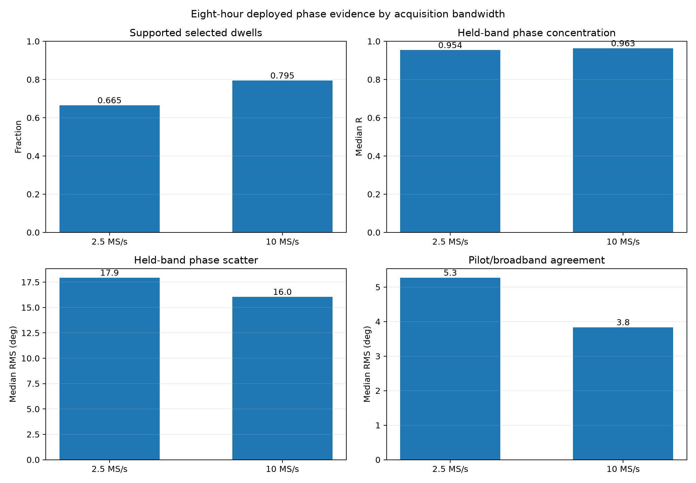
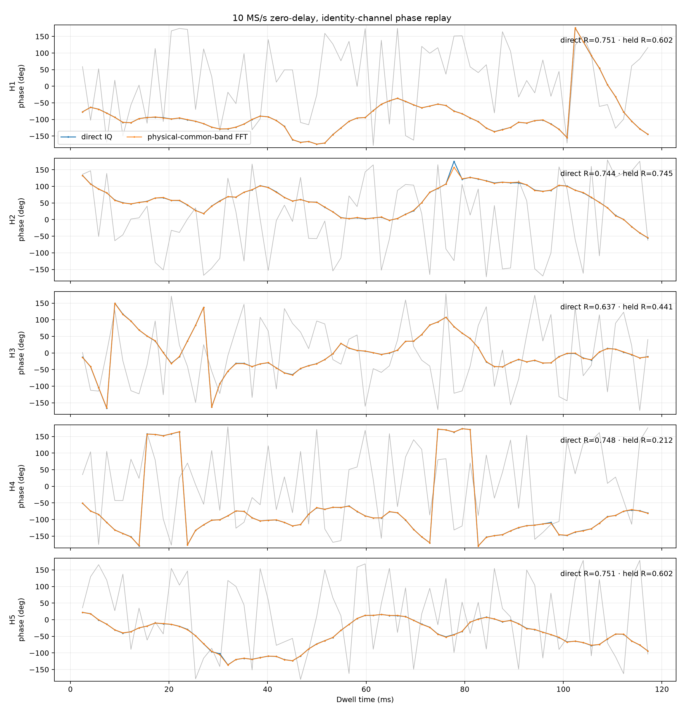
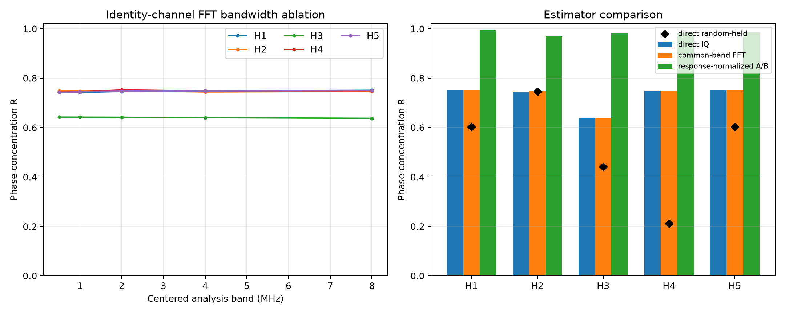
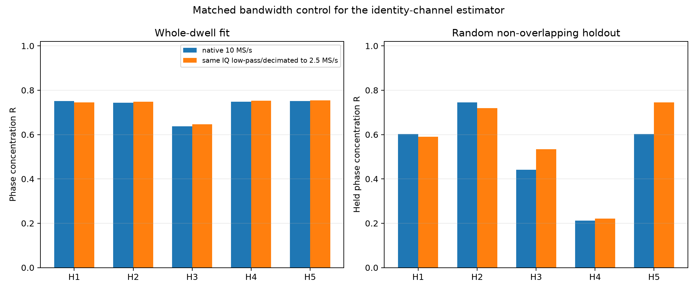

# Eight-hour high-bandwidth dual-RX phase review

The 10 MS/s dual captures **do help**, but primarily when the estimator uses
their extra spectral information. They improve physical common-band support,
the response-normalized disjoint-band phase check, pilot/broadband agreement,
and the wrong-time rejection floor. They do **not** materially improve the
plain zero-delay identity-channel direct-IQ phase concentration: on the same
five dwells, native 10 MS/s and a matched 2.5 MS/s decimation give essentially
the same whole-dwell result.

The review freezes the eight-hour interval from **2026-09-25 06:20:00 through
14:20:00 UTC**. It covers 45 completed analyzed scans: 28 at 10 MS/s and 17 at
2.5 MS/s. All reads are from immutable saved IQ and sealed deployed analysis.
No RF collection or production write was performed.

## Full-cohort result

The deployed phase product selects dwells using paired GLRT evidence without
phase. Its support test learns a response on one frequency partition and checks
phase on a disjoint partition. The following statistics therefore measure the
same algorithm at both rates.

| Quantity | 2.5 MS/s | 10 MS/s |
| --- | ---: | ---: |
| Completed sessions | 17 | 28 |
| Sessions with paired-GLRT selections | 17 | 14 |
| Phase-blind selected dwells | 1,027 | 677 |
| Supported selected dwells | 683 (66.5%) | 538 (79.5%) |
| Median per-session supported fraction | 0.672 | 0.818 |
| Median held-band phase R | 0.954 | 0.963 |
| Median held-band scatter | 17.94° | 16.05° |
| Median retained bandwidth | 1.53 MHz | 9.24 MHz |
| Median pilot/broadband held RMS | 5.27° | 3.84° |
| Median simultaneous scalar coherence | 0.147 | 0.131 |
| Median wrong-time coherence | 0.00616 | 0.00236 |



Conditional on a phase-blind selected dwell, 10 MS/s raises the supported
fraction by 13 percentage points, supplies about six times the retained
bandwidth, reduces held-band scatter by 11%, and reduces pilot/broadband RMS by
27%. Its scalar coherence is not larger, but its wrong-time floor is 2.6 times
lower. In other words, the advantage is discrimination and spectral leverage,
not simply a larger raw correlation number.

Only 14 of the 28 high-rate sessions had any paired-GLRT selection, versus all
17 low-rate sessions. This is a sky-time/source-availability difference in an
alternating observational stream, not evidence that 10 MS/s misses signals.
The conditional comparisons above avoid calling those empty sessions phase
failures, but the cohort is still observational rather than randomized.

## Zero-delay, identity-channel replay

Five 10 MS/s dwells were frozen before examining their phase result: for each
high-rate session with a phase-blind selection, take the strongest paired-GLRT
dwell, then retain the five strongest priorities across distinct sessions. The
exact choice is in [`selection.json`](selection.json).

The replay retains the restrictions requested in the earlier analysis:

- relative timing delay fixed to zero;
- identity channel response;
- no global, group, or window phase intercept;
- only relative center frequency and frequency rate fitted;
- 32,768-sample windows and 16,384-sample stride at 10 MS/s, exactly matching
  the 3.2768 ms / 1.6384 ms timing of the earlier 8,192 / 4,096 schedule;
- six 20 ms strata with three non-overlapping random training windows and three
  non-overlapping held windows per stratum.

The branch-resolved broadband CFO is used only as a frequency seed. This is
necessary because several paired GLRT differences occupy an adjacent
227.273 kHz symbol-alias branch. It does not enter phase-blind dwell selection.

| Dwell | Scan suffix / visit | Raw R | Direct fitted R | Random-held R | Common-band FFT R | Deployed A/B R |
| --- | --- | ---: | ---: | ---: | ---: | ---: |
| H1 | `e78bf49faf433d04 / 739` | 0.139 | 0.751 | 0.602 | 0.751 | 0.994 |
| H2 | `25eae90b871e6bbb / 1136` | 0.126 | 0.744 | 0.745 | 0.748 | 0.973 |
| H3 | `94dcda7ded855b71 / 1000` | 0.056 | 0.637 | 0.441 | 0.637 | 0.984 |
| H4 | `452dfcf3eb70ece0 / 804` | 0.104 | 0.748 | 0.212 | 0.748 | 0.984 |
| H5 | `438bc1098ed57bd4 / 74` | 0.114 | 0.751 | 0.602 | 0.750 | 0.985 |



Frequency-and-rate correction raises median direct-IQ concentration from raw
`R = 0.114` to `R = 0.748`. The random non-overlapping holdout is weaker at
median `R = 0.602`, and H3/H4 do not generalize well. The response-normalized
A/B statistic is much stronger, but it is a different residual-phase metric
and must not be presented as the raw observed phase.

The full-bin FFT and direct-IQ phasors agree to numerical precision because
they are Parseval-equivalent representations of the same windowed
cross-product. Restricting the FFT to the physical common band changes little.
Phase-only weighting also changes little. Increasing the centered analysis band
from 0.5 to 8 MHz leaves phase concentration almost flat in every dwell.



Thus extra arbitrary FFT bins do not independently improve the identity-channel
phase trace. The 10 MS/s benefit appears only after the estimator uses frequency
structure—disjoint-band validation, a stable trained response, or known pilots.

## Matched bandwidth control

Each selected 10 MS/s dwell was also passed through the same 257-tap linear-phase
anti-alias filter and decimated by four. Both receivers receive the identical
filter, the time windows are identical in seconds, and the exact same physical
windows are assigned to training and held evaluation.

| Metric, median over five matched dwells | Native 10 MS/s | Derived 2.5 MS/s |
| --- | ---: | ---: |
| Whole-dwell direct-IQ R | 0.748 | 0.749 |
| Random-held direct-IQ R | 0.602 | 0.590 |
| Median direct coherence | 0.197 | 0.132 |



The native bandwidth raises direct coherence by about 49%, but it does not
raise phase concentration. This matched result is stronger evidence than the
cross-session comparison: for the identity-channel estimator, bandwidth adds
shared-signal energy but does not cure the remaining phase evolution or
training/held instability.

## What this means for each approach

**Direct IQ:** keep it as the simplest broadband diagnostic. High bandwidth
improves same-time coherence, but not phase stability. A whole-dwell fitted
frequency rate remains dangerous because it can absorb geometric phase rate.

**Aggregate FFT:** useful for physical-overlap masking, interference rejection,
and debugging. It does not create an independent phase measurement; summing all
bins reproduces direct IQ. More bandwidth alone does not improve its R.

**Per-bin FFT phase:** high bandwidth gives many more bins, but arbitrary bins
are still not persistent observables when windows cut across OFDM symbols. Use
symbol-aligned subcarriers or known pilots, not generic sliding FFT bins.

**Known-pilot / disjoint-band tracking:** this is where 10 MS/s is clearly
valuable. The eight-hour cohort has lower pilot/broadband discrepancy, broader
held support, and a lower wrong-time floor. A defensible next estimator should
use known-pilot phase at matching frame times and combine subcarriers only after
their deterministic pilot phase is removed.

**Tracking use:** do not independently fit a frequency rate inside every dwell
and then call the residual geometric. Fit a receiver-clock frequency model
across multiple visits and reserve the within-dwell pilot phase for candidate
geometry. Phase continuity across retunes, receiver calibration, and integer
cycle resolution remain unproven.

## Recommendation

Retain the 10 MS/s mode for phase work. Its best use is not a larger unstructured
IQ sum; it is a pilot-aligned, frequency-partitioned estimator with:

1. phase-blind paired GLRT selection and alias-branch resolution;
2. zero relative timing correction unless independent calibration demonstrates
   a real delay;
3. symbol-aligned per-subcarrier RX1-minus-RX0 phase;
4. training/held separation across both symbols and frequency groups;
5. a shared multi-dwell receiver-clock model instead of a per-dwell rate fit;
6. wrong-time controls placed away from the observed 20 ms recurrence.

This uses the high bandwidth where it demonstrably helps while preserving the
simple physical interpretation requested for the phase observable.

## Reproduction and artifacts

Run from the repository root with read-only access to `/srv/bulk/leo`:

```bash
sudo -n ./.venv/bin/python \
  reports/2026_09_25_eight_hour_high_bandwidth_phase/analyze.py
```

Machine-readable outputs are [`results.json`](results.json),
[`sessions.csv`](sessions.csv), [`selected-visits.csv`](selected-visits.csv), and
[`raw-replay.csv`](raw-replay.csv). The implementation is
[`analyze.py`](analyze.py), with focused checks in
[`test_analysis.py`](test_analysis.py). Every replayed compressed-IQ digest is
verified before use.
