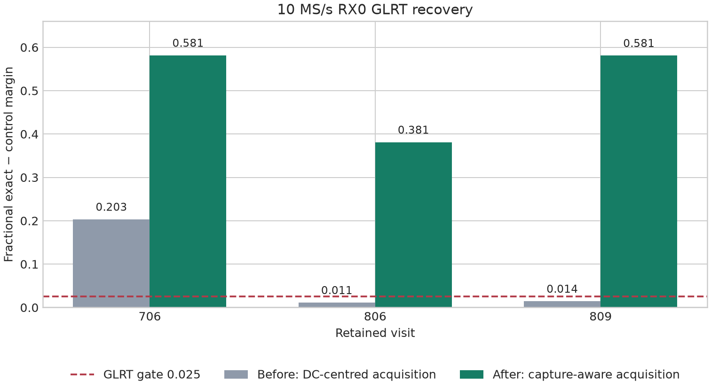
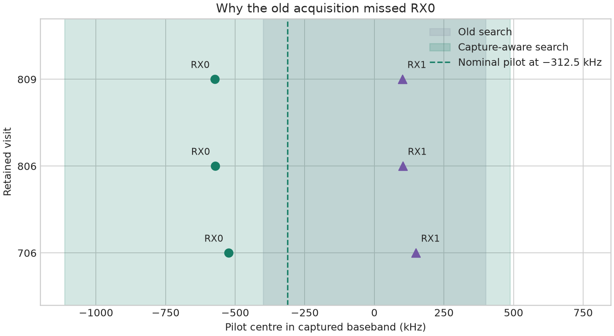

# Adaptive GLRT tuning failure, recovery, and correction

## Scope and outcome

Read-only native-rate replay of five selected retained visits from two sessions.
No downsampling, new RF, production code changes, or published-result changes.
This is a mechanistic diagnostic on selected examples, not randomized cohort
validation or a measurement of the population-wide miss/false-positive rate.

Numerical runtime: production release
`5b75347a636fce413e7514efc2d0911d6eb7759f`. Replay:
`2026_09_25_glrt_tuning_replay.py`; numerical output:
`2026_09_25_glrt_tuning_replay.jsonl` in this directory.

All modes use the same first 20 ms, native sample rate, GLRT scorer, fractional
refinement, and 0.025 margin gate. In-memory counter-word masking is identical
between modes. The script only masks high-amplitude rows whose eight bytes
decode to the recorded sample counter plus two; this diagnostic does not repair
the archive or certify the rest of the samples as uncontaminated.

Baseline uses the adaptive configuration's default 8 candidates and a zero
frequency reference with +/-400 kHz acquisition. Tuning-only changes only the
frequency reference, derived from channel/edge, nominal LNB frequency and
recorded actual LO. A separate tuning-wide trial uses +/-800 kHz around that
reference. Neither trial uses receiver-fitted offsets or cross-RX timing.

## Results

All table entries are best completed **fractional** GLRT margins from replay,
not the earlier guided integer scores or historical UI outputs.

| Session / visit | Rate | Baseline RX0 / RX1 | Tuning-only RX0 / RX1 | Tuning-wide RX0 / RX1 |
|---|---:|---:|---:|---:|
| `4fd51c7c4c1a0273` / 706 | 10 MS/s | 0.2032 / 0.7407 | 0.5813 / 0.3681 | 0.5813 / 0.7407 |
| `4fd51c7c4c1a0273` / 806 | 10 MS/s | 0.0110 / 0.4358 | 0.0110 / 0.2213 | 0.0005 / 0.4358 |
| `4fd51c7c4c1a0273` / 809 | 10 MS/s | 0.0142 / 0.6223 | 0.5808 / 0.4687 | 0.5808 / 0.6223 |
| `84ded59806e73af6` / 705 | 2.5 MS/s | 0.4131 / 0.4179 | 0.4131 / 0.4179 | 0.4131 / 0.4179 |
| `84ded59806e73af6` / 707 | 2.5 MS/s | 0.4140 / 0.4422 | 0.4140 / 0.4422 | 0.4140 / 0.4422 |

Full session IDs have prefix `scan-fw-`. Visit 809 was selected as the first
CH1-lower visit after 806, before inspecting its replay outcome. Controls 705
and 707 were previously inspected positives; they are not independent holdouts.

Visit 706's masked baseline still passes, but reports a different frequency
solution near -297 kHz. The corrected result is near -524 kHz at the same epoch.
It is not a new binary detection. Visit 809 is a genuine miss-to-pass recovery:
RX0 is near -573 kHz, epoch 11338; RX1 near +101 kHz, epoch 11336. Strong margins
and near-matched epochs do not by themselves establish satellite identity.

For visit 806, tuning-wide candidate-budget trials produce RX0 margins:

| Retained candidates | Best fractional margin | Outcome |
|---:|---:|---|
| 8 | 0.00046 | Below gate |
| 32 | 0.01323 | Below gate |
| 64 | 0.01323 | Below gate |
| 128 | 0.38087 | Above gate; epoch 8651, CFO -571547 Hz |

RX1 independently acquires epoch 8652. The 128-candidate recovery is blind:
neither that epoch nor that frequency is supplied to acquisition. In an initial
single-threaded run, RX0 replay cost approximately 4.38 seconds at 128 candidates
versus sub-second work at 8. These are illustrative timings, not a queue benchmark.

Conclusions: incorrect tuning coordinates cause misses and distorted frequency
solutions; narrow residual coverage degrades RX1; coarse global shortlist
selection can still discard a real signal after correcting frequency geometry.
Simply shifting the existing +/-400 kHz window is not a complete fix.

The +/-800 kHz trial is diagnostic, not a proposed universal policy. At 2.5 MS/s
its full prior plus the complete eight-tone template exceeds the physical
passband, although the detected control candidates themselves are observable.
A production geometry compiler must reject or explicitly restrict that prior.

## Implemented correction

1. **One frequency-coordinate compiler, shared by every adaptive analysis path.**
   Reuse/extend `analysis/starlink/pilot_search_geometry.py`, already consumed by
   Standard native full-capture/stateful analysis. The adaptive detector currently
   bypassed it and supplied `center_hz=0`. The adaptive adapter now passes an
   immutable `Glrt64SearchGeometry`, not infrastructure or storage models.

   Define `nominal_baseband = pilot_RF - nominal_LNB_LO - effective_IQ_center`.
   The effective IQ center must describe the actual sample coordinate, incorporating
   any *applied* digital translation with an explicit sign. Requested target minus
   actual LO is not proof that a digital translation was applied. The current replay
   uses actual LO; the 2.5-MS/s metadata differs from requested tuning by only 2 Hz.

2. **Separate known tuning from uncertain receiver/Doppler frequency.**
   Acquisition searches `nominal_baseband + receiver_prior + residual_grid`.
   The correction uses the same independently labelled reference for each receiver
   and an 800 kHz residual uncertainty policy; it does not fit either receiver's
   observed offset or use the other RX's CFO/timing. The policy is intersected with
   the observable capture geometry below. No sample-rate-specific branch or fitted
   offset from these examples enters the path.

3. **Derive admissibility from the capture and template.**
   With usable baseband `[L,U]` and template tone extrema `[t_min,t_max]`, admissible
   pilot centers lie in `[L-t_min,U-t_max]`. Intersect this with the declared search
   prior. The implementation uses actual rate, bandwidth, LNB frequency and LO—not
   a `rate == 10M` branch—and fails if no complete template is observable. At 10 MS/s
   in these examples the nominal centre is -312.5 kHz and the residual policy is
   +/-800 kHz. At 2.5 MS/s the complete-template geometry limits the symmetric search
   to +/-429687.5 Hz, so it never requests an unobservable +/-800 kHz band.

4. **Bounded stronger-anchor fallback.**
   Every receiver first uses the existing 12-symbol coarse timing acquisition and
   eight-candidate output budget. Only when one receiver has independent fractional
   GLRT evidence and its peer does not, the missing peer is reacquired with 22 evenly
   spaced anchor symbols. It still searches its own frequency/timing and must pass its
   own exact-minus-control GLRT. Candidate count and the 0.025 gate are unchanged.
   This recovers visit 806 with eight candidates; it avoids the diagnostic 128-candidate
   default and avoids extra work when neither receiver has evidence.

5. **Preserve scientific and publication semantics.**
   No published major-version model or stored historical result is mutated. New
   analysis is bound to its immutable release SHA; old products remain readable.
   Timestamp-word validity remains a separate source-framing issue; diagnostic
   zeroing is not included in the production correction.

## Corrected replay through the integrated detector

The integrated detector was run on the first native 20 ms probe with its normal
eight-candidate output budget and bounded peer fallback. The resulting RX0/RX1
fractional margins were 0.5813/0.7407 (visit 706), 0.3809/0.4358 (visit 806),
and 0.5808/0.6223 (visit 809). Visit 806 epochs are 8652 and 8653 samples.
The full adaptive visit path was also executed for visit 806: both receivers
passed on all eleven probes, with RX0 margins 0.3123 through 0.5369 and RX1
margins 0.4112 through 0.5820. That full diagnostic took 94.6 seconds with
numerical-library threads deliberately limited to one; it is not a production
throughput benchmark.

## Verification gates and follow-up

- Existing geometry tests: 11 passed locally, including lower/upper edges and
  synthetic native 10-MS/s recovery outside the old zero-centred window.
- Adaptive-adapter tests now prove actual tuning reaches the shared compiler;
  arbitrary signed offsets and nominal LNB values; 2.5/5/7.5/10 MS/s; passband
  failures; stable frequency units; and explicit missing-metadata behavior.
- Continue testing frequency-translation invariance and physical-time timing tolerances across
  rates, plus retained-candidate diversity and bounded runtime.
- Freeze the selected diagnostic examples, then validate on reproducibly randomized
  whole-scan holdouts with a recorded seed/group assignment. Fit receiver priors only
  on training groups. Include quiet/noise and timestamp/impulse negatives; expanding
  a search changes the number of tested hypotheses and therefore false-alarm risk.
- Shadow replay before deployment; compare both-RX recovery, false alarms, frequency
  aliases, per-probe latency, and queue throughput. Do not infer production readiness
  from these five selected positive-oriented examples.

## Post-deployment live verification

The correction was deployed to the adaptive analysis queue/worker units as immutable
release `a49b686331d65fa08db60c77e33c6bd05c2c3378`. One explicitly bounded 30-second
10-MS/s adaptive capture, `scan-fw-776915aa0fb2df2f`, then delivered 220 dual-RX
visits with manual gain, zero invalid/skipped/cancelled visits, and exact radio
restoration. It is API-visible and was admitted to the deployed analysis queue.

Two strong upper-edge visits were replayed through the deployed release, using the
native first 20-ms probe and normal eight-candidate output budget:

| Visit | RX | Old zero-centred margin | Deployed margin | Deployed CFO | Epoch |
|---:|---:|---:|---:|---:|---:|
| 198 | 0 | 0.29604 | 0.29604 | +141350 Hz | 2153 |
| 198 | 1 | 0.00059 | **0.49481** | +801623 Hz | 2155 |
| 202 | 0 | 0.39073 | 0.39072 | +139483 Hz | 9225 |
| 202 | 1 | 0.00615 | **0.55294** | +799659 Hz | 9225 |

The gate is 0.025. In both examples the old path missed RX1 and the deployed path
recovers it while retaining RX0. The compiler derived a +312.5-kHz nominal pilot
centre and +/-800-kHz residual policy from the upper-edge capture metadata. Neither
receiver CFO nor epoch was fitted into the search. A third inspected visit retained
strong RX1-only evidence (0.57254 versus RX0 0.00426), so the correction does not
force artificial dual-RX outcomes.
