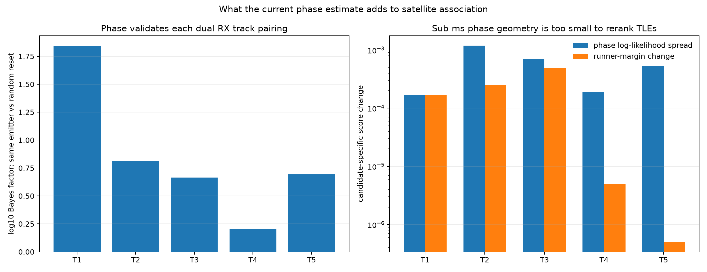

# Phase-assisted satellite association on five tracks

## Result

The present phase estimate **tightens association at the dual-receiver track-pair
level**, but it does **not yet distinguish candidate TLEs directly**.

Using the independent 10 MS/s track to calibrate a zero-centered circular phase
model, every one of the five frozen 2.5 MS/s RX0/RX1 track pairings receives
positive phase evidence against an independent random-reset model:

| Track | Adjacent edges | Same-emitter phase Bayes factor | Doppler leader |
|---|---:|---:|---:|
| T1 | 3 | `69.5` | 58679 |
| T2 | 2 | `6.52` | 68269 |
| T3 | 1 | `4.62` | 64165 |
| T4 | 1 | `1.60` | 69263 |
| T5 | 1 | `4.92` | 69339 |

This makes phase useful as an independent gate before fusing the two receiver
Doppler tracks. T1 has strong phase support; T2, T3, and T5 have modest support;
T4 is only weakly positive. This evidence should be recorded as support for the
physical RX0/RX1 pairing, not multiplied into every candidate TLE as though it
were candidate-specific.



## Direct TLE discrimination check

For each track, the common top candidates from both frozen receiver reviews were
propagated at the exact analysis-window centers surrounding every boundary. The
known horizontal east–west 8 cm baseline was used, with one global RX-order sign
for the whole cohort. No phase intercept was fitted.

Across all tested candidates and edges, predicted geometric boundary changes span
only `−0.00385°` to `+0.01954°`. That is several orders of magnitude below the
current `1.8–44°` held boundary residuals. Consequently:

- none of five Doppler-leading candidates changes rank;
- the largest candidate phase log-likelihood spread is only `0.00119`;
- the largest runner-margin change is `0.000488` in the adopted Doppler log-cost;
- the two global receiver-order signs differ in score by only `0.00084`, so the
  sign remains unresolved.

The honest conclusion is that sub-millisecond boundary phase cannot yet rerank
TLE candidates. Its immediate association value is validating that the RX0 and
RX1 Doppler tracks belong to the same emitter, allowing their evidence to be
fused with greater confidence.

## Scoring method

The independent calibration has circular concentration `R = 0.9109`, converted
to a von Mises concentration of `κ = 5.900`. For each track, the phase evidence
for a common emitter versus a uniform phase reset is

```text
log BFphase = Σe [κ cos(boundary_residual[e]) − log I0(κ)]
```

This is zero-centered and uses no global or per-track phase intercept. The
calibration track is not one of the five evaluation tracks.

For the diagnostic TLE test, the candidate prediction on an east–west baseline is

```text
Δφcandidate = 360° · fRF · B / c · (ûE(t1) − ûE(t0))
```

The Doppler fusion diagnostic uses the sum over receivers of observation count
times the logarithm of randomized-evaluation RMS. This is a transparent report
score, not a replacement for the persisted association contract.

## Recommended operational use now

1. Form candidate RX0/RX1 track pairs using the existing phase-blind time,
   channel, and Doppler criteria.
2. Compute adjacent-boundary phase evidence with the frozen estimator.
3. Reject or defer pairings with negative phase log Bayes factor; distinguish
   weak support such as T4 from strong support such as T1.
4. Fuse receiver Doppler/TLE evidence only after that phase validation.
5. Keep phase out of candidate-specific TLE ranking until a stitched path spans
   enough time for predicted east–west geometry to exceed phase uncertainty.

The next threshold is therefore a seconds-long stitched phase path or an
independently calibrated differential oscillator. Boundary continuity alone is
already useful for association integrity, but it must not be presented as
satellite-identity evidence.

The frozen inputs are in [selection.json](selection.json), the reproducible
analysis is in [analyze.py](analyze.py), and detailed scores are in
[results.json](results.json).
