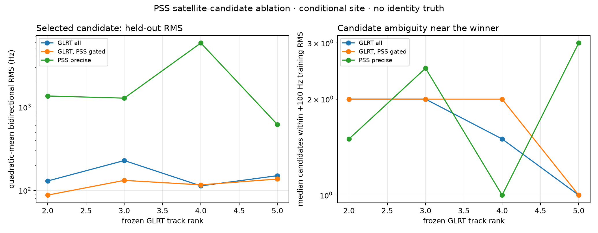

# PSS gain in conditional satellite-candidate ranking

## Result

PSS helps these cases primarily as a **track-membership gate**, not yet as a
replacement Doppler observable.

On the four GLRT tracks with a coherent PSS reconstruction, retaining the GLRT
CFO only at PSS-supported visits:

- lowers the median selected-candidate bidirectional holdout RMS from 139.8 Hz
  to 124.1 Hz, an **11.2% reduction**;
- raises forward/reverse candidate agreement from 3/4 tracks to **4/4**;
- leaves the median runner-up margin essentially unchanged, 103.4 Hz to
  105.0 Hz; and
- does not reduce local catalogue crowding: the median candidate count within
  100 Hz of the winner changes from 1.75 to 2.0.

The benefit is therefore modest but real: PSS removes some GLRT support that
hurts out-of-sample orbit-shape prediction and resolves track 3's directional
ranking disagreement. It does not make the candidate catalogue uniquely
identified.

Using the refined PSS carrier itself is not beneficial yet. Its median held-out
RMS is 1,322.6 Hz, **9.46 times the all-GLRT baseline**, and only 1/4 tracks
selects the same candidate in both time directions. The approximately 1--2 Hz
formal within-visit PSS phase-slope precision does not overcome the previously
measured long-arc estimator bias.

| GLRT rank | all-GLRT holdout RMS | PSS-gated GLRT RMS | change | same candidate both directions, before -> after | gated conditional candidate |
|---:|---:|---:|---:|:---:|---|
| 2 | 129.5 Hz | 87.6 Hz | **32.4% better** | yes -> yes | STARLINK-37259 / NORAD 68972 |
| 3 | 228.1 Hz | 131.7 Hz | **42.3% better** | no -> yes | STARLINK-37259 / NORAD 68972 |
| 4 | 113.1 Hz | 116.4 Hz | 2.9% worse | yes -> yes | STARLINK-32945 / NORAD 63118 |
| 5 | 150.0 Hz | 136.8 Hz | **8.8% better** | yes -> yes | STARLINK-34787 / NORAD 65204 |

Track 1 has no coherent PSS timing reconstruction under the frozen policy, so
PSS abstains rather than adding identification evidence. Its all-GLRT fit is
directionally stable at 141.6 Hz held-out RMS, with STARLINK-30584 / NORAD
58089 as the conditional candidate, but that label is not independently
verified.

## Controlled comparison

The five tracks and their ordering remain frozen by the preceding GLRT-only
selection. For each track, the experiment compares:

1. all GLRT track points;
2. GLRT CFO on only the visits belonging to the independently associated PSS
   timing track; and
3. inter-frame-phase refined PSS CFO on that same PSS support.

Every arm uses the same causal Space-Track catalogue, the conditional
`spinnaker-sausalito` observer preset, and the same constant-CFO nuisance model.
A candidate is selected using 60% of the arc and evaluated on the held-out 40%,
first forward and then in reverse. PSS never sees a satellite label while
forming a timing track.

The snapshot was collected at 2026-09-25 12:05:00.389100001 UTC, 5,101.7
seconds before the first-sample estimate, and has SHA-256
`a96938544b511b6d4772cd00371e5a4acdfbd73565352e966b8c82781bb6f132`.
Each track still has 497--512 geometrically visible catalogue candidates (527
for track 1), before Doppler-shape ranking.

## Claim boundary

This experiment measures **conditional candidate-ranking consistency**, not
identification accuracy: there is no verified spacecraft label for these
signals. The observer location is an external preset rather than capture-bound
GPS, the first-sample host bracket is 363.7 ms wide, antenna boresight is
unknown, and both observables come from the same IQ. TLE and propagation errors
also remain.

The defensible operational use is therefore:

- use PSS timing continuity to validate or split a GLRT track;
- retain GLRT as the orbit-ranking Doppler observable; and
- treat the resulting NORAD label as a candidate until a longer/repeated arc or
  independent geometry closes the identity.

## Artifacts

- `figures/2026_09_25_pss_identification_gain/summary.json`
- `figures/2026_09_25_pss_identification_gain/candidate-ledger-top25.csv`
- `figures/2026_09_25_pss_identification_gain/glrt-all-points.json`
- `figures/2026_09_25_pss_identification_gain/pss-identification-gain.png`
- `figures/2026_09_25_pss_identification_gain/analyze.py`
