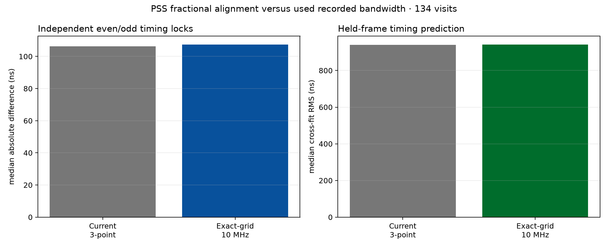

# Full-recorded-bandwidth PSS fractional alignment

## Result

The current PSS timing estimator is **not limited by its three-point fractional
peak interpolation** on these recordings.

Replacing that interpolation with exact spectral evaluation of the published
PSS waveform on a 1/64-sample grid across all recorded 10 MHz produced no
repeatable improvement over the same 134 frozen visits and 12,060 PSS frames:

| Validation metric | current log-parabola | exact-grid 10 MHz | change |
|---|---:|---:|---:|
| Median absolute even/odd lock difference | 106.19 ns | 107.30 ns | +1.10 ns |
| RMS even/odd lock difference | 186.11 ns | 186.23 ns | +0.13 ns |
| Median held-frame cross-fit RMS | 939.66 ns | 940.77 ns | +1.11 ns |
| Median per-frame residual MAD | 529.33 ns | 529.79 ns | +0.46 ns |

For the even/odd metric, the visit-resampled 95% interval for exact-minus-current
is -7.03 to +6.16 ns. For held-frame prediction it is -6.39 to +3.27 ns. Both
contain zero comfortably. Exact timing improves 63/134 even/odd comparisons and
75/134 held-frame comparisons, rather than showing a consistent population-wide
gain.

Only 2/12,060 exact full-band estimates reach the +/-0.75-sample grid boundary.
A noisy synthetic validation recovers seven declared fractional shifts with a
maximum error of 0.0246 sample (2.46 ns at 10 MS/s). The null result is therefore
not explained by a broken delay sign or a generally truncated full-band search.

## What “full bandwidth” means here

The saved IQ contains a 10 MHz edge slice of the native 240 MHz PSS waveform.
The existing matched filter already projects the published waveform across that
entire recorded slice. This experiment improves the *fractional evaluation* of
that full recorded bandwidth; it cannot recreate the missing 230 MHz.

The 2.5 and 5 MHz sensitivity variants are retained in the ledger but are not
used for a scientific comparison. Their optima reach the fractional-grid edge
for 50.5% and 21.2% of frames because their broader correlation lobes need a
fresh wider integer-delay search. The valid 10 MHz arm has a 0.017% edge rate.

## Carrier consequence

Recomputing correlation phase at the exact fractional epoch also leaves the PSS
carrier result essentially unchanged:

| track | prior refined median error | exact-timing median error | exact-timing RMSE | exact PSS-minus-GLRT rate |
|---:|---:|---:|---:|---:|
| 2 | 1.019 kHz | 1.010 kHz | 1.169 kHz | +0.208 kHz/s |
| 3 | 4.713 kHz | 4.719 kHz | 5.918 kHz | +0.919 kHz/s |
| 4 | 2.599 kHz | 2.590 kHz | 3.022 kHz | -0.645 kHz/s |
| 5 | 1.101 kHz | 1.106 kHz | 1.440 kHz | +0.401 kHz/s |

The long-arc bias that made direct PSS carrier ranking worse than GLRT is not a
fractional-epoch interpolation error.

## Interpretation and next improvement

The approximately 0.1--0.2 microsecond visit-center repeatability is currently
limited by recorded bandwidth, per-frame SNR, channel/template mismatch, and
unknown analogue passband phase rather than the numerical location of the
matched-filter peak.

The next defensible improvements are:

1. fit timing and carrier jointly across frames/visits with a PSS-only dynamical
   state, while retaining time- and frequency-disjoint validation;
2. measure the receiver/LNB complex response and include it in the PSS template;
3. continue using PSS timing as a GLRT track gate while retaining GLRT Doppler
   for orbit ranking; and
4. if materially wider PSS timing is required, make a separately authorized,
   bounded wider-band recording rather than inferring unrecorded bandwidth.

There is no evidence here to replace the current production fractional peak
with the more expensive exact-grid evaluator.

## Artifacts

- `figures/2026_09_25_pss_wideband_fractional_alignment/summary.json`
- `figures/2026_09_25_pss_wideband_fractional_alignment/visit-metrics.csv`
- `figures/2026_09_25_pss_wideband_fractional_alignment/pss-wideband-fractional-alignment.png`
- `figures/2026_09_25_pss_wideband_fractional_alignment/analyze.py`
