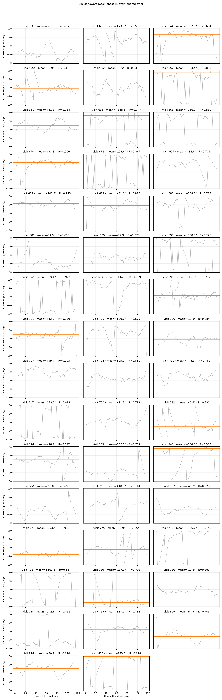
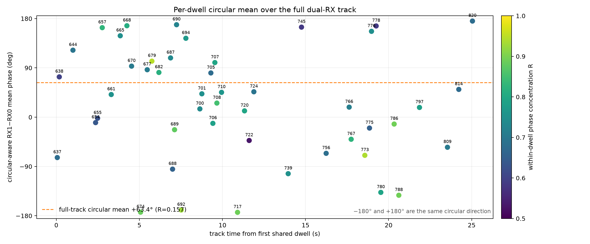
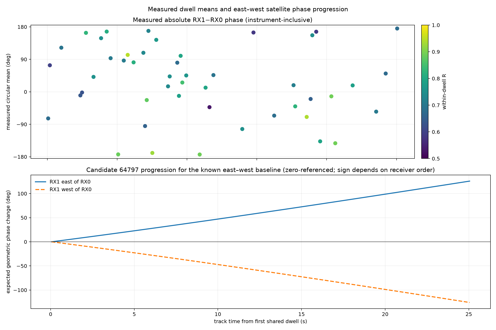
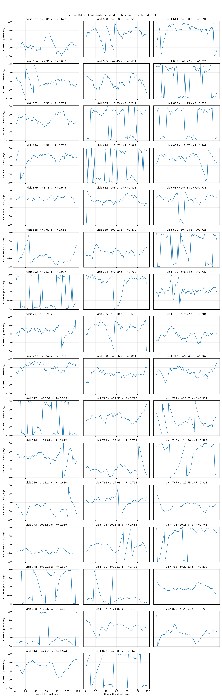
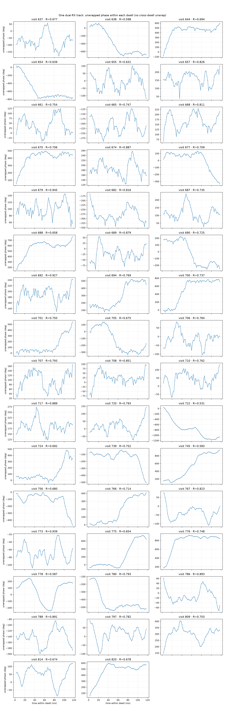
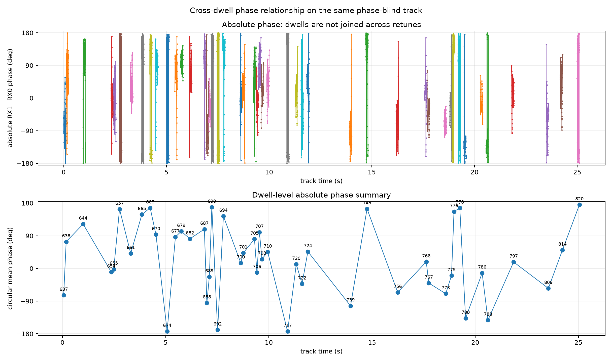
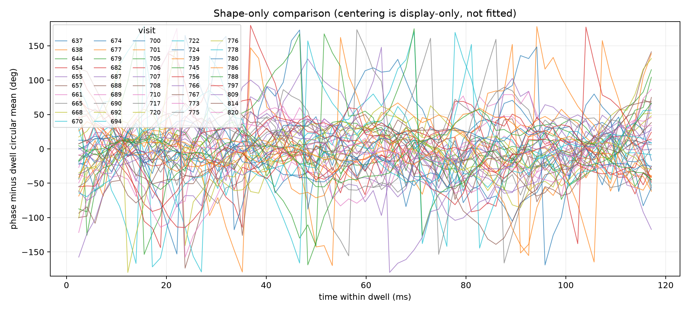

# Phase across every dwell of one dual-RX track

## Result

The selected 10 MS/s CH4-lower track is present in both receivers for **47 exact
shared dwells over 24.99 s**.  Within a dwell, direct-IQ RX1−RX0 phase is usually
trackable: the median circular concentration is **R = 0.748** and the minimum is
`0.531`.

The absolute phase does **not** continue predictably from one dwell to the next.
The 47 dwell means have circular concentration `R = 0.157`, which is ordinary
under a uniform-phase null (`p = 0.317`).  Adjacent wrapped changes have
`R = 0.089`, a median magnitude of `90.46°`, and are no more ordered than random
dwell permutations (`p = 0.694`).  Therefore this capture supports local phase
tracking inside each dwell, but not direct phase transport across scanner
retunes.

## Circular-aware dwell means

For each dwell, the orange line below is the amplitude-weighted circular mean,
computed as `angle(Σ |z[k]| exp(j phase[k]))`. It is therefore not the ordinary
arithmetic average of wrapped degree values. `R` in each title gives the length
of the normalized mean vector.



The same 47 circular means are plotted against their acquisition time below.
Markers are not connected because doing so would imply a resolved phase path
and integer cycle count across retunes. Color shows each dwell's within-dwell
phase concentration.



## Expected satellite phase progression

The candidate-only association for this physical group is catalogue 64797.
Using its frozen TLE, the Sausalito observer site, `11.46 GHz`, and the known
horizontal east–west `8 cm` mechanical baseline gives the geometric phase-change
curve below. Both signs are retained because we have not yet established whether
RX1 is physically east or west of RX0.



Every model curve is zero-referenced to the first shared dwell. No measured
phase intercept is fitted or applied. Over 24.99 s, the candidate predicts
approximately `+126°`, or `−126°` with the receiver ordering reversed. The
measured absolute dwell means do not follow this smooth curve because their
receiver phase gauge changes between retuned acquisitions.



The unwrapped view below removes only the ±180° plotting discontinuities inside
each dwell.  It does not join dwells or estimate missing cycles.



## Same-track relationship

The upper plot places all window estimates on the track time axis without
drawing across gaps.  The lower plot is the weighted circular mean of each
dwell.  Its scatter is the main evidence against an absolute cross-dwell phase
relationship.



If each dwell mean is subtracted for display only, the residual shapes have
moderate similarity: median all-pairs shape concentration is `0.570`.  However,
adjacent dwells are not more similar (`0.568`, order-permutation `p = 0.514`).
That points to repeatable within-dwell receiver/channel structure, not a phase
trajectory carried along the track.



## Exactly what was computed

The phase-blind persisted trajectory supplies the RX0 and RX1 track IDs.  Their
exact intersection contains visits 637 through 820 (47 non-contiguous visits).
No phase value selected the track or its dwells.

For every dwell, each plotted point is one `32,768`-sample Hann-windowed direct
cross-product, with a `16,384`-sample stride (71 points per 120 ms dwell):

```text
z[k] = Σn hann[n]^2 · conj(RX0[n]) · RX1[n]
       · exp(-j 2π carrier_correction[n])
phase[k] = angle(z[k])
```

All dwells use the same phase-blind session carrier seed, `674,853.358 Hz`.
Only relative frequency and relative frequency rate are refined from the whole
dwell.  The fit has:

- relative timing delay fixed to exactly zero;
- identity channel response (no complex response correction);
- no global or per-dwell phase intercept;
- no chronological holdout and no cross-dwell phase unwrap.

Consequently, the displayed absolute dwell phase retains the receiver phase at
the start of each acquisition.  A retune can change that phase gauge, and the
data show that it does.  Recovering a phase observable that transports between
dwells will require either continuous phase authority across retunes or an
independent calibration/reference that measures the retune-induced phase jump.

The reproducible analysis is in [analyze.py](analyze.py), its checks are in
[test_analysis.py](test_analysis.py), and all numerical evidence is retained in
[results.json](results.json).
