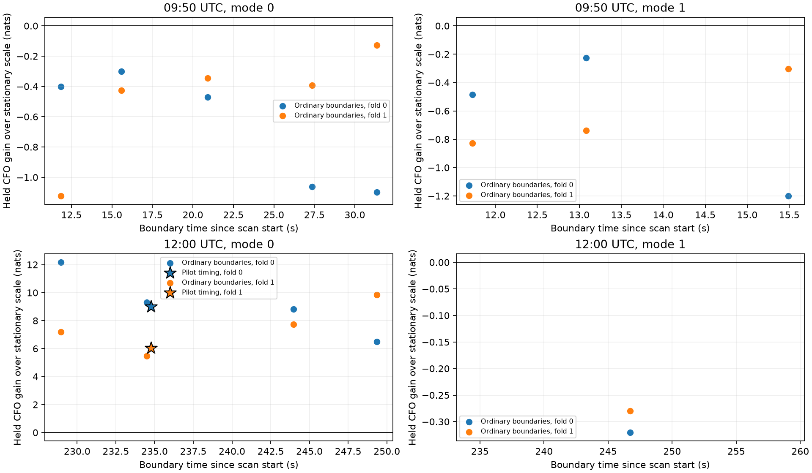

# Does pilot timing identify a useful uncertainty boundary?

**The 12:00 track benefits from nonstationary CFO uncertainty, but the pilot-timing boundary is not uniquely informative in this test.** Several ordinary time splits improve prediction as much or more. The smooth control tracks worsen under every eligible forced split. A timing-triggered model avoids those unnecessary splits, but does not beat a generic boundary-mixture model on the problematic track.

This qualifies the [separate-episode result](SEGMENT_ASSOCIATION.md): the earlier +8.990/+6.031 nats are real conditional predictive gains, but cannot be attributed specifically to the timing cue. This is a retrospective control experiment on four existing development tracks, not unseen-scan validation or proof of satellite identity accuracy.

## Design

For each of the two tracked modes in the 09:50 and 12:00 DS5 scans, propose ordinary boundaries at acquisition-time quantiles 0.25, 0.375, 0.5, 0.625 and 0.75. The proposals depend on timestamps only. A split requires at least three training and three held CFO blocks on each side. This leaves 26 eligible ordinary comparisons across two folds; 14 lack enough support and are recorded as ineligible rather than scored as zero. We also retain the supported pilot-timing boundary in the first 12:00 mode, giving two more comparisons.

Every tested model keeps one identity, one orbital-time hypothesis and one CFO intercept. Only the residual scale can differ across the boundary. Scale priors, timing integration and per-fold candidate banks are fixed across boundaries. The first 12:00 mode uses the preceding segment-catalogue proposal union; the other tracks use their preceding original banks. Those different search histories are a limitation of cross-track comparison. No new catalogue search, raw extraction or acquisition was performed.

All observations remain present. Block grouping matches the previous experiments, including the supported-break subdivision of one second in the first 12:00 mode. Ordinary controls divide the existing blocks according to their mean observation times. That block discretization is another reason this is not an exact randomized boundary-location significance test.

| Track | Fold | Ordinary-boundary gain range | Pilot-boundary gain |
|---|---:|---:|---:|
| 09:50 mode 0 | 0 | −1.097 to −0.300 nats | No supported break |
| 09:50 mode 0 | 1 | −1.124 to −0.127 nats | No supported break |
| 09:50 mode 1 | 0 | −1.201 to −0.227 nats | No supported break |
| 09:50 mode 1 | 1 | −0.829 to −0.304 nats | No supported break |
| 12:00 mode 0 | 0 | +6.497 to +12.167 nats | +8.990 nats |
| 12:00 mode 0 | 1 | +5.474 to +9.839 nats | +6.031 nats |
| 12:00 mode 1 | 0 | −0.320 nats, one eligible control | No supported break |
| 12:00 mode 1 | 1 | −0.280 nats, one eligible control | No supported break |

The ordinary ranges are descriptive; selecting the best held boundary would bias the conclusion. The figure shows all eligible controls, not only the best ones. The two folds reuse the same tracks and are not independent population samples.

## Compare model mixtures without selecting a favorable held result

As an exploratory follow-up, assign half the prior probability to stationary uncertainty and half equally across proposed boundaries. A generic model proposes the eligible ordinary boundaries. A timing-triggered model proposes the supported pilot boundary, or remains stationary if none exists. Conditional prediction uses training evidence to weight the models; held values never select a boundary or its weight. The half/half prior was declared after examining the controls, so this remains development analysis.

| Track | Fold | Timing-triggered mixture gain | Generic mixture gain |
|---|---:|---:|---:|
| 09:50 mode 0 | 0 | 0.000 | −0.126 |
| 09:50 mode 0 | 1 | 0.000 | −0.071 |
| 09:50 mode 1 | 0 | 0.000 | −0.153 |
| 09:50 mode 1 | 1 | 0.000 | −0.153 |
| 12:00 mode 0 | 0 | +7.519 | +8.412 |
| 12:00 mode 0 | 1 | +5.871 | +6.987 |
| 12:00 mode 1 | 0 | 0.000 | −0.089 |
| 12:00 mode 1 | 1 | 0.000 | −0.077 |

Values are held CFO predictive gains in nats relative to the same stationary model. Zero for the timing-triggered smooth controls is by construction, not an independent demonstration of perfect gating. Generic model averaging substantially reduces the harm from forcing a split on those tracks. On the problematic track it outperforms the timing-triggered mixture by 0.892 and 1.116 nats.

## Consequence for association and tracking

The supported finding is a need to handle nonstationary residual uncertainty in the problematic track. The evidence is insufficient to claim that a pilot phase/timing discontinuity pinpoints its cause, optimal boundary or satellite identity. In particular, do not hard-split identities or reset CFO offsets from this cue. The preceding carrier-phase comparisons remain negative under the stronger uncertainty model.

A useful next test is a **causal quality-state model** that compares a generic transition prior against one modulated by supported timing innovations. Freeze both models before applying them to additional tracks. Predict each subsequent dwell without using future timestamps, residuals or boundary proposals. Report predictive likelihood and identity ambiguity separately from the additional contribution of carrier phase. The current quantile-boundary design knows the complete observation schedule and does not establish online tracking performance.

## Reproduction and verification

Run `python boundary_controls.py` then `python boundary_controls_summary.py` in the parent report's scientific environment. The complete controls and mixture pass takes approximately 21 seconds, with 0.025 s timing spacing. Candidate completeness, grid convergence for these new comparisons and external identity truth remain unresolved; the limitations in the parent reports still apply.

[boundary_controls.py](boundary_controls.py) computes the shared-offset, separate-scale likelihood from sufficient statistics. [Tests](test_boundary_controls.py) compare it with explicit scale-pair integration, verify held-data changes cannot alter training evidence, and check the model-mixture calculation. Segment-regression tests verify unchanged block coverage and the underlying covariance integral. The combined receipt records **nine passing tests** in [tests.xml](boundary-controls/tests.xml). [results.json](boundary-controls/results.json) retains every eligible and ineligible boundary, training/full evidence and both model-mixture scores; [summary.json](boundary-controls/summary.json) supports the table and plot.
