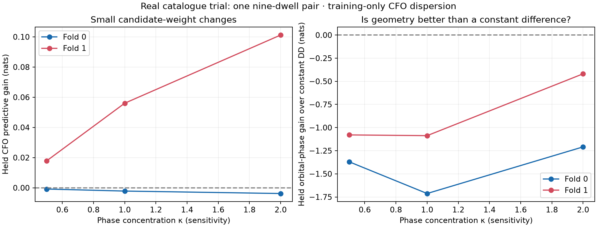

# Real catalogue trial: association improvement remains unproven

The phase replay now connects to actual DS5 orbit-catalogue hypotheses. This is progress beyond simultaneous-signal consistency, but it does **not** yet demonstrate a reliable improvement in satellite association. On the one sufficiently recurrent pair, phase changes candidate weights slightly without changing the top identity pair, and the orbital phase model predicts held phase worse than a simple constant double difference.

## Verified association inputs

The prior phase replay reconstructed tracks using eight-observation/four-second minimum support. Production DS5 TLE inputs use six observations/three seconds. Reconstructing with the production configuration reproduces all three earlier DS5 evidence digests and causal catalogue snapshot digests. Track counts are **39, 52 and 52**. [catalogue-input-audit.json](catalogue-input-audit.json) records exact candidate joins, aliases and source digests.

Same-epoch, frequency-alias-equivalent acquisition candidates increase the recurrent 09:50 track pair from **4 to 9 dwells**: 1838, 1839, 1843, 1853, 1859, 1873, 1874, 1882 and 1891. A match requires epoch agreement within three samples and frequency agreement within 2 kHz after an integer pilot-symbol alias lift; only unique receiver-level track matches are used. This changes the association link, not the original IQ mixing frequency or extracted phase. These remain physical-signal hypotheses, not proven satellite identities.

The 07:20 and 12:00 replay subsets do not supply a four-visit recurring production-track pair under this rule. They are retained in the coverage denominator and not assigned catalogue-phase success.

Earlier DS5 reports also provide a fixed reference observer coordinate and the archived TLE snapshot authority. The trial uses that coordinate as a **conditional diagnostic site**, not a new survey or a phase-derived receiver location. No current web catalogue is substituted for the causal archived elements.

## Protocol

- Search the full eligible Starlink catalogue at zero orbital timing offset; select four candidates per track using training CFO evidence only. Score the 16 candidate pairs.
- Use one constant CFO offset per track, analytically integrated under a broad prior. CFO evidence averages observations in occupied-second blocks.
- Bind CFO and phase samples from a dwell to its **visit-start second** before partitioning, preventing different midpoint conventions from splitting raw support across train and evaluation.
- The initial hash partition leaves only one phase-training dwell, even after alias linking. That cannot provide candidate-dependent evidence with a free phase intercept. Initial receipts remain available and are not promoted as a useful identity test.
- The balanced follow-up randomly assigns whole represented visit-start-second groups with seed 20260927, then evaluates both complementary folds. It uses 4 train / 5 held phase dwells in fold 0 and 5 train / 4 held in fold 1. CFO selection is rebuilt under those masks. These are retrospective development comparisons, not a fresh blinded dataset.
- Use one circular mean double difference per dwell, keeping the physical RF of both modes. Evaluate the candidate direction on the assumed horizontal 79° axis, integrate a signed baseline uniformly on −2 to +2 m in 0.01 m steps, and analytically integrate one constant phase intercept for the recurring pair.
- Report phase concentration sensitivities κ = 0.5, 1 and 2; none is calibrated against satellite phase truth. The illustrative baseline range is not installation authority.
- Evaluate a fixed 100 Hz CFO scale and a separate training-only dispersion sensitivity: `max(100 Hz, best candidate training RMS)`, fixed across each track's candidate set. The latter is about 843/860 Hz on one track and 100 Hz on the other. It acknowledges model mismatch; it does not identify the cause or correct the orbit model.

The phase update uses training phase only. Held CFO prediction measures the effect on candidate weighting. Held phase is separately compared both with uniform phase and with a **constant double-difference model**. Beating uniform phase alone does not establish that orbital geometry is useful.

## Results

For κ = 1:

| CFO noise treatment | Fold | Phase-induced held CFO log-score gain | Largest candidate-probability change | Top pair changed? |
|---|---:|---:|---:|---|
| Fixed 100 Hz | 0 | 0.0000 nats | effectively zero | No |
| Fixed 100 Hz | 1 | +0.0801 nats | below 10⁻¹⁵ | No |
| Training dispersion | 0 | −0.0022 nats | 0.00147 | No |
| Training dispersion | 1 | +0.0560 nats | 0.01264 | No |

A tiny posterior tail can affect a held log score even when the displayed posterior is numerically almost one. That is why the fixed-scale fold-1 score change is not an identity-resolution claim. The two folds also prefer different CFO-only pairs: **59526 / 67094** in fold 0 and **63678 / 67094** in fold 1. These catalogue numbers are competing hypotheses, not ground truth.

With training dispersion, the orbital phase model loses **1.713 and 1.087 nats** to the constant-double-difference predictor on the two folds at κ = 1. It loses to that simpler model at all three tested κ values. Positive predictability relative to uniform phase is therefore insufficient evidence for geometric association.



The nine visits span only about **7.18 seconds**. Baseline length, phase intercept, and nearly linear candidate projection can trade off over such a short interval. Residual extraction response and phase-branch effects may also matter. There is no independent satellite identity truth in this experiment.

## Consequence for the active objective

**Do not enable the orbital-phase update as a production association improvement yet.** The earlier simultaneous-donor tracking result remains useful evidence about common receiver phase, but it does not establish geometric identity information.

The next meaningful work is to obtain longer phase-supported overlaps for fixed candidate pairs, preserve explicit alias/epoch authority, and compare against the existing DS5 orbital-timing-marginalized CFO model. This trial fixes orbit timing to zero; it is deliberately not a fair replacement for that fuller baseline. The observed CFO mismatch and split-dependent candidate preferences make that comparison necessary before interpreting small phase-driven weight changes.

The goal of improving DS5 satellite association remains active. This report records a tested connection to real catalogue hypotheses and evidence limiting the current approach; it does not redefine completion as producing a likelihood interface or a favorable synthetic example.

## Reproduction

Use the same runtime and source tree recorded in [provenance.json](provenance.json), with read-only access to the DS5 reports, recording manifests, and `/var/lib/leo/tle` archive:

```sh
python catalogue_audit.py
python catalogue_trial.py --alias-equivalent --balanced-groups --fold 0
python catalogue_trial.py --alias-equivalent --balanced-groups --fold 1
python catalogue_trial.py --alias-equivalent --balanced-groups --fold 0 --calibrate-cfo-scale
python catalogue_trial.py --alias-equivalent --balanced-groups --fold 1 --calibrate-cfo-scale
python catalogue_summarize.py
python -m pytest test_phase_factor.py test_replay.py test_catalogue_trial.py -q
```

[catalogue-summary.json](catalogue-summary.json) includes all sensitivities and denominators. The `catalogue-*-protocol.json` files state the individual experiment settings; matching result JSON files retain shortlists, train masks, phase observations, posterior weights and held scores. `catalogue-trial-observation-bin-initial.json` is explicitly superseded by the visit-boundary-safe partition and must not be pooled with the balanced results.
