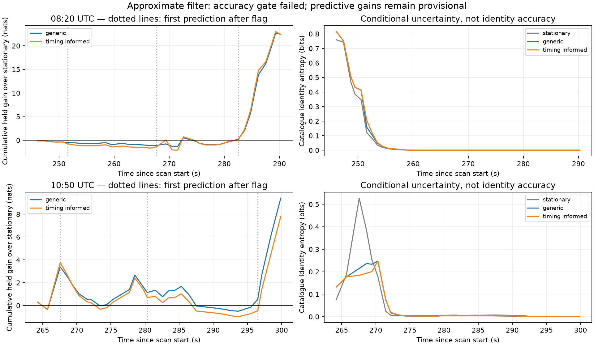

# Sequential quality prediction on two additional DS5 scans

**The new scans show promising adaptive-uncertainty scores, but the filter fails its numerical accuracy gate. These gains are provisional and must not be promoted to a validated association result.** The pilot-timing trigger adds no gain over generic quality changes in either scan under this approximate implementation.

This continues the [boundary-control experiment](BOUNDARY_CONTROLS.md) with two additional real DS5 recordings. No new collection or raw-IQ extraction was needed; the prototype uses persisted acquisition CFO and pilot timing.

| UTC scan start | Recording | Observed second blocks | Warm-up / scored blocks | Supported timing flags |
|---|---|---:|---:|---:|
| 08:20 | `scan-fw-4fc9ccc9f49e637b` | 48 | 8 / 40 | 3 |
| 10:50 | `scan-fw-382ca32cddbfdc6a` | 39 | 8 / 31 | 3 |

Both captures are 10 MS/s. The frozen selection rule chooses the RX1 production-input track with the most observed second bins, requiring at least 24 and retaining at most 64. Track membership and availability are selected from the completed scan. Consequently, **prediction conditional on those tracks is causal; the experiment is not an end-to-end online track-discovery test.**

## Prediction model

Catalogue proposals use only the first eight blocks. Each scan searches its full eligible catalogue on a 5 s orbital-time grid, retains the union of the top eight under mixed-scale, 100 Hz and 400 Hz evidence, and propagates retained candidates on a 0.2 s grid. Interpolation to 0.05 s supplies the sequential filter. Twelve candidates survive in each scan. The same reference observer coordinates and historical timing prior as the earlier reports remain assumptions.

All models keep a fixed identity, orbital-time hypothesis and static unknown CFO intercept. The latent residual scale takes one of the declared values from 3.125 to 1600 Hz.

- **Stationary:** the scale remains fixed but its posterior is learned sequentially.
- **Generic:** scale can be redrawn with probability `1 − exp(−Δt / 20 s)` between observations.
- **Timing informed:** the generic model plus an independent 0.5 redraw probability on the first prediction after a supported timing flag.

Timing flags use five earlier pilot epochs, permit extrapolation no longer than their span, and require an innovation above 44 samples at 10 MS/s. A flag in block `i` first affects prediction of block `i+1`. The current or future CFO value cannot choose its own uncertainty transition. Parameters were declared before examining these scans' predictive outcomes. They are development choices, not calibrated transition probabilities.

The filter scores each next block before updating its posterior. A Gaussian approximation merges the CFO-intercept distributions of alternative quality histories within each identity/time/scale state. That approximation is the failed accuracy check described below.

## Provisional real-data results



| Scan | Generic gain over stationary | Timing-informed gain over stationary | Timing increment over generic |
|---|---:|---:|---:|
| 08:20 | +22.466 nats | +22.433 nats | −0.032 nats |
| 10:50 | +9.402 nats | +7.803 nats | −1.598 nats |

These are held sequential CFO log-predictive scores from the approximate filter. They do not establish satellite accuracy or carrier-phase geometry. All three models finish with the same top candidate within each scan: 60023 at 08:20 and 63024 at 10:50. Those IDs are conditional catalogue hypotheses, not known identities. Posterior concentration and entropy in the figure must not be read as accuracy measurements.

This experiment uses acquisition pilot timing as a quality cue. It does not introduce new RX1-minus-RX0 carrier-phase measurements on these scans, and cannot validate the earlier distance or sky-location objective.

## Numerical accuracy gate: failed

For six known residuals `[0, 3, 1, 60, 40, 15]` Hz, two scale states of 5/50 Hz and a timing flag after the third observation, all 64 quality histories can be enumerated exactly. Each history's common-offset Gaussian integral is analytic. The required accuracy tolerance is 0.05 nats.

| Model | Approximate minus exact log evidence | Gate |
|---|---:|---|
| Stationary | 0.000 nats | Pass |
| Generic changes | −0.173 nats | **Fail** |
| Timing-informed changes | −0.379 nats | **Fail** |

The original accuracy assertion failed. The tolerance was not relaxed: [accuracy-audit.json](causal-quality/accuracy-audit.json) preserves `overall_accuracy_gate_passed: false`, and the plot/summary explicitly carry that failure. Software tests verify the stationary identity, causality and exact reference calculation; their passing status does **not** supersede the failed scientific accuracy gate.

The short-case errors are not upper bounds for the longer real tracks. In particular, the −0.032 nats timing increment at 08:20 is smaller than the demonstrated approximation error and should not be interpreted as a reliable preference. The larger generic gains also need re-evaluation with a more accurate inference method.

The issue is that different quality histories can imply different CFO offsets. Replacing their mixture with a single Gaussian preserves its mean and variance, but not its predictive density. Future work should retain multiple offset components or perform controlled numerical integration, demonstrate convergence against exact short histories, and replay these fixed banks before changing model parameters. This numerical correction comes before any production integration or another search for favorable timing thresholds.

## Reproduction and checks

Use the parent report's scientific environment:

```sh
python causal_quality_trial.py --scan 0
python causal_quality_trial.py --scan 1
python causal_quality_accuracy.py
python causal_quality_summary.py
python -m pytest test_causal_quality.py -q
```

[causal_quality.py](causal_quality.py) contains the pure filter. [causal_quality_accuracy.py](causal_quality_accuracy.py) is the bounded exact reference. Tests check stationary evidence against analytic integration, future-data isolation, one-block delay of timing flags, equality of unflagged timing and generic models, and the reference path sum. Four software tests pass; the separate **0.05-nat accuracy gate fails** for both changing-quality models.

Plans bind production observation IDs to original acquisition candidate IDs and verify timestamp/CFO alignment. The initial implementation incorrectly treated production observation IDs as acquisition IDs and stopped before analysis; the binding was corrected using the reconstructed track points, with numeric agreement assertions. This was a report-local input bug, not a change to production contracts.

All proposal scores, source digests, numeric prediction banks and per-block posterior/score records are in [causal-quality](causal-quality/). No production tracking behavior changed. Remaining limits include offline track selection, finite candidate proposals, timing-grid convergence, uncalibrated quality priors, the failed Gaussian approximation and absent independent identity truth.
