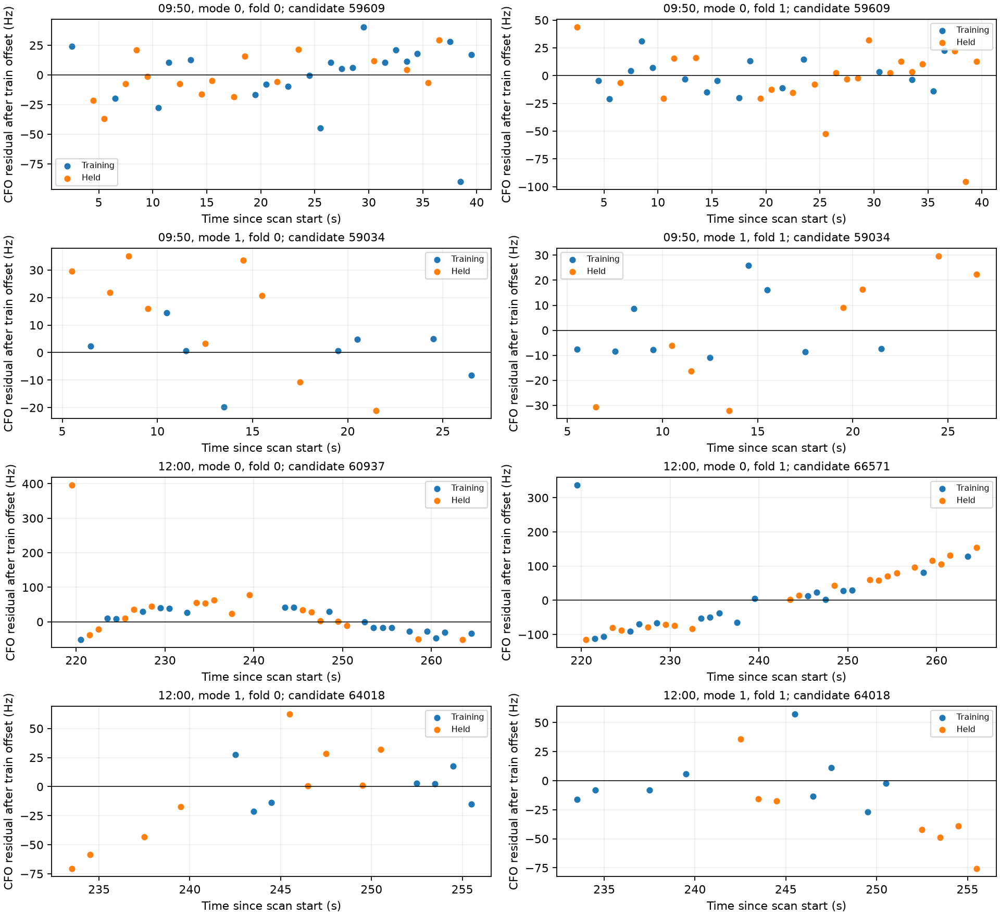
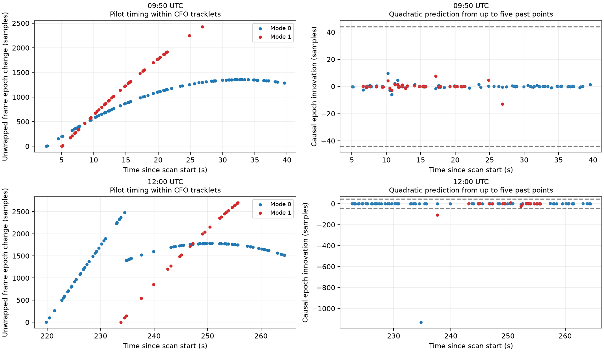

# CFO uncertainty and pilot continuity across DS5

The phase prototype has useful qualified measurements, but **does not yet improve association consistently**. This follow-up tests uncertainty choices and finds acquisition timing discontinuities worth addressing before a phase update is trusted across an entire track.

This is real recorded DS5 data: the 09:50 scan `scan-fw-f7515a5fdb02cda5` and 12:00 scan `scan-fw-888fc1e1e005ded3`, extending the [three-scan replay](README.md). The 07:20 scan did not supply a qualifying long simultaneous pair. No new collection was made. Identity truth and surveyed baseline length remain unavailable; these are conditional predictive comparisons, not measured satellite identification accuracy.

## Uncertainty integration

Earlier association gains depended on choosing 100 or 200 Hz CFO error. We now integrate an independent residual scale per track over 3.125, 6.25, 12.5, 25, 50, 100, 200, 400, 800 and 1600 Hz, with equal prior mass. The same latent scale applies to training and held data; held outcomes do not choose the training weights. This scale includes model mismatch and is not a hardware noise calibration.

We keep every candidate in the existing proposal banks, integrate orbital timing, and compare a uniform signed baseline prior within ±2 m against a baseline distribution learned only from the other scan. Geometry uses the stated horizontal axis of 79°. Source fitting, qualification and phase evaluation use disjoint sample sets as in the [joint-phase report](JOINT_PHASE_TRACKING.md); unsupported dwells remain neutral. No independent flexible per-track phase trend is calibrated away.

| Target | Fold | Uniform baseline: held CFO gain (nats) | Other-scan baseline: gain (nats) |
|---|---:|---:|---:|
| 09:50 | 0 | +0.00200 | +0.00182 |
| 09:50 | 1 | −0.00216 | −0.00172 |
| 12:00 | 0 | +0.16695 | +0.04810 |
| 12:00 | 1 | −0.35507 | −0.19939 |

Positive means phase improves held CFO prediction relative to CFO alone with the same coverage and uncertainty model. The 09:50 effects are negligible; the 12:00 effects change sign by fold. Neither baseline choice provides consistent improvement.

Most training posterior mass favors 12.5–50 Hz. The first 12:00 track instead favors 100 Hz in fold 1. A training-selected candidate/timing residual diagnostic locates a large error at scan second 219: about 337–396 Hz across the two fits. That acquisition has strong pilot/control support, so deleting it as a weak detection is unjustified. The plot below subtracts each training-fit CFO intercept; it is a diagnostic of one selected hypothesis, not the marginalized score above.

## Pilot timing within tracks

We reconstruct pilot frame phase from device sample counters plus integer and fractional acquisition epochs, modulo the nominal 750 Hz frame clock. Counters are differenced before float conversion. We unwrap frame phase and predict each observation from a quadratic fit to up to five previous observations, resetting after a large innovation. A descriptive threshold of 44 samples is one nominal 4.4 µs symbol at 10 MS/s. This threshold is not a calibrated false-alarm rate.

| Scan | Mode | Flagged visit | Time since scan start | Timing innovation |
|---|---:|---:|---:|---:|
| 09:50 | 0 and 1 | None | — | — |
| 12:00 | 0 | 1728 | 234.764 s | −1131 samples, approximately −113 µs |
| 12:00 | 1 | 1749 | 237.613 s | −108 samples, approximately −10.8 µs |

At the larger jump, raw CFO remains smooth and its relative alias index remains −3. The other mode does not show the same jump at that visit. This check therefore does not support a shared receiver counter step or a CFO alias-index change as its explanation. A source framing reset, acquisition timing ambiguity or incorrect track linkage remain possibilities. **A timing jump alone does not establish a satellite identity change.** The smaller second-mode flag also needs investigation; the simple extrapolation rule can respond to curvature or gaps.

The first two selected 12:00 phase dwells have no qualified simultaneous pair; qualified phase therefore begins after the larger break, while the current CFO hypothesis also includes earlier observations. This is a concrete reason to test episode-aware hypotheses before imposing one identity/reference model on all observations. No observations were removed and no scores in the table were changed using these diagnostics.

## Integration into association and tracking

1. Attach phase and pilot epoch observations to existing acquisition candidate IDs through an analysis sidecar. Preserve failed qualification, timing, RF, RX order, alias hypotheses and sample provenance.
2. Track reference continuity separately from satellite identity. A timing discontinuity should branch or reset the phase-reference hypothesis; it should not automatically delete a CFO point or declare a new satellite.
3. Compare an uninterrupted-track hypothesis with timing-episode hypotheses. Retain all observations and give the CFO-only comparator identical coverage. Re-propose catalogue candidates per episode so that a candidate omitted by the earlier whole-track search can recover.
4. Apply simultaneous phase double differences as one joint identity-pair factor, with shared receiver terms marginalized. Do not count a reused reference independently for each track. Use neutral factors when source support or reference continuity is uncertain.
5. Evaluate causally on frozen scans before enabling live influence. Report predictive likelihood, false transfers, resets, availability and identity ambiguity. Independent identity truth is still needed to claim actual association accuracy or sky-position recovery.

The next implementation target is step 3. The present audit supplies evidence and a tested causal diagnostic; it does not yet implement or validate episode-aware association in production.

## Numerical checks and limits

Small inferred CFO scales require finer orbital-time integration. Final results use 0.025 s spacing, recomputing the historical timing prior rather than interpolating its log density. CFO residuals and geometric projections are cubically interpolated from the existing 0.2 s banks. Direct orbit propagation at 31 test offsets per bank agrees within 0.000053 Hz and 2.43×10⁻¹⁰ in line-of-sight projection. These sampled checks are not a global interpolation bound. Changing 0.05 s to 0.025 s changes gains by up to approximately 0.0009 nats; full quadrature convergence is not certified.

Candidate banks were originally proposed at 100/200 Hz. Retaining all bank candidates removes the later top-four truncation but does not establish full-catalogue completeness at smaller scales. The scan set and folds have already been used in development. Results must remain retrospective and conditional.

Reproducible entry points: [scale mixture](cfo_scale_mixture.py), [trial runner](cfo_scale_trial.py), [direct interpolation check](timing_interpolation_audit.py), [CFO residual audit](cfo_residual_audit.py), and [pilot epoch audit](cfo_epoch_audit.py). Artifacts and protocol JSON are in [cfo-scale-mixture](cfo-scale-mixture/). The earlier `outlier-pilot-epoch-audit.json` is exploratory: its global timing fit spans the detected break and is superseded by the causal audit for continuity interpretation.

Run `python cfo_scale_trial.py --scan 0 --prior extended --quantiles 33 --tau-step .025` and repeat with `--scan 1` in the same scientific environment as the parent report. Run the three audit scripts for the figures and propagation check. Focused tests in [test_cfo_scale_mixture.py](test_cfo_scale_mixture.py) check explicit scale/time marginalization, absence of held-data leakage into training scale weights, agreement with the previous single-scale integrator, and causal break behavior on a known smooth curve and injected jump.
