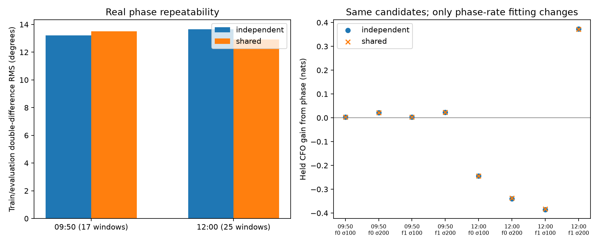
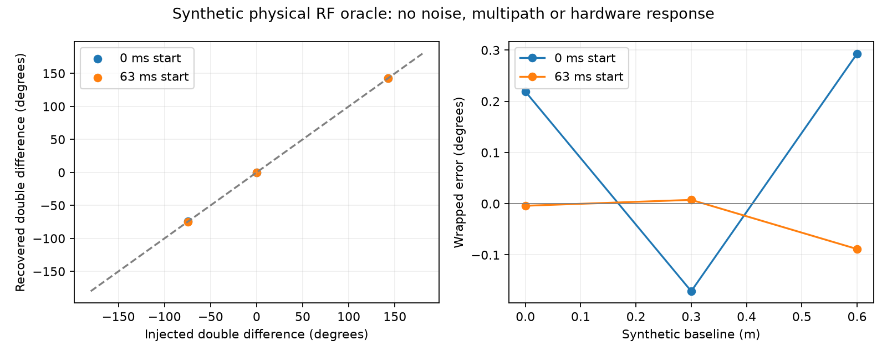
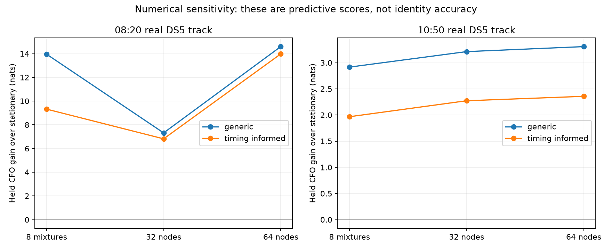

# DS5: physical phase checks, shared-rate extraction and direct tracking integration

The real recordings contain repeatable simultaneous-receiver phase, but these checks do **not** establish a satellite-association improvement. Sharing the short-window receiver rate has mixed effects on phase repeatability and almost no effect on candidate scores. An independent physical RF injection checks the phase sign and time reference. Direct offset integration exposes remaining numerical sensitivity in the adaptive CFO model.

This is a follow-up to [joint phase tracking](JOINT_PHASE_TRACKING.md) and [offset-mixture inference](QUALITY_MIXTURE.md). All real-data experiments use existing DS5 recordings; the physical propagation oracle below is explicitly synthetic. There is no new collection, production deployment, catalogue search or database write.

## What was tested

| Experiment | Recordings / data | Outcome |
|---|---|---|
| One common residual receiver rate within each 7 ms window | 09:50 `scan-fw-f7515a5fdb02cda5`; 12:00 `scan-fw-888fc1e1e005ded3` | Mixed repeatability; no consistent association gain |
| Physical propagation sign and reference check | Six synthetic cases, two sources, two receivers | Maximum double-difference error 0.00512 rad (0.294°) |
| Direct receiver-offset integration | 08:20 `scan-fw-4fc9ccc9f49e637b`; 10:50 `scan-fw-382ca32cddbfdc6a` | Earlier adaptive-quality gains remain numerically provisional |

## Does independent frequency fitting add phase noise?

The two simultaneous qualified modes use identical differential acquisition-CFO seeds, but their independently fitted residual rates differ: median absolute difference 11.22 Hz at 09:50 and 6.74 Hz at 12:00. A common LO contribution should be shared. Noise, interference, model errors and genuine source-dependent geometric rates can still differ.

The prototype profiles a **separate phase intercept for each mode and one common residual rate**, using training samples only. It maximizes the sum of the two coherent phasor magnitudes. Both modes are referenced to the same window midpoint. It does not subtract a fitted phase curve across dwells. Separate phase intercepts preserve the measured simultaneous phase difference; the common-rate approximation only constrains variation within 7 ms.

The replay retains exactly the previously qualified 17 and 25 windows, in 13 and 14 dwells respectively. Source qualification metrics are unchanged. It cannot measure whether this method recovers additional windows because qualification and the selected support set were intentionally held fixed.

| Scan | Independent-rate RMS | Shared-rate RMS | Interpretation |
|---|---:|---:|---|
| 09:50 | 13.21° | 13.52° | Slightly worse |
| 12:00 | 13.66° | 12.92° | Slightly better |

RMS is wrapped training/evaluation **double-difference disagreement**, not angular sky error or error against known satellite geometry. Evaluation samples do not select the rate. Acquisition, timing and offline track selection retain the conditioning described in the original report.



The eight original fold/100-or-200-Hz CFO scenarios use unchanged candidate banks, geometry epochs, qualification and phase weights. Changing extraction changes the phase-assisted held CFO score by at most **0.00217 nats**. The 12:00 result still changes sign between uncertainty scenarios. All eight shared-rate orbital-phase models lose to the constant-double-difference phase control (by 0.061–1.016 nats). We therefore retain independent-rate extraction as the default; the shared-rate arm remains experimental.

These candidate comparisons use the original 0.2-second timing bank, not the later causal adaptive-quality model. They isolate one estimator change and are not a new comprehensive association benchmark. Full values: [scores](shared-rate/scores.json), [raw extraction results](shared-rate/results.json).

## Independent physical RF oracle

The generator directly evaluates continuous-time pilot tones and symbols. It injects physical RF propagation delay into both the envelope and carrier, independent transmitter frame phases shared by the receivers, a common 678123.45 Hz receiver LO difference and an additional 75 Hz drift. The two sources have different carrier frequencies and baseline projections. It does not use the extractor's sampled-template FFT-shift method to generate the delay.

Baselines 0, 0.3 and 0.6 m and window starts 0 and 63 ms produce six checks. These lengths are synthetic, not measurements of the DS5 hardware. The recovered RX1-times-conjugate-RX0 double difference agrees within 0.00512 rad. This checks sign, physical RF versus baseband frequency use, absolute time and cancellation of common receiver phase in an ideal case.



This oracle has no noise, multipath, ADC filtering or unknown direction-dependent antenna response. It cannot validate the effective DS5 antenna baseline or prove the real phase is geometric. A separate test injects opposite ±0.25 Hz geometric rates with the shared-rate fit and retains midpoint phase within 0.01 rad. That establishes preservation for that bounded example, not arbitrary motion.

## Direct offset integration of adaptive CFO quality

The [earlier mixture experiment](QUALITY_MIXTURE.md) compresses offset histories after observation updates. This independent method instead fixes a receiver-offset quadrature node, performs the exact finite quality-state forward recursion there, and then integrates over nodes. No Gaussian-history merging occurs. Offset quadrature and the existing orbital-time grid remain approximations.

Both real tracks retain all **57,612 candidate/time hypotheses** (12 candidates × 4,801 orbital-time offsets). Offset proposals use only the first eight bootstrap blocks: mean and median, crossed with ten residual scales. Prior/proposal correction preserves the intended offset prior. Generic quality transitions use elapsed time; timing-informed transitions can use only the preceding block's timing flag. Held scores cover the following 40 and 31 blocks. Offline track membership and initial candidate coverage remain limitations.



The machine-readable [comparison](quality-quadrature/summary.json) reports 32- and 64-node scores, total changes, maximum held-block changes and identity-probability changes. The necessary consistency gate is ≤0.05 nats for both total and maximum block change. Passing adjacent resolutions alone would not certify an absolute error bound or convergence of the orbital-time grid. The results do not satisfy a basis for promoting the model into association; the timing-informed variant also fails to improve on generic adaptation in these replays.

| Scan | Model | 32-node held score | 64-node held score | Change | Maximum block change |
|---|---|---:|---:|---:|---:|
| 08:20 | Generic | −257.483 | −250.206 | +7.277 | 2.115 |
| 08:20 | Timing-informed | −257.984 | −250.825 | +7.159 | 2.431 |
| 10:50 | Generic | −177.655 | −177.559 | +0.096 | 0.080 |
| 10:50 | Timing-informed | −178.594 | −178.509 | +0.085 | 0.075 |

All entries are nats; higher held score is better. **All four comparisons fail the consistency gate.** Small identity-probability changes (maximum 0.00021) do not rescue an inaccurate predictive likelihood. The next numerical investigation should inspect the offset integrand and adapt integration around resolved posterior peaks on a bounded subset, checking against high-resolution scalar integration before another full-bank replay. Simply accepting a favorable resolution would overstate the evidence.

## How this should enter association and tracking

1. **Preserve the measurements.** Keep wrapped receiver phase, residual rate, frequency branch, common evaluation epoch, independent-source qualification and uncertainty alongside each track observation. Do not turn phase directly into a position or silently unwrap across retunes.
2. **Maintain common receiver state separately from source geometry.** Multiple simultaneous sources can constrain shared LO changes. A free common phase offset and effective-baseline uncertainty must remain nuisance parameters. Source-specific antenna response and ambiguity are not guaranteed to cancel.
3. **Score candidate geometry conditionally.** Use simultaneous double differences and explicit reference episodes, with a neutral likelihood when support fails. Retain a CFO-only result and a constant-phase control. Do not count correlated windows as independent orbital evidence.
4. **Validate the inference before increasing phase weight.** Direct numerical integration must become consistent on held prediction. Then compare phase-assisted versus CFO-only prediction across additional frozen tracks, checking frequency uncertainty, false-mode controls and candidate coverage.
5. **Require a useful held-out association result.** Internal repeatability is evidence about extraction. It is not satellite identity truth. A robust predictive benefit across uncertainty assumptions is still missing; confirmed identity accuracy would additionally need independent truth.

The reported 79° horizontal LNB axis alone does not specify baseline length, effective receiving phase centers or reflector geometry. We retain conditional baseline integration and do not claim an absolute distance difference or sky position. Calibration that fits arbitrary source-specific slow phase would remove the desired geometry; the next model should constrain common receiver behavior while preserving separate source phases.

## Reproduction and checks

Report-owned scripts: [shared extraction](shared_rate_trial.py), [candidate scoring](shared_rate_score.py), [physical oracle](physical_phase_audit.py), [direct recursion](quality_quadrature_batch.py), [full-bank replay](quality_quadrature_replay.py), [figures](direct_check_figures.py).

Run with the science environment and `PYTHONPATH` recorded in the surrounding report provenance. From this directory:

```sh
python shared_rate_trial.py
python shared_rate_score.py
python physical_phase_audit.py
python quality_quadrature_replay.py --scan 0 --nodes 32
python quality_quadrature_replay.py --scan 0 --nodes 64
python quality_quadrature_replay.py --scan 1 --nodes 32
python quality_quadrature_replay.py --scan 1 --nodes 64
python direct_check_figures.py
python -m pytest test_shared_rate.py test_joint_phase.py test_quality_quadrature_batch.py
```

The combined test receipt records **12 passing tests**, including evaluation-sample isolation, phase-intercept invariance, physical phase preservation, and agreement between the scaled batch recursion and independent log-domain implementation. Full-bank source digests and runtime are recorded beside each replay. These are report prototypes; no published production contract changed.
