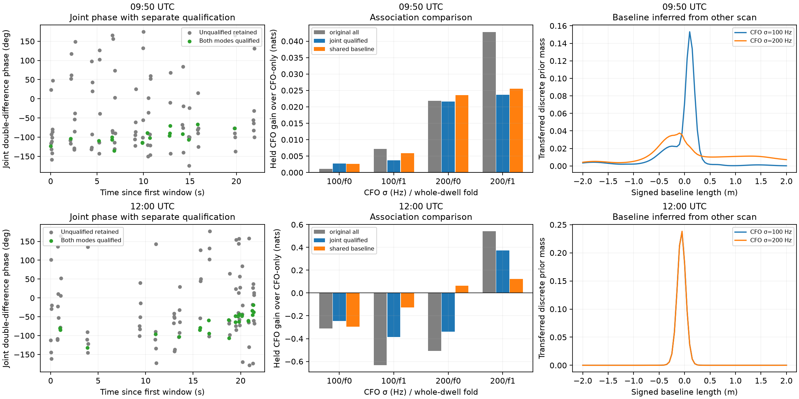

# Joint-source DS5 phase and a shared baseline

**Joint fitting addresses the demonstrated false-mode leakage in controlled tests and provides usable real phase, but satellite-association improvement is still not robust.** Sharing a baseline distribution between scans makes both 12:00 folds positive at the 200 Hz CFO scale, while both remain negative at 100 Hz. Numerical refinement does not change that conclusion.

This prototype follows the [mode-leakage audit](SPECTRAL_MODE_AUDIT.md). It replays all selected longer-overlap dwells in the real 09:50 and 12:00 recordings. It introduces no new RF capture or production association changes.

## Separate fitting, qualification and phase measurement

Model each receiver's raw window as the sum of both known pilot modes, with one complex coefficient per mode per frame. Use the earlier acquisition CFO and training-selected timing as fixed inputs. Within every 7 ms window, a seeded permutation of 200-sample blocks creates three disjoint sets:

| Purpose | Blocks | Samples |
|---|---:|---:|
| Fit joint, donor-only and rolled-target models | 175 | 35,000 |
| Check additional source support | 87 | 17,400 |
| Estimate evaluation phase | 88 | 17,600 |

Seed is 20261003. Qualification requires the exact target to improve prediction beyond the donor-only model and beyond a donor-plus-rolled-target control in **both receivers**. Both block contrast statistics must exceed three; the donor improvement must also exceed a numerical energy-fraction floor of 10⁻⁸. These fixed prototype rules are not calibrated false-alarm probabilities. Nearby blocks and receivers may remain correlated.

Estimate each mode's differential phase rate from its joint coefficients on the fit samples, then apply that rate unchanged to evaluation coefficients using template-energy time centroids. Report the phase at the window midpoint. The procedure preserves that intercept and does not subtract a fitted temporal trend across visits.

The new three sets are disjoint from one another, but prior acquisition and timing selection used overlapping raw support. This remains a conditional retrospective experiment. Evaluation IQ does not enter qualification or the fitted differential rate; a mutation test explicitly checks that boundary.

## Known-source verification

At both real candidate geometries, inject only mode 0, only mode 1, or both, with known receiver phases +0.7 and −0.5 radians. Repeat with no residual receiver offset and with a common +125 Hz RX1 residual offset.

- Injected modes pass qualification; absent modes fail in all these noiseless controls.
- Recovered phase error is below 0.01 radians and differential-rate error below 1 Hz for every present mode.
- A seeded 0 dB single-source test also retains the true source and rejects the absent mode.
- The earlier independent-filter counterexample with near-perfect false-mode R is retained in the preceding report.

These bounded controls verify the demonstrated mechanism and phase convention. They do not estimate a general false-positive rate across SNR, signal mixtures, channels or receiver response.

## Real recovery and availability

Both scans complete 108 two-mode windows each, corresponding to 216 per-mode phase estimates per scan. All raw manifests and selected chunk hashes are checked. Each replay takes about 20 seconds.

| Scan | Two-mode windows attempted | Both modes qualify | Dwells with at least one qualified pair | DD phase disagreement RMS, all windows | RMS, qualified windows |
|---|---:|---:|---:|---:|---:|
| 09:50 | 108 | 17 | 13 / 18 | 67.53° | 13.21° |
| 12:00 | 108 | 25 | 14 / 18 | 71.62° | 13.66° |

DD disagreement is evaluation-minus-fit double-difference phase. It is internal consistency, not geometric ground-truth error. Qualification does not inspect evaluation phase, so the qualified RMS is a useful check of the support rule, but the small sample and shared conditioning still limit its interpretation. All unqualified windows remain in the observation artifacts and plots.

## Association with neutral fallback

Reuse the timing-aware trial's candidate banks, priors and whole-dwell folds. Compare four arms: original phase from all windows; joint phase from all windows; original phase using only jointly qualified windows; and joint phase using only jointly qualified windows. This separates the effect of qualification from the change in estimator.

For each dwell, circular-average its included simultaneous differences. Assign κ=1 if any window qualifies and κ=0 if none qualifies. Retain all 18 dwell slots; unsupported dwells contribute neutral phase evidence. Multiple windows do not multiply precision. This is an illustrative likelihood concentration, not a fully calibrated measurement-error model.

When the selected windows change the mean epoch, shift only the phase geometry by the corresponding offset, at most 52.5 ms, using interpolation of the existing 0.2-second orbit-time grid and linear boundary extrapolation. CFO timing posteriors are unchanged. A known linear-geometry test verifies the interpolation operation; this is not a direct-propagation accuracy certificate for every orbit.

Joint qualified phase reduces several adverse scores at 12:00 but does not consistently beat CFO-only. For example, the 100 Hz/fold-1 gain improves from −0.634 nats with original all-window phase to −0.385, which is **less harmful, not a positive association gain**.

## One physical baseline shared across scans

The receivers' physical separation should remain the same if the setup was unchanged. Test that constraint without requiring local calibration:

1. Exclude the target scan completely when constructing its baseline prior.
2. In the other scan, combine the candidate proposals from both CFO folds, rank them using all donor CFO observations, and retain four per track. Marginalize candidate identity and orbit-time uncertainty.
3. Use all donor qualified phase to infer a signed baseline-length distribution along the assumed horizontal 79° axis, starting from a uniform −2 to +2 m prior. Integrate a separate constant phase offset for that donor pair.
4. Transfer the baseline distribution to the target scan. Its own phase intercept remains separate. Fit target identity/phase weights only on its training dwells, then evaluate held CFO predictions.

This is an offline leave-one-scan-out experiment: later data can inform an earlier recording. It is not a causal tracker or external survey. The method assumes the physical setup and baseline axis are unchanged; unmodeled signal-dependent phase trends could bias the inferred length.

The 09:50 donor produces a conditional baseline mean near **−0.061 m**, with standard deviation about **0.097 m**, at either CFO scale. The 12:00 donor is much less informative: approximately −0.080±0.500 m at 100 Hz and +0.112±0.906 m at 200 Hz. These are model-conditional moments, not measured antenna separation or recovered satellite distance.

| Target / fold | CFO σ | Original all-window gain | Joint-qualified gain | Joint-qualified + other-scan baseline gain |
|---|---:|---:|---:|---:|
| 09:50 / 0 | 100 Hz | +0.0011 | +0.0027 | +0.0026 |
| 09:50 / 1 | 100 Hz | +0.0071 | +0.0037 | +0.0059 |
| 09:50 / 0 | 200 Hz | +0.0218 | +0.0216 | +0.0236 |
| 09:50 / 1 | 200 Hz | +0.0428 | +0.0237 | +0.0255 |
| 12:00 / 0 | 100 Hz | −0.3094 | −0.2448 | −0.2959 |
| 12:00 / 1 | 100 Hz | −0.6339 | −0.3849 | −0.1251 |
| 12:00 / 0 | 200 Hz | −0.5072 | −0.3395 | +0.0650 |
| 12:00 / 1 | 200 Hz | +0.5413 | +0.3737 | +0.1235 |

Gains are held CFO log predictive evidence relative to the same CFO-only baseline, in nats. They are not known satellite identity accuracy. Choosing the 200 Hz scale because it yields positive phase gains would be outcome-driven tuning. The established 100/200 Hz sensitivity must remain visible until CFO uncertainty is justified independently or represented explicitly as model uncertainty.

Green phase points pass the separate qualification test; gray points retain the rest. Bar-chart scales differ between scans. Baseline curves come from the other scan; neither uses target phase to train the transferred prior.

Increasing timing quantiles from 33 to 65 and baseline points from 81 to 161 changes shared-baseline CFO gains by at most **0.000289 nats**. Numerical quadrature is therefore not the source of the principal positive/negative sensitivity. This check does not prove catalogue-shortlist completeness or physical model adequacy.

## Integration status

The prototype now has a concrete route for rejecting the demonstrated leakage case before treating a mode as independent phase evidence. Separate qualification, neutral fallback and shared-baseline marginalization preserve geometric information better than arbitrary per-track phase calibration.

The requested DS5 satellite-association improvement is still unverified. The remaining comparison needs a defensible CFO error model and confirmation on additional untouched scan groups. Candidate identity uncertainty, shared-source dependence, conditional acquisition selection and possible repeatable non-geometric phase remain material limitations. No hard identity gate or production update is justified by these results.

## Reproduction and tests

Run `joint_phase_run.py --scan 0|1`, `joint_phase_score.py --scan 0|1`, and `shared_baseline_trial.py --scan 0|1` with the parent report's scientific environment. The convergence pass adds `--quantiles 65 --baseline-points 161` to the shared-baseline command. Run `joint_phase_summarize.py` for figures, summary and convergence records.

All **35 focused tests pass**, including disjoint sample masks, evaluation/qualification isolation, known-source phase and rate recovery, absent-mode rejection, neutral zero-support updates, epoch interpolation and donor-scan exclusion. Artifacts: [summary](joint-phase/summary.json), [convergence](joint-phase/convergence.json), per-scan extraction/scoring protocols and observations in [joint-phase](joint-phase), and the [test receipt](joint-phase/tests.xml).
