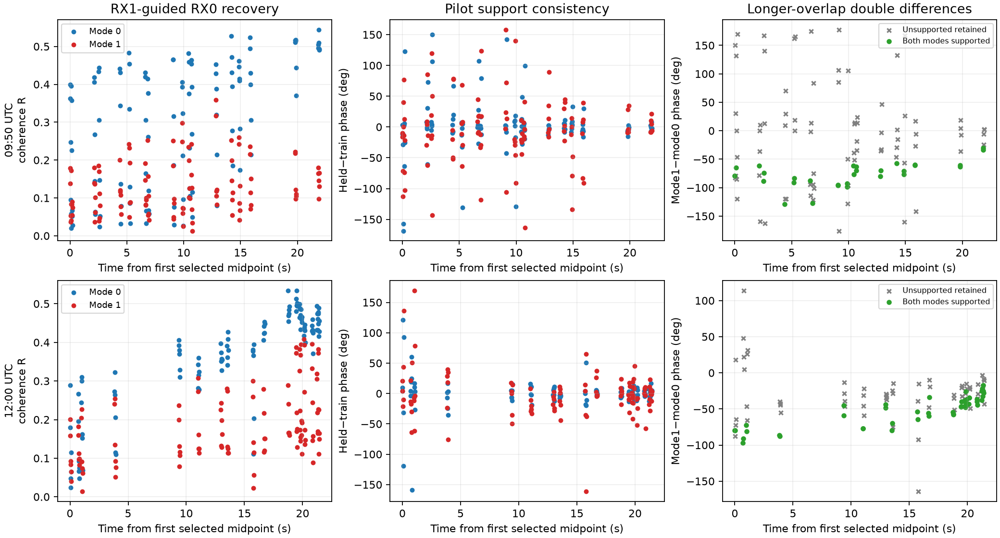
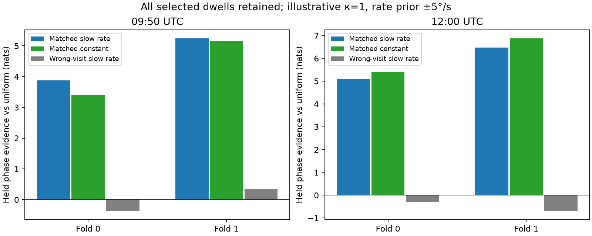
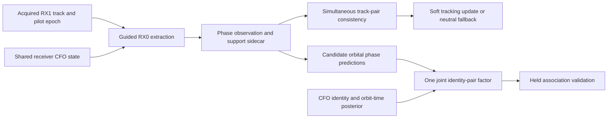

# Longer DS5 overlaps: guided recovery and tracking evidence

Existing real DS5 recordings support another **432 phase windows across 36 selected dwells**. Strong RX1 acquisition tracks can guide extraction of weaker RX0 counterparts over roughly 22-second overlaps. The resulting simultaneous track differences contain repeatable structure, but adding a slow angular rate does not consistently improve held-dwell predictions. **This is tracking evidence, not a demonstrated improvement in satellite identity or direction recovery.**

This report follows the [three-scan replay](README.md) and [real catalogue trial](CATALOGUE_TRIAL.md). It requires no new RF collection or local calibration. All association and production tracking behavior remains unchanged.

## Why extend the overlap?

The previously tested recurring catalogue pair has only about 8.5 seconds of overlapping CFO support, even though each individual track lasts longer. More visits to that pair cannot supply a substantially longer geometry test. Instead, this experiment selects the longest co-observed pair of strong RX1 tracks in the same channel, edge and RF lane, requiring distinct pilot epochs, distinct CFOs, at least eight common visits and at least 20 seconds of common support. Selection uses acquisition metadata without inspecting recovered phase.

For each qualifying scan, choose up to six visits randomly within each of three chronological metadata strata, using seed 20260928. These strata spread the sample across the overlap; they are not the evaluation folds. The complete frozen [input plan](long-overlap/plan.json) retains track IDs, candidate seeds, receiver-offset fits and recording metadata.

| Scan UTC | Qualifying common span | Common visits in selected pair | Replayed visits | Extracted mode-windows | Both RX pilot ratios >2 |
|---|---:|---:|---:|---:|---:|
| 07:20 | No qualifying pair | — | 0 | 0 | — |
| 09:50 | 21.83 s | 41 | 18 | 216 | 146 / 216 |
| 12:00 | 21.86 s | 24 | 18 | 216 | 155 / 216 |

The 07:20 result means no pair met this selection rule, not that the recording has no recoverable phase. The two extracted scans each contain two modes, six nonoverlapping 7 ms windows per dwell and 18 dwells. All requested windows completed, with no extraction errors. These windows supplement the earlier replay and should not be added to its totals as independent observations without checking raw-sample overlap.

## Recovering the weaker receiver

Same-epoch passing RX0/RX1 acquisitions provide a scan-specific differential CFO estimate. A dominant offset cluster within ±2 kHz of its modal 1 kHz bin is fitted with a linear rate using acquisition metadata. The fit residual RMS is **152.8 Hz at 09:50** and **136.9 Hz at 12:00**. RX0 uses the RX1 pilot epoch and RX1 physical CFO minus that fitted offset. The existing extractor then searches its training-only fractional timing candidates and fits residual differential phase rate on training pilot symbols.

This is an offline recovery experiment: the offset fit uses acquisitions from the whole scan. A causal implementation must estimate this state using only information available by the update epoch. The full-scan fit is a frequency seed, not subtraction of an independently fitted geometric phase trend. RX0 guided seeds have candidate rank −1 and no fabricated RX0 acquisition-track membership. RX1 production track IDs remain attached.

The phase convention is RX1 times conjugate RX0. For simultaneous modes A and B, the double difference is `phase_B − phase_A`. Shared receiver phase cancels to the extent that the two signals see the same receiver state. Signal-specific response, residual timing/frequency errors and multipath may remain.

| Scan | Median R | Median absolute held−train phase | RMS held−train phase | Descriptively supported windows | Both modes supported simultaneously |
|---|---:|---:|---:|---:|---:|
| 09:50 | 0.159 | 12.69° | 50.10° | 103 / 216 | 29 / 108 pairs |
| 12:00 | 0.272 | 9.22° | 32.16° | 143 / 216 | 47 / 108 pairs |

For illustration only, “supported” means both RX held exact/control ratios exceed 2, full-support R ≥0.15, and absolute held−train phase disagreement ≤30°. These thresholds use held outcomes and **are not a gate for the predictive experiment below**. They are not a calibrated uncertainty or probability of correct association. Large RMS values expose failures that median errors hide.



Blue and red are the two persistent RX1 acquisition tracks, not identified satellites. Green points in the right column satisfy the descriptive support rule for both modes; gray crosses retain every other attempted pair. Plots are wrapped; no phase connection across missing periods or retunes is assumed. Smooth-looking green points cannot alone establish satellite motion, particularly when their selection uses phase agreement.

## Negative controls

The first and middle selected visits in metadata order supply 24 control windows per scan. Shift actual RX1 IQ by 3 ms, freeze the exact extraction's fractional timing, and retain training-only residual-rate fitting. No control timing search is allowed. Selected raw chunks pass their uncompressed SHA-256 checks.

| Scan | Exact held R, median | Shifted-RX held R, median | Exact internal phase RMS | Shifted-RX internal phase RMS |
|---|---:|---:|---:|---:|
| 09:50 | 0.112 | 0.047 | 71.65° | 97.18° |
| 12:00 | 0.174 | 0.051 | 51.04° | 104.34° |

Exact alignment improves aggregate support, but the control sample includes substantial exact-case failures. This establishes neither per-window correctness nor satellite identity. The [control results](long-overlap/shifted-controls.json) retain all 48 matched comparisons.

## Does a slow phase model predict held visits?

Average the six simultaneous complex double differences within each dwell, then retain **all 18 dwell means per scan**, regardless of descriptive quality. Randomly assign half the occupied device-counter visit-start seconds to training with seed 20260929; assign every sample of each dwell together. Evaluate both complementary folds. These are correlated retrospective interpolation tests, not forward-time forecasts or independent experiments.

Compare a constant phase with a constant plus angular rate. Integrate the unknown circular intercept analytically. Integrate rate on a uniform 401-point grid, with sensitivity ranges ±2, ±5 and ±10°/s and illustrative von Mises concentrations κ=0.5, 1 and 2. No rate or intercept is fitted to held observations. The protocol was set after inspecting descriptive phase plots, so these are exploratory tests; confirmation needs untouched scan groups.

The table shows κ=1 and ±5°/s. Scores are held log predictive evidence **relative to uniform phase**, in nats; higher is better. They are not satellite posterior odds.

| Scan / fold | Train / held dwells | Matched slow-rate score | Matched constant score | Slow-rate gain | Wrong-visit slow-rate score |
|---|---:|---:|---:|---:|---:|
| 09:50 / 0 | 9 / 9 | 3.874 | 3.395 | +0.480 | −0.367 |
| 09:50 / 1 | 9 / 9 | 5.240 | 5.166 | +0.075 | +0.344 |
| 12:00 / 0 | 10 / 8 | 5.093 | 5.383 | −0.291 | −0.299 |
| 12:00 / 1 | 8 / 10 | 6.475 | 6.871 | −0.396 | −0.691 |



The matched reference provides much more predictive phase structure than shifting mode B by one whole visit. The wrong-visit control changes both signal epoch and shared hardware state; it is a deliberately mismatched diagnostic, not a calibrated false-association distribution. It also reuses the same underlying visits, so do not interpret fold comparisons as independent significance tests.

The main result is **stable simultaneous track-pair structure with mixed evidence for a slow rate**. A free slow rate can include geometry and residual instrument effects. Do not remove that rate as “LNB calibration” and then try to recover geometry from the remainder. The full sensitivity grid and all partitions are in [prediction.json](long-overlap/prediction.json).

## How to integrate this information



1. **Track support first.** Use acquired strong-track timing and a shared receiver CFO state to recover weaker counterparts. Attach phase and source support through a sidecar; do not invent an acquired RX0 track when extraction was guided. Preserve missing and failed observations.
2. **Track continuity as a soft factor.** A simultaneous reference helps distinguish a consistent pair from a time-mismatched pair. Use independently qualified support, uncertainty growth and neutral fallback. Test wrong-track references and causal prediction before enabling automatic linking; the present experiment has not measured false-link rates.
3. **Geometry through joint candidate predictions.** For each candidate pair, predict `2π B (f_B u_B − f_A u_A)/c` along the assumed horizontal 79° axis. Marginalize the unmeasured signed baseline and one shared constant phase. Include candidate orbit-time uncertainty from the existing timing-aware CFO model. A per-track arbitrary trend would absorb the sought geometry.
4. **Validate against the real baseline.** The prior catalogue trial used zero orbit-time offset and did not establish association improvement. These longer overlaps have not yet been evaluated with a timing-marginalized orbital phase likelihood. Freeze whole-scan evaluation groups and compare identical candidate priors, held CFO prediction, held phase prediction and identity changes. Do not promote a gain over a deliberately restricted CFO baseline as production improvement.

Baseline length, its receiver ordering and physical orientation remain uncalibrated. One baseline measures a projection and has phase-wrap ambiguities; these results do not determine a unique sky position or absolute differential distance. The current data support prototyping receiver-reference tracking, while satellite-association benefit remains an open validation objective.

## Reproduction and checks

From this report directory, using the Python environment and same-repository source revision in [provenance.json](provenance.json):

```sh
python long_overlap_plan.py
python long_overlap_run.py
python long_overlap_summarize.py
python long_overlap_controls.py
python long_overlap_predict.py
python -m pytest test_phase_factor.py test_replay.py test_catalogue_trial.py test_long_overlap.py -q
```

The extraction cache checks the frozen plan digest. Preserve existing outputs and use a separate output directory for changed plans. Raw replay requires the recorded local corpus. All **16 focused tests pass**, including real-window/control accounting, whole-dwell group isolation, phase-offset invariance, neutral zero-rate comparison and the earlier synthetic IQ sign test. The [test receipt](long-overlap/tests.xml), scripts, input plans, per-window observations and figures accompany this report.
