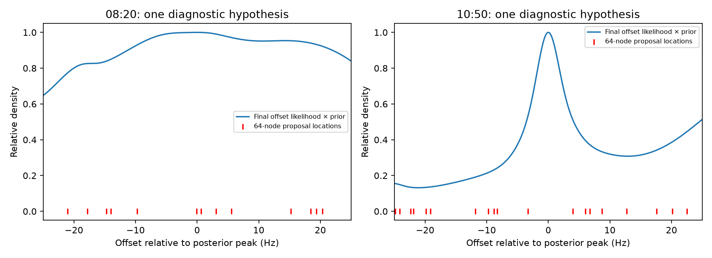

# Resolving the DS5 receiver-offset integration failure

An observation-centered integration reference is numerically stable on twelve selected real candidate/time/model cases. It confirms that bootstrap-centered quadrature can misestimate held CFO likelihoods. This supplies a more reliable reference for correcting inference before assessing phase-assisted association; it does **not** establish a new association gain.

## Why the previous calculation was unstable

At a fixed satellite candidate and orbital-time offset, the remaining static receiver CFO offset is integrated out. The quality state changes over time. Conditional on a fixed receiver offset, its finite-state recursion is exact. The [previous calculation](DIRECT_CHECKS.md) placed Gaussian quadrature nodes around means and medians of the first eight observations. Later observations can concentrate likelihood between those nodes or away from their support. Increasing the node count does not guarantee monotonic convergence.

Blue is the final prefix likelihood times the offset prior, normalized to its peak, for one selected hypothesis per scan. Red marks the previous 64-node-per-component locations; their vertical positions do not represent quadrature weights. The 10:50 example has a narrow peak whose closest node is approximately 3.33 Hz away. The 08:20 local peak is broader; integration errors also depend on other modes and the bootstrap denominator. These pictures are diagnostic examples, not a characterization of every candidate or proof that all full-bank errors have one cause.

## Replacement reference and safeguards

The new reference integrates on Gauss–Legendre panels around every observed residual, at each of the ten quality scales and their narrow posterior widths. Additional outer panels resolve the tails. It integrates the original broad Gaussian offset prior and the same prefix likelihoods; it does not introduce a new fitted offset prior or alter transition probabilities.

Panel placement can use later residuals because it is only a numerical rule for evaluating an unchanged integral. That distinction must be verified: changing future observations leaves preceding prefix evidence unchanged within 1e−6 nats in the test. The first implementation failed this check because large empty intervals were not adequately split near their tails. Explicit outer panels fixed the failure without relaxing the threshold.

Other tests compare against exact quality-history enumeration, including all ten scales with a roughly −800 kHz receiver offset. **Three tests pass.** This is report-owned inference code, not a production tracking change.

## Bounded real-data comparison

For each of the 08:20 and 10:50 scans, the diagnostic selects the highest final candidate probability from the earlier 64-node generic result. It evaluates that candidate at its peak-prior orbital-time offset (−0.2 s), and at ±30 s around that value. Both generic and timing-informed models are tested: twelve cases total. Selection is retrospective and intentionally numerical; it cannot be used as a held-out association evaluation.

| Scan, time offset | Model | 64-node score minus panel reference (nats) |
|---|---|---:|
| 08:20, −0.2 s | Generic | +0.289 |
| 08:20, −0.2 s | Timing-informed | +0.336 |
| 10:50, −0.2 s | Generic | +0.174 |
| 10:50, −0.2 s | Timing-informed | −0.087 |

Errors on some ±30 s diagnostic hypotheses are much larger, exceeding 1,800 nats. Those hypotheses have poor held likelihoods and may contribute negligible mass to the full-bank result. Their errors cannot be directly interpreted as an error of that size in the marginalized satellite score.

Eight- versus sixteen-point panels agree on these twelve cases to less than 1e−10 nats for both retained prefix and held-block evidence. Expanding the tail integration is also recorded in [audit.json](quality-panel/audit.json). Adjacent-order agreement and finite tests are strong diagnostic evidence, not a mathematical error certificate for all 57,612 hypotheses or the orbital-time grid. The reference has not yet replaced the full-bank scores.

## Next integration step

Use this reference to validate a faster batched or adaptively refined integrator on the hypotheses carrying posterior mass, retaining an explicit bound or check for omitted mass. Benchmark before committing to a full replay. Once full-bank likelihoods are consistent, rerun the phase-versus-CFO-only comparison with identical candidates and priors. Keep the constant-phase control: stable extraction alone does not show the phase is explained by satellite geometry.

Reproduction: run [quality_panel_audit.py](quality_panel_audit.py), then [quality_panel_plot.py](quality_panel_plot.py), in the report's scientific environment. [Tests](test_quality_panel_reference.py) and their [receipt](quality-panel/tests.xml) cover exact integration and prefix isolation. Raw recordings were not changed or recollected.
