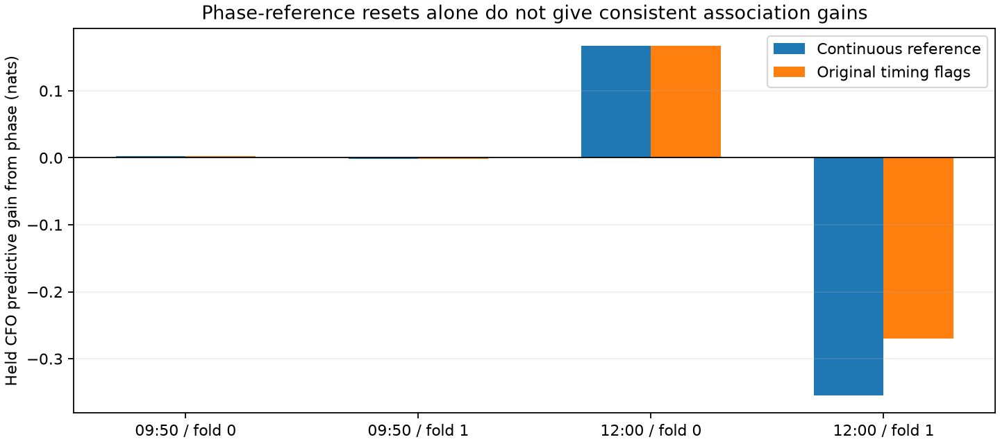
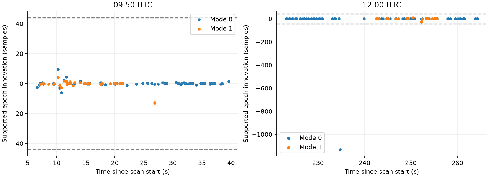

# Testing phase-reference resets in DS5

**Allowing phase resets at the previously flagged timing breaks does not produce consistent association improvement.** A stronger history-support check also removes the smaller 12:00 flag: its original prediction relied on three closely spaced points extrapolated across a much larger gap. The large 12:00 discontinuity survives. These tests narrow the next task to examining CFO track membership across that discontinuity rather than simply adding phase offsets.

This is a retrospective experiment on the real 09:50 and 12:00 DS5 recordings, following the [CFO continuity audit](CFO_CONTINUITY.md). No new capture, point deletion or production tracking change was made. Actual satellite identities remain unknown.

## Controlled reset experiment

The [trial](episode_trial.py) retains every CFO and phase observation, candidate identity, orbital timing prior, signed baseline prior and fold from the uncertainty-mixture experiment. It changes only the phase nuisance model: each episode gets an independent uniform constant phase intercept. Episode boundaries are the union of both tracks' acquisition timing flags. Baseline and satellite identities remain shared across episodes. The constant-phase comparator gets the same episode boundaries.

For residual phase `r = measured phase − predicted geometry`, each episode contributes `log I₀(|Σ κ exp(i r)|) − Σ log I₀(κ)`. Contributions add across episodes before orbital-time and baseline integration. This marginalizes an offset without fitting a flexible trend that would remove geometric variation. It does lose all phase constraints between episodes, which is a real cost of resetting.

| Scan | Fold | Continuous reference: held CFO gain | Original timing flags: held CFO gain |
|---|---:|---:|---:|
| 09:50 | 0 | +0.00200 nats | +0.00200 nats |
| 09:50 | 1 | −0.00216 nats | −0.00216 nats |
| 12:00 | 0 | +0.16695 nats | +0.16695 nats |
| 12:00 | 1 | −0.35507 nats | −0.26947 nats |

The exact CFO-only predictive likelihood and identity probabilities match between arms. In 12:00 fold 0, the intermediate episode contains one qualified held phase and no qualified training phase: resetting changes phase prediction but cannot change the training identity update. In fold 1 it contains one qualified training phase. An isolated phase with an unknown uniform intercept carries no geometry information, so its former cross-episode constraint disappears. The resulting smaller negative gain is not evidence of better satellite identification.

## Correcting an overconfident timing flag

The original mode-1 flag at 237.613 s predicted from three observations spanning only 0.984 s, then extrapolated 2.848 s ahead. A quadratic can amplify small timing errors severely in that configuration. We therefore tested a causal diagnostic requiring five past points and a forecast gap no longer than their time span. It uses the same 44-sample threshold and no phase values or CFO fit residuals. This is a retrospective support check, not a calibrated false-alarm model.

Only the large mode-0 break at visit 1728, 234.764 s survives. Neither 09:50 track nor the second 12:00 track is flagged by this rule. This supersedes any interpretation of the smaller flag as an established discontinuity; it does not prove that track is continuous everywhere.

All qualified simultaneous phase observations lie after the surviving break. Consequently, resetting only there gives **exactly the continuous-reference evidence**: the earlier episode has zero phase concentration and contributes zero for every candidate. This is an algebraic equivalence checked against recorded support, not a separate numerical rerun. [summary.json](phase-episodes/summary.json) records the deduction explicitly.

## Implications for tracking and association

Phase reference continuity and satellite identity must be separate states. A supported timing discontinuity can justify a reference reset or competing continuity hypotheses; it cannot on its own justify changing satellite identity. Sparse extrapolation must not silently force resets.

The surviving discontinuity changes both pilot epoch and its subsequent evolution while raw CFO remains smooth. The whole CFO track currently spans both sides, whereas useful paired phase covers only the later side. The next substantive comparison is therefore **whole-track versus separate-episode catalogue association**, retaining both sides and all CFO data, re-proposing candidates per episode, and comparing against an equally segmented CFO-only baseline. Merely discarding earlier points would not answer the question.

Until that test demonstrates repeatable improvement, phase should remain an experimental soft factor with neutral fallback. This run does not establish distance recovery, sky position, calibrated association probabilities or a production accuracy gain.

## Reproduction and validation

Run `python episode_trial.py`, `python episode_support_audit.py`, and `python episode_summary.py` in the parent report's scientific environment. The bounded integration uses all existing proposal-bank candidates, 33 timing quantiles, 0.025 s refined timing spacing and 81 signed baseline points. Full-catalogue completeness and independent identity truth remain unresolved, as documented in the parent audit.

[test_episode_trial.py](test_episode_trial.py) tests independent phase-offset invariance, neutral groups, singleton neutrality, causal assignment, predictor history support and unchanged real-data CFO coverage. Regression tests also cover the original timing integrator, scale mixture and joint extraction. The machine-readable results, frozen protocol and test receipt are in [phase-episodes](phase-episodes/).
