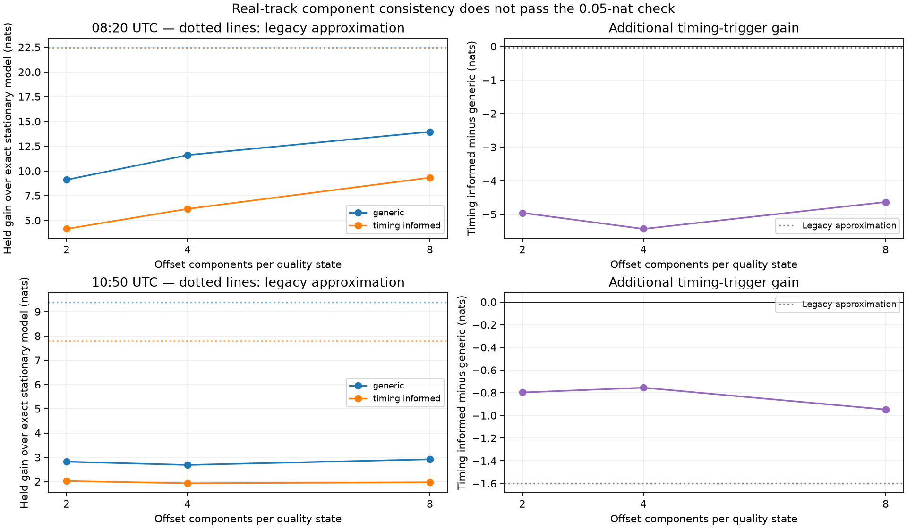

# Retaining CFO-offset mixtures in the DS5 quality filter

**The replacement fixes the demonstrated short-history accuracy failure, but the real-track scores still do not meet the component-resolution consistency check.** Earlier adaptive-uncertainty gains were materially affected by numerical approximation. This report preserves that distinction rather than treating a passing small-case test as proof of converged association evidence.

The experiment replays the same 08:20 and 10:50 DS5 banks from the [causal quality prototype](CAUSAL_QUALITY.md). Candidate lists, orbital-time grid, observations, warm-up, quality scales and transition rules are unchanged. No new data selection, collection or threshold tuning was performed.

## What changed in the inference

The legacy filter merged alternative CFO-offset histories into one Gaussian **before** scoring the next measurement. That changes the predictive density when histories imply different offsets or uncertainty.

The [Gaussian-mixture replacement](quality_mixture.py) first predicts and updates each retained offset history separately. It then groups posterior components by offset, retaining up to `K` weighted Gaussian components per quality state. Each merge preserves probability mass, mean and variance; it does not pretend that the resulting mixture is exact. Catalogue identity and orbital time remain fixed latent hypotheses, and a timing flag still affects only the next observation.

This is an accuracy correction, not a new physical calibration. No geometric trend or per-track phase trend is subtracted from the recordings.

## Exact checks

The original six-observation, two-state example is preserved. Eight additional seeded cases change the residual realization while retaining the declared scale transition. Each case is evaluated under generic and timing-informed quality transitions against exact enumeration of every history.

| Offset components per quality state | Maximum absolute error across the nine two-state cases |
|---:|---:|
| 1 | 0.109408 nats — fails 0.05-nat gate |
| 2 | 0.027939 nats — passes |
| 4 | 0.027301 nats — passes |
| 8 | 0.000568 nats — passes |
| 16 and 32 | Approximately 1.4×10⁻¹⁴ nats |

With enough retained components, short histories are preserved without compression and the result agrees with exact enumeration. A separate four-observation example uses **all ten scale states from the real model**, integrating 10,000 possible histories. All tested sizes from 2 through 32 pass the 0.05-nat gate there; the eight-component maximum error is approximately 0.00094 nats. These are bounded exact checks, not error bounds for long tracks. Errors need not decrease monotonically under deterministic mixture compression.

## Real-track resolution check



The stationary model has an analytic offset integral and is the unchanged reference. The following generic-model gains are measured against it:

| Scan | Legacy approximation | 2 components | 4 components | 8 components |
|---|---:|---:|---:|---:|
| 08:20 | +22.466 | +9.107 | +11.604 | +13.957 |
| 10:50 | +9.402 | +2.819 | +2.684 | +2.916 |

All values are held CFO predictive gains in nats, conditional on the retained catalogue banks and retrospectively selected tracks. The 08:20 generic score changes by **2.353 nats** from four to eight components; the 10:50 score changes by **0.232 nats**. Both exceed the declared 0.05-nat consistency threshold. The summary also checks per-block score changes and identity-probability sensitivity, so aggregate cancellation cannot hide an unstable prediction.

At eight components, the timing-trigger increment over generic quality changes is **−4.635 nats at 08:20** and **−0.948 nats at 10:50**. The complete scores and resolution changes are in the right-hand panels and [summary.json](quality-mixture/summary.json). These are not independent validation of the trigger. The preceding small-case gate now passes, but **real-track numerical convergence remains unverified**, and the original large gain claims remain provisional. No satellite identity truth or carrier-phase distance recovery has been established.

## Independent integration prototype

To avoid relying only on increasing Gaussian-mixture size, [quality_offset_quadrature.py](quality_offset_quadrature.py) prototypes direct numerical integration over the static CFO offset. Conditional on each offset node, the finite-state quality recursion is exact. The offset proposal uses only the declared warm-up; later values do not select the proposal. Only evidence differences after warm-up are intended for causal held scoring.

This independent method has been tested on the two exact short examples, not on the real catalogue banks. At 512 nodes per proposal component, its maximum error is approximately **0.014 nats** across stationary, generic and timing-informed models. Its error also varies with resolution, so it needs a controlled quadrature study before use as a real-data reference. [quadrature-audit.json](quality-mixture/quadrature-audit.json) preserves all node counts, including less accurate settings.

The next step is to make that direct integration efficient for the fixed real banks and compare increasing quadrature resolution with the Gaussian-mixture results. Changing the timing hazard or selecting favorable tracks before resolving this numerical sensitivity would confound model improvement with inference error.

## Reproduction and validation

Run in the parent report's scientific environment:

```sh
python quality_mixture_accuracy.py
python quality_mixture_trial.py --scan 0 --components 2
python quality_mixture_trial.py --scan 1 --components 2
# Repeat both scans with --components 4 and 8.
python quality_quadrature_audit.py
python quality_mixture_summary.py
python -m pytest test_quality_mixture.py test_causal_quality.py -q
```

Tests cover exact short-history evidence and identity probabilities, conservation of mass and moments during compression, the stationary analytic likelihood, isolation from future values/flags, and warm-up-only quadrature proposals. The receipt is [tests.xml](quality-mixture/tests.xml). Passing implementation tests and bounded exact cases do not supersede the failed real-track resolution check.

All runs are bounded replays of saved numeric banks. The eight-component runs require minutes per model; no multi-hour RF campaign or production tracking change is involved. Existing limits remain: offline track membership, finite catalogue proposals, unverified orbital-time-grid convergence, uncertain physical calibration and absent independent satellite identity truth.
