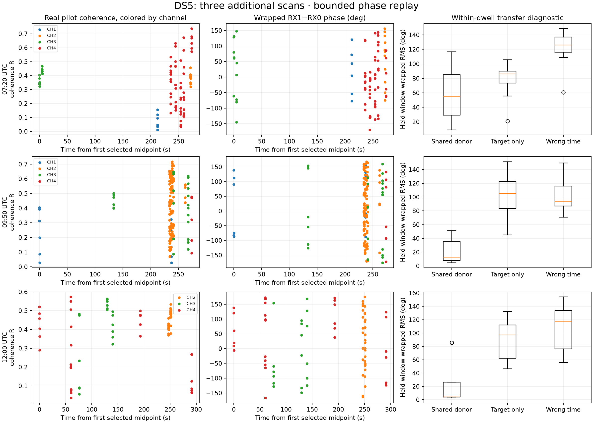
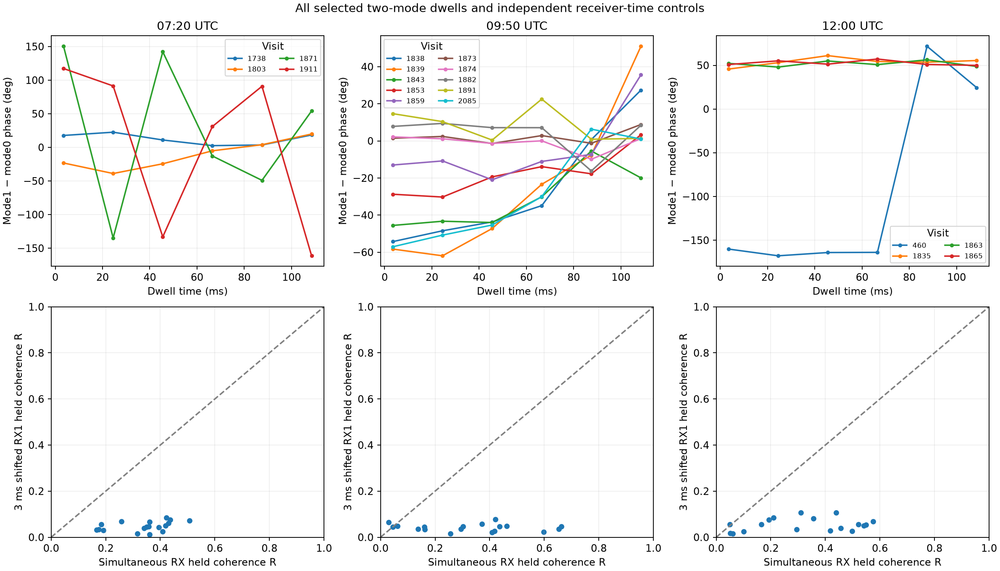
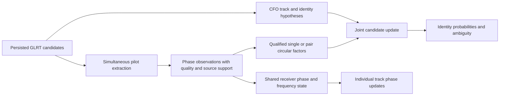

# DS5 phase evidence for association and tracking

Three additional DS5 scans provide repeatable simultaneous-receiver phase evidence. **324 measurements from 36 dwells completed without errors.** A simultaneous reference signal substantially improves within-dwell phase prediction in the 09:50 and 12:00 scans, while the 07:20 scan is less consistent. This supports developing an optional, uncertainty-preserving phase score. It does **not** yet establish satellite identities, a calibrated geometric baseline, or an absolute phase connection through every retune.

This report extends the [standalone phase-to-sky explanation](../2026_09_26_phase_to_sky_standalone/README.md). All measurements below are from existing real recordings; the estimator sign test uses explicitly synthetic IQ. No RF collection, production association change or database write was performed.

The subsequent [real catalogue trial](CATALOGUE_TRIAL.md) verifies production-track joins, expands one recurring pair from four to nine dwells, and evaluates actual satellite hypotheses. It finds small, mixed candidate-weight gains and no top-pair changes; orbital phase loses to a constant double-difference control. Satellite-association improvement remains unproven.

The [longer-overlap extension](LONG_OVERLAP.md) adds 432 guided-recovery windows over approximately 22-second track-pair overlaps in two scans. It finds repeatable simultaneous phase structure, with mixed held-dwell evidence for a slow rate. It includes weaker-receiver recovery, negative controls, whole-dwell prediction tests and an integration path for tracking and association.

The [timing-aware satellite-pair trial](TIMING_TRIAL.md) evaluates those longer overlaps with historical orbit-time uncertainty. It resolves a configuration-dependent track-ID join and a timing-integration issue, but finds no robust association gain: the 12:00 ranking response is sensitive to assumed CFO error, and orbital phase often loses to a constant-difference model.

The [cross-scan pilot-support calibration](SUPPORT_CALIBRATION.md) then predicts internal phase agreement using other scans only. It improves agreement likelihood but does not resolve association sensitivity; greater confidence can strengthen harmful orbital identity updates. Repeatability is not a complete geometric error model.

The [spectral response and mode-leakage audit](SPECTRAL_MODE_AUDIT.md) improves internal phase agreement but finds a more fundamental qualification issue: a single source can produce high R and passing pilot/control ratios at an absent mode's template. Joint pilot fitting rejects that synthetic false component and supplies a conditional-support test for real simultaneous modes. Earlier support ratios must not be interpreted as proof of independent sources.

The [joint-phase tracking prototype](JOINT_PHASE_TRACKING.md) separates fitting, source qualification and phase evaluation, retains neutral fallback, and tests sharing a physical-baseline distribution across scans. It rejects the known false-mode controls and yields useful qualified phase, but association benefit remains sensitive to the CFO uncertainty model.

The [CFO uncertainty and pilot-continuity audit](CFO_CONTINUITY.md) integrates the residual scale instead of choosing a favorable value. Gains remain inconsistent, and two acquisition timing discontinuities in the 12:00 tracks motivate testing separate reference episodes before applying phase across an entire track.

The [phase-reference episode trial](PHASE_EPISODES.md) tests timing-triggered phase resets with identical CFO coverage. Resets alone do not give consistent gains. A stricter forecast-support audit also removes the smaller timing flag, leaving one substantial discontinuity to investigate through separate-episode catalogue association.

The [separate-episode catalogue experiment](SEGMENT_ASSOCIATION.md) re-searches all 11,116 candidates around the surviving timing break. Its strongest result keeps one identity and offset but allows different residual uncertainty: held CFO prediction improves in both existing folds. This is retrospective quality-model evidence, not confirmed satellite identity accuracy or carrier-phase benefit.

The [boundary-control experiment](BOUNDARY_CONTROLS.md) qualifies that result: ordinary time splits also improve the problematic track, and a generic boundary mixture outperforms the pilot-triggered mixture there. Pilot timing avoids unnecessary splits on smooth controls, but its unique predictive value remains unproven. The next validation needs causal quality-state comparisons on additional tracks.

The [causal quality prototype](CAUSAL_QUALITY.md) adds 08:20 and 10:50 scans and predicts subsequent blocks from earlier data. Generic adaptive uncertainty gives promising scores, but its Gaussian approximation fails a bounded exact-history accuracy gate. The timing trigger does not add a provisional gain. Numerical inference must be corrected before promoting these results.

The [offset-mixture correction](QUALITY_MIXTURE.md) passes expanded exact short-history checks and substantially changes the real-data scores. Four-to-eight-component differences still fail the real-track consistency threshold. An independent direct-offset integration prototype is now available for the next numerical reference replay; association improvement remains unverified.

## Recording selection and coverage

The [physical-phase, shared-rate and direct-integration checks](DIRECT_CHECKS.md) add an independent synthetic RF propagation oracle and real replays. Sharing the within-window receiver rate has mixed repeatability and negligible candidate-score impact. Direct offset integration continues to expose numerical sensitivity in adaptive CFO inference. The report specifies how qualified phase can enter tracking while preserving geometry and neutral fallback; production association improvement remains unproven.

DS5 contains 42 scans with 2.5, 5, 7.5 and 10 MS/s captures. This bounded replay selects three additional 10 MS/s scans spread across the capture period, maintaining the earlier extractor's sample rate. The previously examined 12:20 scan is excluded. These three scans are not a random sample of all DS5, and the result does not establish performance at other sample rates.

| UTC start | Recording | All visits | Joint epoch-paired visits | Two-mode eligible visits | Replayed visits | Phase rows |
|---|---|---:|---:|---:|---:|---:|
| 07:20 | `scan-fw-006056cf3db5b95a` | 2,212 | 312 | 4 | 10 | 84 |
| 09:50 | `scan-fw-f7515a5fdb02cda5` | 2,216 | 644 | 13 | 16 | 156 |
| 12:00 | `scan-fw-888fc1e1e005ded3` | 2,208 | 597 | 4 | 10 | 84 |

All selected visits use the **lower pilot edge**, unlike the original selected upper-edge prototype. Acquisition gates and same-epoch pairing define eligibility; these counts are not a detector completeness estimate. Six 7 ms windows per mode start at 0, 21, 42, 63, 84 and 105 ms within each 120 ms dwell. The 18 selected two-mode dwells supply **108 simultaneous double differences**. The remaining 18 visits supply one paired signal each.

The metadata-only plan first seeks recurrent exact RX0 track-pair/channel/edge groups, retaining at most three groups and six randomly selected visits per group. It adds up to six other two-mode visits and six single-mode visits per scan. It uses seed **20260927** and freezes the selected visits and whole-visit train/held labels before reading their raw samples. Only one group has four or more eligible recurring visits. Full assignments and input digests are in [plan.json](plan.json).

Raw manifest and selected chunk SHA-256 checks pass. Selected chunks have no clipped CI16 rows. This is a bounded integrity check, not a new full-scan capture-contamination audit. Absolute UTC brackets are approximately **363 ms** wide. Original GLRT acquisitions use the beginning of the dwell; early replay windows are acquisition-conditioned, not wholly unseen acquisition tests.

## A portability issue found before extraction

An inherited pairing condition required RX0 and RX1 CFOs to agree within 2 kHz modulo the pilot symbol alias spacing. That happens to be near the receiver offset in the earlier recording, but rejects every joint pair in the 07:20 scan. The new plan pairs passing candidates by common pilot epoch (within three samples modulo one frame), rather than assuming an inter-receiver LO offset. A second simultaneous mode must imply an RX offset within 2 kHz of the first mode, and must have distinct epoch and frequency support. This prevents independent RX maxima or different alias lifts from silently setting different hardware offsets for the two modes.

| Scan | Observed RX1−RX0 acquisition CFO range |
|---|---:|
| 07:20 | 677.943–678.159 kHz |
| 09:50 | 679.648–679.918 kHz |
| 12:00 | 682.113–682.303 kHz |

**Integration implication:** receiver-offset state belongs to the current capture/path group. Do not import a fixed offset from the earlier scan, and do not substitute a display-normalized CFO for the physical mixing frequency. Same-epoch pairing is a signal hypothesis, not proof of a common satellite; false coincidences and pilot aliases remain possible.

## Phase extraction and real support

The copied, hash-recorded pilot extractor retains fractional epoch alignment and the acquisition frequency branch. Four fractional timing candidates are selected using training symbols only. Training/held symbols are disjoint guarded blocks, with the earlier fixed seed 20260926 and held block assignments retained. It forms RX1 times conjugate RX0 **before averaging**, fits differential phase rate on training support, and evaluates held pilot symbols with that correction unchanged.

| Scan | Median full-support R | Median absolute train/held disagreement | RMS disagreement | Both RX held exact/control >2 |
|---|---:|---:|---:|---:|
| 07:20 | 0.349 | 7.27° | 36.66° | 74 / 84 |
| 09:50 | 0.427 | 5.66° | 20.55° | 135 / 156 |
| 12:00 | 0.459 | 4.55° | 20.24° | 79 / 84 |

Every extracted window remains in the denominator, including poor results. Exact/control >2 is a descriptive support count, not a post hoc exclusion from tracking evaluation. R is complex concentration, not an uncertainty in degrees. These are internal pilot-consistency results, not errors against known geometric phase.



Phase scatter is colored by channel consistently with the coherence panel. Local mode labels are not persistent satellite labels, and disconnected dwell phases are not unwrapped. The data do not support blindly fitting a single smooth phase trajectory across the scan.

## Does a simultaneous signal help tracking?

For each two-mode dwell, choose three of its six nonoverlapping windows as training groups using a reproducible random draw. Fit a single circular mean phase difference between the two modes. Predict the target's phase at the remaining windows using the donor's **simultaneously measured** phase plus that training offset. Compare with a target-only constant phase and a wrong-time donor shifted by one window, each calibrated on the same training windows.

| Scan | Two-mode dwells | Median simultaneous-donor held RMS | Target-only constant | Wrong-time donor |
|---|---:|---:|---:|---:|
| 07:20 | 4 | 55.27° | 86.12° | 126.05° |
| 09:50 | 10 | 11.77° | 104.99° | 93.81° |
| 12:00 | 4 | 5.55° | 97.16° | 116.88° |

Both donor directions are evaluated: 36 directional comparisons over **18 dwells**, not 36 independent experiments. Matched donor beats the constant target in 33/36 directional comparisons and the wrong-time donor in 34/36. No error-based dwell exclusion was applied. The two directions and nearby dwells share data and hardware; these counts should not be used as independent Bernoulli trials.

This is a **conditional reconstruction** test with a reference signal available at the target epoch. It is not a forecast through a period when both signals are absent. A simple constant target is a deliberately limited baseline; superiority to a well-tuned causal joint CFO/phase tracker has not been established.



The top panels show every selected pair. The 12:00 repeated pair is fairly stable within its dwells, while 07:20 has large failures. Some 09:50 differences evolve by tens of degrees over 0.1 s. Those residual changes must not automatically be attributed to satellite motion: signal-specific frequency error, response, multiple paths or pairing errors may remain. The plots are wrapped and lines only guide the eye.

**Tracking use:** maintain a shared receiver phase/frequency nuisance state from reliable simultaneous signals. Use it to help update other tracks, retaining their individual geometric phase states and uncertainty. When the donor loses support, allow uncertainty to grow. A fitted per-track slow trend must not be subtracted as calibration, because it may contain the geometry of interest.

## Does the effect survive negative controls?

The original symbol-rolled pilot controls retain some inter-receiver phase structure, so they are not sufficient as an independent noise floor. An additional test shifts the actual RX1 IQ stream by 3 ms. It uses the first selected single-mode visit and first selected two-mode visit in each scan, chosen by metadata order, with exact-case fractional timing frozen. No control timing search is performed. The residual phase rate is still trained on the control's training symbols.

| Scan | Paired control windows | Median exact held R | Shifted-RX held R | Exact support RMS | Shifted-RX support RMS |
|---|---:|---:|---:|---:|---:|
| 07:20 | 18 | 0.359 | 0.046 | 14.21° | 113.80° |
| 09:50 | 18 | 0.337 | 0.044 | 32.54° | 99.96° |
| 12:00 | 18 | 0.333 | 0.055 | 30.84° | 95.56° |

This supports the importance of real time alignment. The negative control destroys matching pilot timing as well as simultaneous hardware phase; it does not isolate which physical mechanism creates the entire positive effect, and does not prove two satellite identities. The lower figure panels show all 54 paired control windows.

## Do extracted phases correspond to CFO tracks and retuned returns?

Tracks were reconstructed from persisted acquisition candidates through the existing TLE-blind trajectory analyzer. Exact candidate memberships are retained with the phase rows. **270/324** rows have at least one exact receiver-track membership; **198/324** have RX0 membership. These are repeated window-level counts, not numbers of satellites. The reconstructed track counts are 35, 45 and 47. They need not equal older DS5 position-report inventories, which may use different reconstruction configuration or source versions. No unverified join to a satellite-association document is made.

One recurring exact RX0 track pair in the 09:50 scan, CH2 lower, supplies visits **1838, 1839, 1853 and 1891**. Whole-visit random splitting assigns the first two to training and the last two to evaluation in this seeded draw. Fit a constant double-difference phase using training dwell circular means; the held dwell means have **26.04° RMS** disagreement. Their within-dwell double-difference concentrations are 0.981 and 0.990.

This is encouraging for a track-pair constraint, but only **two held visits from one group** support it. A constant model also ignores real changing geometry. Other scan pairs lack enough exact recurring membership under this conservative selection. It would be premature to bridge all retunes with absolute phase or declare an alias resolved.

## Prototype integration into association

The new pure [phase_factor.py](phase_factor.py) supplies an optional circular evidence term and normalizes updates over an existing CFO candidate set. It does not access storage, know satellite identities, or change production behavior.

For observed phase `y_j`, geometric prediction `g_j`, and independently calibrated concentration `kappa_j`, marginalize one unknown constant hardware phase per validated reference group:

```
Z = sum_j kappa_j exp(i (y_j − g_j))
log evidence relative to uniform phase
  = log I0(|Z|) − sum_j log I0(kappa_j)

held predictive evidence = joint evidence − training evidence
candidate posterior ∝ CFO prior × phase likelihood
```

This preserves the candidate-dependent phase shape while integrating the constant offset. A **single phase with an unconstrained hardware offset supplies zero directional evidence**, which is explicitly tested. Assigning an independent free offset to every measurement likewise removes all phase information. `kappa=0` is neutral. An unqualified factor leaves CFO probabilities exactly unchanged.

In this replay, `kappa=1` is used only to illustrate conditional evidence over the hypotheses “simultaneous donor”, “target constant” and “wrong-time donor”. These are not satellite candidate probabilities and are not calibrated probabilities of physical truth. R must not be substituted directly for kappa without a validated error model. Phase and CFO can share acquisition samples and selection; simply multiplying their likelihoods may double-count information. A production integration needs independent support or an explicitly conditional joint model.

For actual satellite-pair hypotheses, predict

```
g_AB(t) = 2π B (f_B u_B(t) − f_A u_A(t)) / c
          + 2π (f_B − f_A) tau
```

using each candidate's baseline projection `u`, both RFs and a shared differential delay `tau` if supported. Integrate or profile signed baseline length, time uncertainty and hardware nuisance parameters on training data. A physical 79° baseline orientation must be confirmed for the DS5 setup; this replay does not infer it from phase.

**A double difference couples two candidate identities.** It cannot safely be added twice as independent single-track evidence. `update_pair_candidates` accepts one joint pair-factor matrix and returns its joint posterior and two marginals. For a short retained list this is an inexpensive finite sum. The existing independent per-track soft-association model would need this small joint coupling step; shared donors across several tracks require a joint factor graph or controlled approximation to avoid counting the same reference repeatedly.



## Proposed integration boundary and acceptance tests

1. **Observation sidecar first.** Attach phase to immutable acquisition candidate IDs through a narrow analysis input, rather than changing existing public persisted contracts. Retain RX order, device/UTC midpoint, physical RF estimate, symbol and frame support, fractional timing, fitted differential rate, circular phasor/R, control evidence, receiver-offset group and track membership. Retain failed/missing windows too. The JSON replay rows demonstrate most fields; a production contract also needs explicit source-sample ranges, phasor amplitude and uncertainty provenance.
2. **Phase qualification.** Require held pilot support and wrong-time controls before using a factor. Define the qualification on separate development support; applying held outcomes as a gate in the same score would bias evaluation. Reset or marginalize the receiver phase on retunes unless continuity is validated. Do not give each track an independent flexible calibration trend.
3. **Tracking shadow mode.** Compare a causal CFO-only tracker and the same tracker with a shared receiver phase state on frozen, unseen whole scan groups. Report availability, phase innovations, cycle slips, wrong-track transfers and behavior when the donor disappears. The present random-window reconstruction does not replace that causal test.
4. **Association shadow mode.** Keep the same Doppler candidate lists and priors. Add qualified phase factors once, preserving all plausible aliases and explicit neutral fallback. Compare held predictive likelihood, posterior calibration and identity outcomes against an independent reference. Propagation requires observer location and an epoch-appropriate orbit catalogue; neither the prior site preset nor selected CFO satellite IDs should be treated as phase truth.
5. **Promote only after broader confirmation.** Extend to additional unseen scans, sample rates, edge bands and recurrent track pairs with frozen thresholds and phase concentration calibration. Existing DS5 has already been used in association development, so a DS5 gain alone is retrospective evidence. Enable phase as a soft tie-breaker before considering any hard rejection gate.

The strongest immediate use is helping **simultaneously visible tracks share a receiver-phase reference**. Geometric satellite ranking remains a separate validation step: this run has not propagated an orbit catalogue, recovered distance or measured a CFO-plus-phase identity-accuracy improvement.

## Reproduction and validation

The original extraction source is copied into [pilot_extract.py](pilot_extract.py). It uses this repository's scientific kernels; there is no dependency on the reference `leo-tracker` or `leo-tracker-redux` repositories. [provenance.json](provenance.json) records the code and data sources. The report-local orchestration reads the existing recording corpus; the pure phase factor has no IO imports. Its tests cover phase-offset invariance, neutral updates, correct shared pair normalization, known-truth IQ recovery with a large LO offset, and complete real-data accounting.

All **nine focused tests pass**, including the injected-IQ phase-sign check. These tests validate the numerical prototype and accounting; they do not turn a conditional real-data comparison into satellite identity ground truth.

Run with a Python environment providing NumPy, SciPy, Matplotlib, zstandard and pytest, and a source revision with the scanner tracking adapters:

```sh
python plan.py
python run.py
python shifted_controls.py
python analyze.py
python plot_pairs.py
python -m pytest test_phase_factor.py test_replay.py -q
```

`plan.py` references the recorded DS5 inventory path; raw replay requires access to `/srv/bulk/leo`. `run.py` reuses completed per-scan artifacts and should be run in a new output directory if changing a frozen plan. All selected main extractions took approximately **92.5 seconds total**, excluding inventory reconstruction and the separate bounded control pass. No multi-hour campaign was needed.

Artifacts: [summary.json](summary.json), [shifted controls](shifted-controls.json), [input plan](plan.json), [test receipt](tests.xml), and the three `scan-fw-*.json` files contain observations, quality, track links, integrity checks and complete failure accounting.
