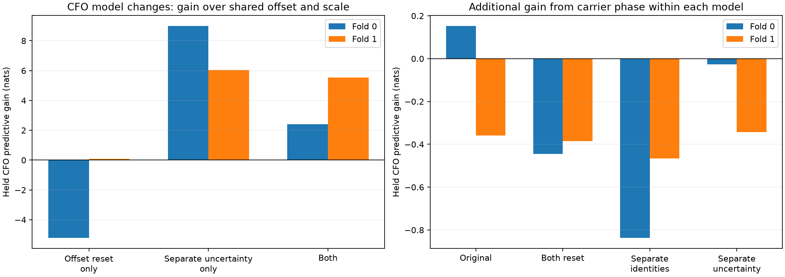

# DS5 association across a pilot-timing discontinuity

Follow-up: [ordinary-boundary and smooth-track controls](BOUNDARY_CONTROLS.md) show that the predictive gain is not unique to the pilot-timing boundary. Read that comparison before attributing the gain specifically to the timing cue.

**The supported timing break is more useful as a measurement-quality boundary than as evidence of a satellite switch.** A model that keeps one catalogue identity and one CFO offset, but allows different residual uncertainty before and after the break, improves held CFO prediction in both existing folds. This is a promising retrospective tracking result. It is not yet verified satellite identity accuracy or an independent validation of phase-assisted association.

This experiment uses the real 12:00 DS5 recording `scan-fw-888fc1e1e005ded3`, following the [phase-episode trial](PHASE_EPISODES.md). It retains the complete first-mode CFO track across the supported acquisition timing discontinuity at visit 1728, 234.764 s. The second simultaneous mode provides the existing phase reference. No capture was added and no difficult observations were removed.

## Catalogue search and coverage

We re-propose candidates separately for the whole track, the before-break section and the after-break section. Each fold searches all **11,116 catalogue candidates** on a −120 to +120 s orbital-time grid at 5 s spacing, scoring training CFO only with the declared residual-scale mixture. The union of the top 16 per section plus the earlier whole-track candidates retains 25 and 26 candidates in folds 0 and 1. These are propagated directly at 0.2 s spacing, then interpolated to 0.025 s for the final comparisons, recomputing the historical timing prior.

All arms share the same CFO blocks, defined by episode, observation second and the existing whole-dwell train/held assignment. A boundary inside one second can create two blocks, but does so in every arm. Each fold has 19 training and 19 held first-mode blocks. The before/after counts are 7/12 training and 8/11 held in fold 0, reversed in fold 1. Tests verify that concatenating the episode blocks reproduces the whole-track arrays exactly.

At the initial 0.2 s timing resolution, both episodes favor catalogue candidate 66571 in both folds. The whole-track fit favors 60937 in fold 0 and 66571 in fold 1. These are conditional model rankings, not confirmed satellite identities. Allowing different identities across episodes does not improve both folds.

## Separate offset changes from uncertainty changes

The initial episode model changed both the CFO intercept and residual scale. To avoid attributing an uncertainty improvement to an offset reset, we ran a factorial comparison. Every arm below retains one identity and one orbital-time hypothesis across episodes. The scale prior is uniform over the declared logarithmic grid from 3.125 to 1600 Hz. A shared offset with unequal scales is integrated analytically using the weighted Gaussian likelihood; a covariance-matrix oracle test checks the calculation.

| Change from shared offset and shared scale | Fold 0 held CFO gain | Fold 1 held CFO gain |
|---|---:|---:|
| Separate offsets only | −5.213 nats | +0.092 nats |
| Separate residual scales only | **+8.990 nats** | **+6.031 nats** |
| Separate offsets and scales | +2.404 nats | +5.539 nats |

The gain therefore does not require an offset jump or a new satellite identity. Treating both episodes as equally precise is the more consequential assumption in this test. The scale represents residual dispersion, including modelling error; it is not a measurement of hardware noise. Earlier evidence located a large CFO residual near scan second 219, before the timing break, despite strong acquisition support.



## Does carrier phase add information?

We evaluate the same qualified simultaneous carrier-phase differences under the corresponding identity/timing posteriors. All qualified paired phase is after the surviving break. The physical baseline remains an unknown signed length within ±2 m along the stated horizontal 79° axis, with an integrated constant pair-phase intercept. Unsupported phase slots remain neutral. Each carrier-phase comparison uses its own matching CFO-only model and identical observations.

| Identity/offset model | Fold 0 carrier-phase gain | Fold 1 carrier-phase gain |
|---|---:|---:|
| One identity, shared offset and scale | +0.152 nats | −0.359 nats |
| One identity, separate offsets and scales | −0.444 nats | −0.386 nats |
| Independent episode identities, offsets and scales | −0.837 nats | −0.466 nats |
| One identity, shared offset, separate scales | −0.027 nats | −0.343 nats |

The separate-scale, shared-offset follow-up is recorded in [phase-scale-only-results.json](segment-catalogue/phase-scale-only-results.json) and the right-hand plot. It was added after reviewing the uncertainty comparison, so it is exploratory. The machine-readable [comparison](segment-catalogue/comparison.json) distinguishes the CFO model improvement from additional carrier-phase gain. Do not report their sum as proof that carrier phase improved association.

The independent-identity arm includes the held likelihood from the before-break episode, even though only the later episode receives paired phase. It therefore preserves all CFO coverage. The second mode keeps its earlier candidate bank; this is not a fresh full-catalogue search for both modes.

## Proposed integration

1. Retain pilot timing continuity as acquisition evidence attached to candidate IDs. A supported discontinuity can propose a measurement-quality boundary without forcing an identity change.
2. Carry competing shared-scale and separate-scale models, or marginalize a quality-state transition. Keep a shared CFO offset and identity unless evidence supports changing them. Do not apply a hard split merely because the current retrospective partition improved its score.
3. Keep carrier-phase association as a separately scored optional factor with neutral fallback. The timing-quality improvement must not justify increasing confidence in carrier geometry.
4. Freeze the continuity rule, quality-state prior and evaluation design before testing additional unseen tracks/scans. Include smooth-track controls and comparable boundaries without timing jumps to determine whether the timing cue is informative beyond ordinary nonstationary residuals.

This is the next integration target: a causal quality-state model evaluated against the same CFO-only tracker, followed by a separately measured phase contribution. A production identity update is premature without that validation.

## Limits and reproduction

The boundary and folds were previously examined. Candidate proposals are training-only within each fold, but the entire exercise remains retrospective. Coarse-grid proposal completeness, finer timing/quadrature convergence for the new candidates, likelihood calibration and independent satellite identity truth are not established. Several hypotheses are compared on the same two folds; the best result requires independent confirmation. The reference observer location and historical orbital-time prior remain the same as the parent reports.

The catalogue pass took about 70 seconds; the first three-model phase comparison took about 108 seconds. These were bounded analyses of existing data. Reproduce using the parent report's scientific environment:

```sh
python segment_catalogue_trial.py
python segment_phase_trial.py
python segment_uncertainty.py
python segment_phase_trial.py --scale-only
python segment_summary.py
```

Scripts, numeric banks, catalogue proposal scores and protocols are preserved in this directory and [segment-catalogue](segment-catalogue/). [test_segment_catalogue.py](test_segment_catalogue.py) checks identical coverage, candidate alignment, time marginalization and the unequal-noise offset integral. Regression tests also cover episode neutrality, scale integration and the original orbital-phase integrator; the test receipt is [tests.xml](segment-catalogue/tests.xml).
