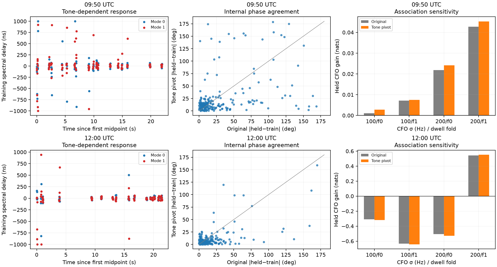
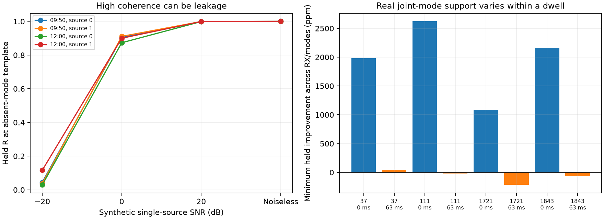

# DS5 spectral response and mode-leakage audit

**A single signal can produce excellent phase coherence at an absent mode's template.** In an explicitly synthetic counterexample at a real DS5 candidate geometry, the absent mode has R=1 and both receivers' exact/control ratios exceed 4.5. Thus neither coherence nor the existing ratio rule alone proves that two independently observed signals exist. A bounded joint-mode regression correctly rejects the absent component in the synthetic tests and finds useful conditional support for both modes in several real windows.

Separately, estimating a frequency-dependent pilot response improves real phase repeatability, particularly at 12:00, but does not establish a robust satellite-association gain. Production association remains unchanged.

## Real tone-resolved replay

Replay all 432 mode-windows from the [longer-overlap plan](LONG_OVERLAP.md), preserving its selected timing, physical CFO seeds and training-fitted differential rate. The raw manifest and selected decompressed chunks pass SHA-256 checks. Each scan replay took about 24 seconds.

Resolve the eight pilot tones at −820312.5, −585937.5, −351562.5, −117187.5, +117187.5, +351562.5, +585937.5 and +820312.5 Hz. Fit a linear frequency-phase slope on training symbols only, searching delay from −1 to +1 microsecond in 2 ns steps. Apply that fixed spectral rotation to held symbols and report phase at the mean tone frequency, zero in this template's baseband coordinates. This preserves the phase intercept at the pivot; it does not subtract a per-track trend over time.

The delay is a descriptive effective response parameter. It combines any propagation, receiver response and estimator error. It is not a measured cable delay or differential satellite distance. Weak windows can produce unstable values or reach the search boundary; no such windows are discarded.

| Scan | Median absolute fitted delay | Median absolute inter-mode delay difference | Boundary fits | Original median phase disagreement | Tone-pivot median | Original RMS | Tone-pivot RMS |
|---|---:|---:|---:|---:|---:|---:|---:|
| 09:50 | 40 ns | 46 ns | 3 / 216 | 12.69° | 12.69° | 50.10° | 47.09° |
| 12:00 | 22 ns | 21 ns | 2 / 216 | 9.22° | 6.05° | 32.16° | 22.16° |

Disagreement means held-minus-training phase, not error against geometric truth. Median concentration of the held double difference across the eight tones is 0.796 at 09:50 and 0.950 at 12:00. Frequency-dependent effects exist, but the improved internal agreement must still be validated for association.



The association comparison retains all 18 dwell means, identical CFO/timing candidate banks and κ=1. At 09:50 the tone-pivot phase gives small held CFO gains of +0.0027/+0.0075 nats at 100 Hz and +0.0242/+0.0453 at 200 Hz. At 12:00 it gives −0.3194/−0.6441 at 100 Hz and −0.5280/+0.5517 at 200 Hz. The adverse/mixed pattern persists. The plots use separate vertical scales; small positive values are not identity-accuracy claims.

## Why high R can be misleading

The ideal complete-window template coherence between the two selected modes is low: medians 0.00754 and 0.00273, maxima 0.02551 and 0.02344. That does **not** prevent leakage from carrying a highly coherent receiver phase.

Suppose the absent mode's extraction responds to one real source with leakage coefficient α in both receiver paths after frequency alignment. Then

```
c_false,RX1 × conjugate(c_false,RX0)
    = |α|² c_source,RX1 × conjugate(c_source,RX0).
```

The leakage can be small in amplitude while retaining exactly the source's phase. Normalized R removes that amplitude scale. A second matched-filter output can therefore repeat the same physical source's receiver-phase information, and counting it as independent evidence would be wrong.

To test this directly, construct one known pilot source using the first selected dwell's timing/CFO geometry from each scan. Inject only mode 0 or only mode 1, with known RX1−RX0 phase 0.7 radians. Extract both mode templates at synthetic SNR −20, 0, +20 dB and without noise. These are synthetic tests, not reinterpreted real measurements, with one seeded noise realization per condition.

| Example absent-mode extraction | Held R | RX0 exact/control | RX1 exact/control |
|---|---:|---:|---:|
| 09:50 geometry, source 0 only, 0 dB | 0.905 | 0.927 | 0.856 |
| 12:00 geometry, source 1 only, 0 dB | 0.900 | 2.558 | 6.029 |
| 12:00 geometry, source 1 only, +20 dB | 0.999 | 4.350 | 4.432 |
| 12:00 geometry, source 1 only, noiseless | 1.000 | 4.551 | 4.551 |

All four noiseless absent-mode cases recover the source phase and R≈1. The 12:00 source-1 example also passes the earlier descriptive both-RX ratio >2 rule. This is a verified counterexample to that rule as a sufficient test of independent mode existence. It does not establish the leakage fraction in the real recording or prove that every weak real mode is false.

## Conditional joint-mode test

Fit the raw window with both modes at once, using one complex amplitude per mode per frame and the prior frozen timing/CFO. Fit on a seeded half of shared 200-sample blocks and evaluate prediction on the other half. Both receivers and all competing models use the same split.

For each target mode, compare held squared error for:

- the other mode alone;
- both exact modes jointly;
- the other exact mode plus a symbol-rolled target control.

The added mode must improve held prediction beyond what the donor already explains. This tests conditional evidence instead of interpreting a correlated matched-filter output as another source. Prior acquisition and timing selection used overlapping raw support, so the new split is a conditional diagnostic, not a wholly unseen detector false-alarm test.

In noiseless known-source tests at both real geometries, joint fitting recovers unit coefficient power for each injected mode and zero for each absent mode to numerical precision. Two-source injections recover both components. This addresses the demonstrated leakage mechanism within the additive pilot model.

For real data, choose the first and middle selected visits in each scan, and windows at 0 and 63 ms: **eight raw windows and 32 receiver/mode comparisons**. No phase or support value selects those visits.

| Real sample | Both modes improve held prediction in both RX, beyond donor-only and rolled-target control |
|---|---:|
| First window, 0 ms | 4 / 4 |
| Later window, 63 ms | 1 / 4 |
| All sampled windows | 5 / 8 |

Twenty-five of 32 individual receiver/mode comparisons improve held prediction. Failures may reflect weak/missing signals, CFO/timing error or inadequate constant-within-frame response; they are not proof of physical absence. The regression has not been calibrated into a false-association probability.



Left: even an absent mode can have near-perfect phase coherence at high synthetic SNR. Right: the minimum incremental held prediction improvement across both modes and receivers in each real window, expressed as parts per million of held IQ energy. Blue bars are 0 ms; orange bars are 63 ms. Negative means at least one component worsens prediction under this model.

## Does using only the first window solve association?

An exploratory restriction uses the fixed 0 ms window in every selected dwell, with no per-dwell quality selection. This restriction was motivated after the conditional-support audit and is not an independent confirmation. It retains acquisition-conditioned phase and all 18 dwells.

Phase geometry is shifted from the six-window mean epoch to the first window, 52.5 ms earlier, by interpolation in the existing 0.2-second orbit-time projection grid, with linear lower-boundary extrapolation. CFO likelihoods and timing posteriors remain unchanged. This is an explicitly approximate geometry evaluation, not a new direct-propagation convergence result.

| Scan / fold | CFO σ | First-window original-phase gain | First-window tone-pivot gain |
|---|---:|---:|---:|
| 09:50 / 0 | 100 Hz | +0.0019 | +0.0028 |
| 09:50 / 1 | 100 Hz | +0.0066 | +0.0074 |
| 09:50 / 0 | 200 Hz | +0.0231 | +0.0243 |
| 09:50 / 1 | 200 Hz | +0.0405 | +0.0449 |
| 12:00 / 0 | 100 Hz | −0.3016 | −0.3195 |
| 12:00 / 1 | 100 Hz | −0.6203 | −0.6374 |
| 12:00 / 0 | 200 Hz | −0.4865 | −0.5250 |
| 12:00 / 1 | 200 Hz | +0.5421 | +0.5508 |

These held CFO gains remain small or model-dependent. Late-window dilution alone does not explain the association problem. No independent satellite labels are available to convert a changed ranking into demonstrated correctness.

## Integration consequence

Before a phase observation is allowed to represent an independent track or satellite, add **conditional source support**: assess whether that mode explains held raw signal beyond stronger simultaneous modes and relevant controls. Preserve covariance and shared-source provenance. Independent matched filters followed by normalized phase coherence are insufficient.

The next prototype should extract phase from jointly fitted components and carry uncertain/missing components as neutral evidence. It needs a separate fitting/qualification/evaluation split and known two-source phase tests before a full real-scan comparison. Do not use the eight-window diagnostic as a tuned production threshold or subtract flexible per-track temporal trends as calibration.

The spectral response correction is a useful measurement refinement, and the leakage counterexample identifies a concrete validation defect. **Neither result yet proves improved satellite association on DS5.**

## Reproduction and checks

Run `spectral_audit.py --scan 0|1`, `spectral_score.py --scan 0|1`, `spectral_injection.py`, `joint_mode_audit.py`, then `spectral_summarize.py`. The optional first-window branch is `spectral_score.py --scan 0|1 --first-window`. Use the scientific environment and same-repository kernels recorded in the parent provenance. Raw recording access is read-only; no new capture is needed.

All **29 focused tests pass**, covering delay/pivot sign, regression fit/held separation, known absent-mode rejection, the high-R leakage counterexample and all 432 real-window accounting. [Summary](spectral-audit/summary.json), [synthetic injections](spectral-audit/single-source-injections.json), [joint-mode results](spectral-audit/joint-mode-results.json), per-scan spectra/scores, protocols, figures and [test receipt](spectral-audit/tests.xml) accompany this report.
