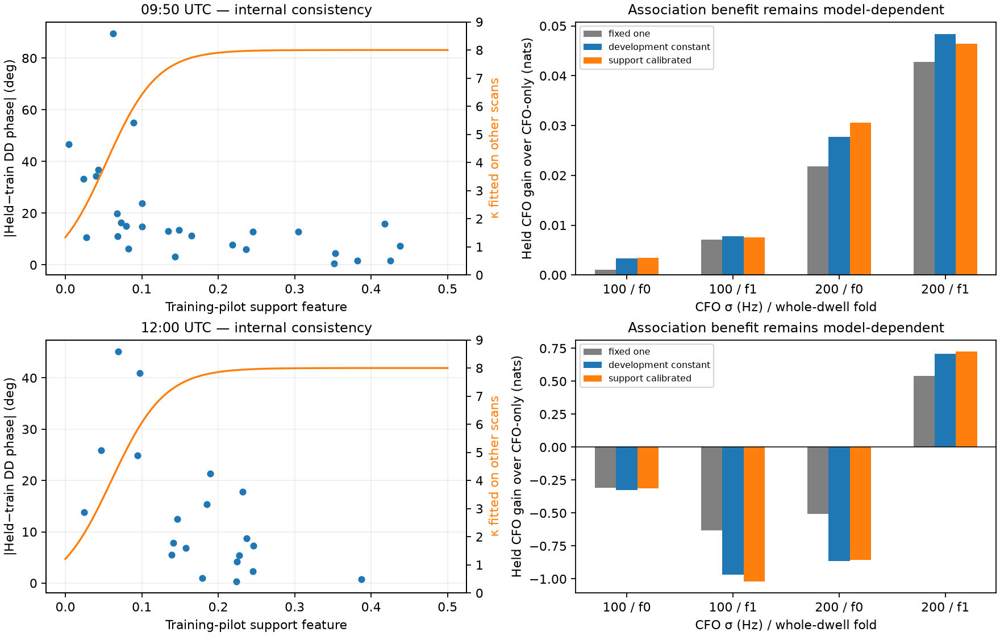

# Does independently calibrated pilot support improve association?

**Pilot support predicts phase repeatability, but that calibration does not resolve the satellite-association problem.** Leaving each target scan out of calibration improves its internal phase-agreement score. Applying the resulting confidence to orbital phase still gives small gains at 09:50 and mixed or harmful gains at 12:00. Some harmful changes become stronger.

This experiment extends the [timing-aware catalogue trial](TIMING_TRIAL.md) using existing real DS5 measurements. It changes the observation uncertainty and uses held-pilot phase for the association observation. No new RF capture, production update or satellite ground-truth label is introduced.

## Calibration without using the target scan

Combine the original and longer-overlap two-mode observations, deduplicating by recording and dwell and preferring the longer-overlap extraction when both contain a dwell. This yields **52 distinct two-mode dwells**: four at 07:20, 28 at 09:50 and 20 at 12:00. Each dwell contributes one agreement sample, not six independent samples.

For each dwell:

1. Form the simultaneous mode-B minus mode-A double difference separately for training and held pilot symbols in each of six windows.
2. Compute separate circular dwell means for training and held support.
3. Build a feature from **training support only**: mean of the smaller of the two modes' training R values, multiplied by the training double-difference concentration across windows.
4. Measure the wrapped held-minus-training dwell-mean disagreement as the calibration response.

Fit `κ(x) = 8 sigmoid(a + b x)` with nonnegative slope, a fixed weak ridge penalty, and equal total weight per development scan. The cap of eight is fixed for this prototype. Compare with a single constant κ fitted on the same development scans and with the earlier illustrative κ=1. When evaluating 09:50, calibration sees only 07:20 and 12:00; when evaluating 12:00, it sees only 07:20 and 09:50. Every target-scan dwell is excluded from parameter fitting.

| Target scan | Development dwells | Target agreement dwells | Support-model mean log score | Development-constant score | Fixed κ=1 score |
|---|---:|---:|---:|---:|---:|
| 09:50 | 24 | 28 | 1.322 | 1.155 | 0.666 |
| 12:00 | 32 | 20 | 1.565 | 1.496 | 0.715 |

Scores are nats per dwell relative to uniform disagreement; higher is better. The support feature transfers usefully for this **internal agreement** target. Median predicted κ is 6.90 at 09:50 and 7.76 at 12:00, with many values near the imposed cap. This is not evidence that the absolute phase is accurate to an equivalent von Mises error distribution. Both pilot subsets can share the same systematic phase error.

The held pilot symbols were not used in timing/rate selection, but the extractor's correction is trained on the training symbols. Both subsets share the same raw capture and fitted correction. Their disagreement is therefore a conditional pipeline-repeatability measure, not two fully independent measurements of known geometric truth. Cross-scan fitting prevents direct target-scan training leakage; it does not remove previous DS5 development or shared receiver effects.

## Association comparison

Reuse exactly the timing trial's CFO candidate banks, orbit-time priors, reference site, 79° baseline axis, baseline-length prior and whole-dwell folds. Retain all 18 longer-overlap dwell means per scan. Each association arm now observes the **held-pilot circular dwell mean**, rather than mixing training and held symbols. The three arms differ only in concentration:

- fixed κ=1;
- one constant κ fitted on other scans;
- support-dependent κ fitted on other scans, evaluated using this dwell's training-only feature.

The timing integration uses 33 quantiles per identity and 81 baseline points. No target held phase is used to set its κ or exclude its dwell. No arm drops unfavorable observations. The code accepts a concentration vector while preserving the former scalar behavior.

| Scan / fold | CFO σ | Fixed κ=1 gain | Development-constant gain | Support-calibrated gain |
|---|---:|---:|---:|---:|
| 09:50 / 0 | 100 Hz | +0.0011 | +0.0033 | +0.0035 |
| 09:50 / 1 | 100 Hz | +0.0071 | +0.0077 | +0.0076 |
| 09:50 / 0 | 200 Hz | +0.0218 | +0.0277 | +0.0306 |
| 09:50 / 1 | 200 Hz | +0.0428 | +0.0484 | +0.0465 |
| 12:00 / 0 | 100 Hz | −0.3094 | −0.3256 | −0.3127 |
| 12:00 / 1 | 100 Hz | −0.6339 | −0.9679 | −1.0194 |
| 12:00 / 0 | 200 Hz | −0.5072 | −0.8649 | −0.8548 |
| 12:00 / 1 | 200 Hz | +0.5413 | +0.7067 | +0.7266 |

Gain is held CFO log predictive evidence relative to CFO-only, in nats. These are conditional scores over retained satellite pairs, not identity accuracy. The 09:50 gains remain small. At 12:00, a larger concentration strengthens both the favorable 200 Hz/fold-1 result and the unfavorable 100 Hz/fold-1 result. Support weighting does not consistently beat even the development-fitted constant concentration.

Left panels: blue points are target-scan internal disagreement; the orange curve is κ fitted entirely on other scans, using the right axis. Right panels: gains from the three uncertainty arms on the same held-pilot observations. Different panels use different vertical scales. Numerical convergence at these higher κ values has not been independently established; the earlier κ=1 convergence receipt must not be presented as covering the new arms. Small differences between calibration arms are therefore descriptive. The substantial adverse 12:00 scores do not justify promotion regardless.

## What this changes

The data support using training-pilot quality to predict **repeatability**. They do not support treating that prediction as a complete geometric-phase uncertainty. Confidence can increase while a wrong physical model becomes more certain.

The next scientific question is which repeatable effects remain in the double difference: signal-dependent timing/frequency response, paired-mode ambiguity, track construction errors, or an inadequately specified baseline/propagation model. A shared frequency-dependent response term must be constrained by independent spectral support; freely removing each track's slow trend would risk removing the geometric signal itself. Comparing repeatability with orbital residuals on separate groups is more informative than merely increasing extraction SNR.

For integration, retain support-calibrated uncertainty as research metadata and keep geometric identity updates disabled until the missing-error model is validated. The earlier shared-source and trajectory-membership limitations still apply. **The active objective of improving satellite association has not been verified by this experiment.**

## Reproduction and verification

Run `support_trial.py --scan 0`, `support_trial.py --scan 1`, then `support_summarize.py` from this report directory with the scientific environment described in the parent report. The trial reads existing phase JSON and published timing banks; it does not reread raw IQ or propagate another catalogue. Protocol files record every calibration row and source digest before scoring.

All **24 focused tests pass**, including target-scan exclusion, monotonic bounded concentration, scalar/vector likelihood equivalence, complete arm accounting and the existing phase/timing tests. Artifacts include [summary](support-trial/summary.json), individual protocols and results in [support-trial](support-trial), and the [test receipt](support-trial/tests.xml). Numerical checks validate the implementation, not satellite identity or the adequacy of the physical model.
