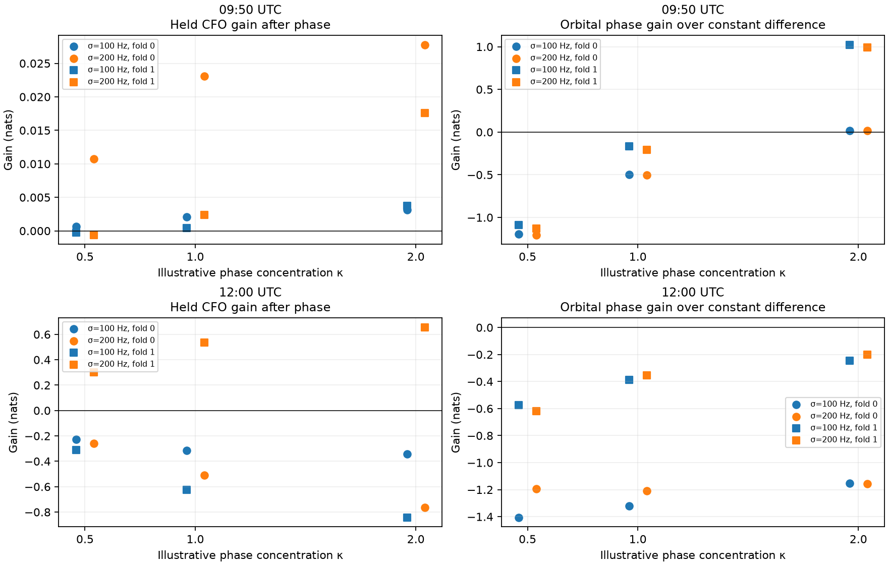

# Timing-aware satellite-pair trial on DS5 phase

**Phase does not yet give a robust satellite-association improvement.** A stronger CFO baseline, with historical orbit-time uncertainty integrated, leaves small phase gains at 09:50 and mixed or adverse gains at 12:00. A changed top candidate pair is not itself evidence of a correct identification. Production association remains unchanged.

This trial uses the real 09:50 and 12:00 [longer-overlap recordings](LONG_OVERLAP.md): 18 selected two-mode dwells per scan, roughly 22 seconds of common support, and all 432 extracted mode-windows. No synthetic phase replaces a real measurement. Synthetic tests verify only the integration mathematics.

## Two integration issues resolved

**Track IDs differ under numerically equivalent configuration serialization.** The extraction plan used `minimum_span_s=3`; production preparation uses `3.0`. Their digests and track IDs differ even though the candidate-and-alias support is identical. An exact ID lookup initially failed. The trial now explicitly joins sets of `(candidate_id, relative_alias_index)` and verifies the equivalent production times and normalized CFO values numerically. It does not modify published IDs or contracts.

| Scan | Selected acquisition track points | Exact equivalent production tracks | Shared probe groups | Production hypotheses containing both tracks |
|---|---:|---:|---:|---:|
| 09:50 | 84 and 43 | One per selected track | 41 | 0 |
| 12:00 | 81 and 25 | One per selected track | 24 | 0 |

**Individual acceptance does not imply a jointly accepted trajectory.** Both selected modes have equivalents in the production input inventory, but the trajectory hypothesis builder treats candidates from one probe source group as exclusive. It therefore does not place these two simultaneous modes in one trajectory hypothesis. This is a modeling boundary to address, not permission to count the same raw evidence twice. The present pair trial explicitly evaluates them as a research hypothesis. Distinct pilot epochs and CFOs plus the earlier phase controls support testing that hypothesis; they do not establish two known satellites.

Final membership audits are in the `*-f1-q65-b161-membership.json` files under [timing-trial](timing-trial). They retain exact candidate IDs and both configuration-dependent track IDs. A future integration needs component-owned tests for a validated simultaneous-mode exception and must retain shared-source covariance or another explicit dependence treatment.

## Stronger CFO comparison

The causal orbit snapshot and reference-site coordinate match the earlier DS5 evidence audit. The coordinate is an existing diagnostic site hypothesis, not a new survey. The horizontal baseline direction is assumed to be 79°; length and receiver ordering remain unknown.

1. Use the historical age-conditioned orbit-time prior already used by the independent DS5 soft-association research. The latest calibration snapshot precedes the recording. Its frozen numerical model and source digest are copied into [timing-calibration.json](timing-calibration.json), with the original pure implementation in [timing_prior.py](timing_prior.py).
2. Partition whole visit-start-second groups with seed **20260930**, sharing the assignment between CFO and phase. Evaluate complementary folds. Phase has 8/10 training/held dwells at 09:50 and 10/8 at 12:00; complementary folds reverse these counts. This is retrospective grouped interpolation, not causal forecasting or an untouched-scan confirmation.
3. Search the full eligible catalogue on training CFO at orbit-time offsets −120 to +120 seconds in 10-second steps. Coarse prior weights integrate probability over grid cells. Retain the union of the best eight candidates at each predefined CFO noise scale, 100 and 200 Hz.
4. Refine those proposals at 0.2-second timing resolution using the historical timing density, then retain four per track separately for each noise scale. Use one-second CFO blocks and integrate an unknown constant CFO intercept with prior standard deviation 1 MHz. Visibility depends only on training epochs. No held CFO or phase selects candidates.
5. Score the same 16 candidate pairs with and without phase. Preserve each candidate's timing posterior instead of plugging in one best-fit orbit time. Unknown signed baseline length is uniform over −2 to +2 m; one circular phase intercept is analytically integrated. Phase concentrations κ=0.5, 1 and 2 are sensitivity assumptions, not calibrated errors.

This is a bounded candidate approximation: a 10-second initial grid can miss candidates whose good timing region is narrow, and discarded proposals are not part of the final normalized probabilities. The reported convergence check covers the subsequent phase/timing quadrature, not completeness of the full catalogue shortlist or convergence of the 0.2-second timing grid. Probability values are conditional on these retained candidates and assumptions.

## Phase and timing are integrated together

For candidate identities A and B, individual orbit-time offsets τA and τB, signed baseline B, and constant phase β:

```
predicted phase(t) = 2π B [fB uB(t; τB) − fA uA(t; τA)] / c + β
```

Here `u` is the line-of-sight projection onto the assumed baseline axis. The observation is the circular mean of the six simultaneous mode differences in each dwell. All dwells remain in the score; descriptive held-pilot thresholds are not used to select favorable observations.

The training phase factor is averaged over the **training CFO timing posterior**, the baseline grid and β. It updates a joint candidate-pair distribution once. The held CFO numerator uses the corresponding **training-plus-held CFO timing posterior** to evaluate the joint density, while phase fitting and the published identity update remain training-only. This is an integration identity for conditional prediction, not fitting phase parameters to held measurements.

An initial approximation sampled the training timing posterior and reweighted its samples by held CFO likelihood. It could miss rare, influential timing support: one case underestimated baseline held evidence by about **7.8 nats** even at 33 quantiles. The final calculation uses the exact fine-grid CFO marginal likelihood and samples each numerator from its own CFO-conditioned timing posterior. A discrete known-answer test checks this identity. Initial 17-quantile outputs are retained as superseded diagnostics, not the reported result.

## Results

The table uses κ=1, 33 equal-mass timing quantiles per identity and 81 baseline points. Gain is held CFO log predictive evidence after adding training phase minus CFO-only evidence; higher is better. It is not identity accuracy or a count of correct satellites.

| Scan / fold | CFO σ | Held CFO gain (nats) | Orbital phase gain over constant difference | Largest pair-probability change | Top pair changes? |
|---|---:|---:|---:|---:|---|
| 09:50 / 0 | 100 Hz | +0.0021 | −0.498 | 0.00023 | No |
| 09:50 / 1 | 100 Hz | +0.0004 | −0.165 | 0.00061 | No |
| 09:50 / 0 | 200 Hz | +0.0230 | −0.501 | 0.02262 | No |
| 09:50 / 1 | 200 Hz | +0.0024 | −0.208 | 0.00256 | No |
| 12:00 / 0 | 100 Hz | −0.3135 | −1.320 | 0.10727 | No |
| 12:00 / 1 | 100 Hz | −0.6260 | −0.389 | 0.23905 | Yes |
| 12:00 / 0 | 200 Hz | −0.5092 | −1.210 | 0.24635 | No |
| 12:00 / 1 | 200 Hz | +0.5354 | −0.353 | 0.37564 | Yes |



Blue is the 100 Hz CFO scale, orange 200 Hz; circles and squares are complementary folds. Positive values help the indicated held score. Each panel has its own vertical scale. The 09:50 gains are small, and neither fold changes its top pair. The 12:00 fold-1 top pair changes from `66571 / 63433` to `66571 / 58476` at both CFO scales, but its predictive gain changes sign. **None of these IDs is known truth.** Choosing the favorable noise scale after seeing held results would overstate success.

At κ=1, orbital phase also loses to a constant double difference in all eight comparisons. At κ=2, the 09:50 phase comparison becomes positive, emphasizing the dependence on uncalibrated concentration. Fold outcomes are correlated and do not supply eight independent validation experiments.

Doubling timing quantiles to 65 and baseline points to 161 at κ=1 changes held CFO gains by at most **0.00423 nats**, phase scores by at most **0.00211 nats**, and pair probabilities by at most **0.00128**. The main adverse/mixed result survives this check. The smallest 09:50 gains should not be interpreted as meaningful improvements merely because their signs are positive.

## Consequences for association and tracking

The phase extraction contains real simultaneous structure, but its present orbital likelihood is not reliable enough to drive satellite identity changes. More timing resolution alone is unlikely to solve the observed sensitivity. The next useful prototype should address the **observation error model** before broadening the catalogue search:

- Derive phase support from independent pilot subsets, carrying weak or multimodal observations as uncertain instead of assigning every dwell the same κ. Freeze that relationship on development groups; do not select evaluation dwells by held phase agreement.
- Model a possible non-geometric residual or outlier explicitly. Compare its predictive evidence with orbital phase and a constant difference. Do not subtract an independent fitted slow trend from each track, because that can erase geometry.
- Use phase first to validate simultaneous-mode continuity and guide weaker-receiver recovery. Before allowing both modes into one production trajectory, test false pairings, alias alternatives and shared raw-source dependence.
- Preserve the exact candidate-and-alias join as provenance. Do not rewrite persisted production IDs to hide the integer/float digest mismatch.

CFO and phase originate in overlapping acquisition/raw samples; multiplying their likelihoods assumes a conditional dependence structure that has not been calibrated here. The pair CFO baseline also uses a product of individual track likelihoods despite shared probes. Both comparison arms share that approximation, but it limits absolute probability interpretation. No independent satellite labels, measured baseline length or instrument calibration are available to establish direction or identity accuracy.

## Reproduction and validation

Run [timing_trial.py](timing_trial.py) for each `--scan 0|1` and `--fold 0|1`, first with `--quantiles 33`, then with `--quantiles 65 --baseline-points 161 --kappa 1`. Run [timing_summarize.py](timing_summarize.py) for the table data and figure. Dependencies and source revision are those in the parent report's provenance. Each individual run here took under a minute; no long radio campaign was performed.

The compressed prediction banks contain numerical CFO residuals, timing priors and line-of-sight projections. They are keyed by scan, fold and track; **use a new output directory or rebuild them if changing inputs, folds, priors or bank-generation code**. They are reproducibility caches, not a versioned production storage contract. The artifact manifest seals the published files.

All **21 focused tests pass**. New tests cover neutral phase updates, exact discrete timing integration, constant-offset invariance, posterior quantiles, complete real-dwell accounting and normalized pair probabilities. [Summary and convergence data](timing-trial/summary.json), individual protocols/results, membership receipts, prediction banks and [test receipt](timing-trial/tests.xml) accompany the report. Passing numerical tests does not establish satellite-association improvement.
