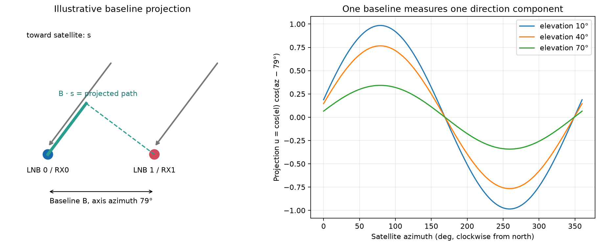
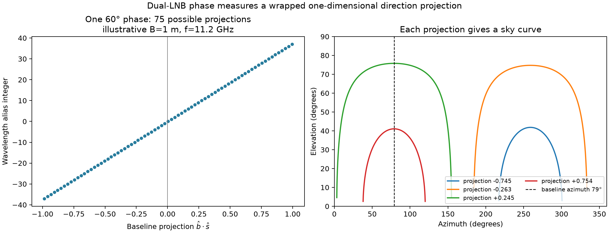
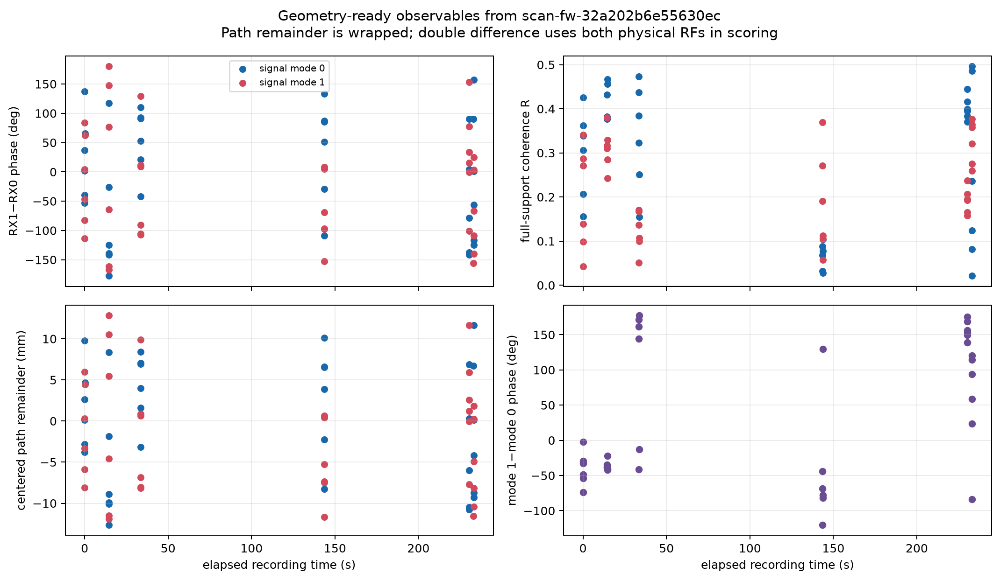
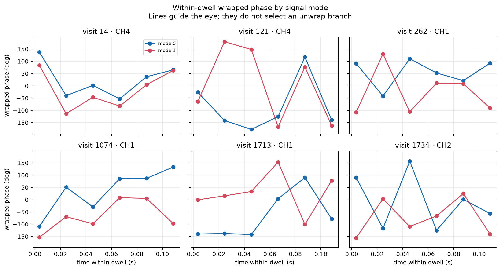
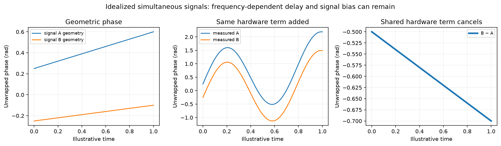
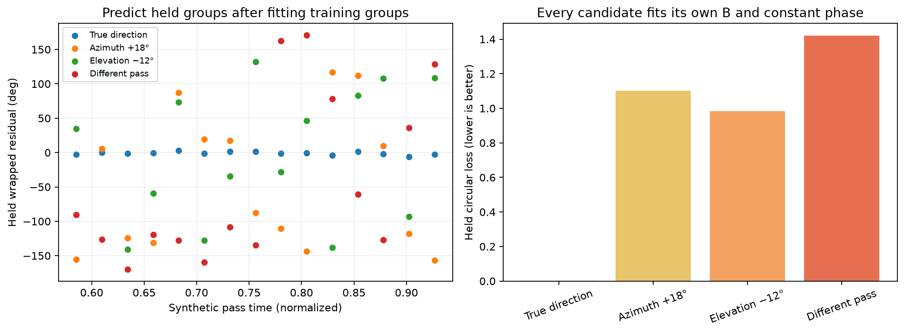

# From two-LNB phase to satellite direction

**Recording:** `scan-fw-32a202b6e55630ec` · **Report date:** 26 September 2026

This standalone report explains and packages a prototype for using two simultaneous receiver signals to constrain satellite direction. It includes the real extracted measurements, explanatory figures, a geometry model, and a reproducible synthetic candidate-scoring demonstration. Reading it requires no earlier report.

Follow-up: the [three-scan DS5 replay and integration report](../2026_09_26_ds5_phase_integration/README.md) adds 324 real measurements, receiver-time controls, simultaneous-track prediction tests and an optional circular association factor.

**Result:** the prototype exports 72 wrapped phase measurements and 36 simultaneous signal-pair differences from six selected visits. It demonstrates candidate discrimination with known synthetic geometry. It has **not recovered an absolute satellite direction or calibrated distance from this recording**. Real phase contains receiver effects, measurement error, and wavelength ambiguity; observer location and baseline length are also unverified.

## 1. What the two antennas measure

A distant satellite illuminates both LNBs with approximately the same wavefront. Their separation projects onto the direction toward the satellite, producing a path difference. Define the baseline vector from LNB 0 to LNB 1 as `b = B b_hat`, and the unit direction toward the satellite as `s`. Under the positive-frequency complex-signal convention:

```
u = b_hat · s
projected path = B u
phase_RX1−RX0 = wrap(2π f_RF B u / c + beta)
```

Here `c = 299,792,458 m/s`, and `beta` includes differential LNB, cable, tuner and receiver phase. The projected path is the negative of `distance_to_RX1 − distance_to_RX0` in the far-field approximation. Swapping receiver labels reverses the sign.

The user supplied an axis azimuth of **79°**. Assuming this means a horizontal baseline measured clockwise from north:

```
u = cos(elevation) cos(azimuth − 79°)
```

The physical direction from RX0 to RX1 along that axis has not been independently confirmed. A signed baseline search can represent that ambiguity. Antenna pointing direction and the line joining the two antenna phase centers are different quantities; this model needs the latter.



The left schematic is illustrative, not a surveyed installation. The right curves show that many combinations of azimuth and elevation give the same projection. One baseline therefore gives a directional constraint, not generally a unique sky coordinate.

## 2. Why phase does not directly give distance

At 11.2 GHz, one wavelength is **26.77 mm**. Adding that much projected path gives the same wrapped phase. With an illustrative 1 m baseline, a single phase observation allows roughly 75 path aliases even if hardware phase were known.



This figure assumes a 1 m baseline and zero instrumental phase solely to explain the ambiguity. Neither is an installation measurement. An unknown `beta` shifts the entire alias family. The exported `centered_path_remainder_m = wavelength × phase / (2π)` is thus an **uncalibrated phase-equivalent remainder**, not a measured absolute path difference.

For scale, one degree of phase at 11.2 GHz corresponds locally to 0.074 mm of projected path. That conversion does not imply submillimetre distance accuracy: noise, response bias, unknown hardware phase and integer wavelengths remain.

## 3. Extraction from the recording

The bounded prototype reuses the fractional-timing pilot cache for visits **14, 121, 262, 1074, 1713 and 1734**. Each visit contributes six 7 ms windows starting at 0, 21, 42, 63, 84 and 105 ms, and two candidate signal modes per window: `6 × 6 × 2 = 72` measurements. This is a selected diagnostic subset, not coverage of every joint detection in the scan. “Mode 0” and “mode 1” are local extraction labels; they do not identify the same satellite across visits, nor prove two distinct emitters.

The extraction sequence is:

1. Pair RX0 and RX1 acquisition candidates, retaining the acquired frequency branch. Guided counterparts are used where the earlier pairing experiment supplied them.
2. Align fractional epoch timing and correlate each receiver with the known pilot template.
3. Form `h1 × conjugate(h0)` for each corresponding pilot coefficient. This product precedes averaging.
4. Fit a residual differential frequency on training pilot blocks, rotate the products to the window midpoint, and check held pilot blocks with the same fit.
5. Average all selected pilot products for the final wrapped midpoint phase. Preserve coherence and train/held disagreement alongside it.

The fractional-timing/fixed-frequency method was chosen after reviewing earlier diagnostics. Its exported full-support phases are descriptive measurements, not a fresh blind validation set. Held disagreement measures internal support consistency, not error against geometric truth.

```
z_k = h1_k conjugate(h0_k) exp[−i 2π delta_f (t_k − t_mid)]
phase = angle(mean(z_k))
R = |mean(z_k)| / mean(|z_k|)
```

`R` measures concentration of the amplitude-weighted complex products. It is not a probability of correctness or a calibrated phase uncertainty. Differential-frequency correction can contain both hardware and geometric rate; retaining its fitted value is necessary for later auditing and transport. An independently fitted slow trend must not be removed from every track, because it could remove the desired geometry.

The physical frequency estimate is `target RF center − actual IF offset + RX0 tracking CFO`. It uses the nominal receiver frequency convention and remains subject to absolute LO error and acquisition ambiguity. RX1 CFO contains a receiver-chain offset and is not averaged into this estimate. Moreover, the phase comes from a multi-tone pilot; treating it as a single-carrier geometry observable assumes its frequency-dependent response can be represented adequately. Per-tone delay/response validation remains necessary for precise geometry.

UTC is derived from the device sample counter and the recording's host time bracket. Relative sample timing is available, but the absolute UTC bracket is **364.640303 ms wide**. This shared timing uncertainty must be profiled when evaluating orbital predictions; it is not independent jitter on every row.

## 4. What the real data shows

| Quantity | Result | Interpretation |
|---|---:|---|
| Phase rows | 72 | Two modes, six windows, six selected visits |
| Simultaneous mode differences | 36 | One pair per window |
| Rows with an existing tracklet match | 66 / 72 | Signal has at least one recorded receiver-track association |
| Rows marked exact members | 54 / 72 | Exact-member flag at signal level; not necessarily both receivers |
| Median full-support R | 0.271 | Substantial within-window dispersion remains |
| Minimum full-support R | 0.021 | Some phases have very weak concentration |
| Median absolute train/held disagreement | 9.71° | Support consistency, not calibrated geometric error |
| RF estimate range | 10.939866–11.690156 GHz | Approximately 25.65–27.40 mm wavelength |

The match counts are repeated window-level counts, not independent track counts or satellite-identification accuracy. Tracklet IDs are receiver-specific, TLE-blind CFO associations.



The overview uses elapsed time from the first exported midpoint. Blue and red denote local mode labels, not persistent identities. The apparent vertical clusters are windows within a dwell. The lower-left panel includes instrumental phase and wavelength ambiguity.



Lines only connect measured wrapped values to guide the eye. They do not assert an unwrap branch or continuity across a wrap. These plots do not yet establish the expected slow satellite geometry. Receiver phase motion, signal mismatch, low coherence and extraction bias remain possible explanations.

## 5. Using simultaneous signals to cancel shared hardware phase

Suppose two candidate signals A and B are observed through the same receiver paths at the same time:

```
phi_A = wrap(2π B f_A u_A / c + beta_common + epsilon_A)
phi_B = wrap(2π B f_B u_B / c + beta_common + epsilon_B)
phi_BA = wrap(phi_B − phi_A)
       = wrap(2π B (f_B u_B − f_A u_A) / c + epsilon_B − epsilon_A)
```



This example is synthetic and deliberately unwrapped for clarity. Common frequency-independent receiver phase cancels. The actual processing uses wrapped complex phase. A differential electrical delay `tau` leaves `2π (f_B − f_A) tau`; frequency-dependent channel response, unequal time support, multipath and signal-specific extraction bias can also remain. The two modes are simultaneous in window midpoint but can have different weighted symbol support, so rapidly changing hardware phase may not cancel exactly.

Each exported double-difference row retains both RF estimates. Its mean-frequency path remainder is display-only. The exact candidate model uses `f_B u_B − f_A u_A`. Shared hardware cancellation is conditional; a cleaner-looking difference is not by itself evidence of satellite geometry.

## 6. How phase can help satellite association

For an observer location and an epoch-appropriate orbit catalogue, predict candidate azimuth and elevation at every phase epoch. Doppler-compatible candidates supply the competing directions. For each candidate, compute its projection on the 79° baseline, predict wrapped phase, and fit only permitted shared hardware parameters using training groups.

The included `scoring.py` prototype searches a baseline-length grid and fits one constant instrumental phase for each candidate. It reports circular loss `mean(1 − cos(observed − predicted))` on training and held data. It also provides a double-difference scorer. These are simple unweighted mathematical interfaces; they do not yet propagate measurement covariance, timing uncertainty, channel-dependent phase or differential delay.



This standalone demonstration uses 42 synthetic observations, a true baseline of 0.79 m, constant phase 0.48 rad and Gaussian phase noise of 0.035 rad. It randomly holds out five of fourteen whole groups of three observations, using seed **20260926**. Every candidate fits its own baseline and constant phase on training groups. Exact results and assignments are in [randomized-benchmark.json](randomized-benchmark.json).

This is a new randomized demonstration. The earlier prototype's periodic group split and 1.98° result are not relabeled as random. The demonstration tests a favorable, specified forward model; it does not establish robustness to real receiver drift or prove that this recording can identify satellites.

| Synthetic candidate | Held circular loss | Held phase RMS |
|---|---:|---:|
| True direction | 0.000891 | 2.42° |
| Azimuth shifted +18° | 1.1024 | 106.64° |
| Elevation shifted −12° | 0.9847 | 96.31° |
| Different pass | 1.4198 | 126.01° |

An operational use would compare CFO-only ranking with CFO-plus-phase ranking on the same unseen whole dwells or track groups. A useful phase result rejects a Doppler-compatible candidate whose projected direction evolution is wrong, while preserving candidates indistinguishable under baseline sign, phase offset or wavelength aliases. Affinely related projections can remain degenerate after nuisance fitting; the scorer cannot resolve every pair of sky tracks.

## 7. What is needed for real sky inference

| Input or check | Current state | Intended use |
|---|---|---|
| Baseline axis | User reports 79° | Confirm horizontal azimuth and RX0→RX1 sign convention |
| Baseline length | Unknown | Profile a physically defensible signed length range |
| Observer position | Absent from raw manifest | Propagate orbit directions; a repository site preset is not recording authority |
| Orbit catalogue | Not bundled in this prototype | Generate candidate identities, not assume the winning satellite |
| Hardware grouping | Conditional | Share nuisance parameters only across compatible time/frequency/path groups |
| UTC offset | 364.64 ms bracket | Profile shared time uncertainty during candidate prediction |
| Phase reference and response | Local midpoint extraction | Validate reference transport, per-tone response and retune behavior |
| Quality model | R and support disagreement saved | Calibrate likelihood weights using controls or injection truth |

Candidate identities need not be known in advance: an orbit catalogue generates hypotheses that can be ranked. Ground truth, independent of the phase fit, is needed to claim identification accuracy. No local calibration is assumed available. Shared-signal differences and constrained nuisance fitting remain possible, but unconstrained per-track trends or per-dwell offsets would absorb the geometry.

## 8. Files, reproducibility and provenance

All files needed to read the report, inspect the extracted rows and rerun its geometry illustration are in this directory. No receiver hardware, database or raw recording access is required for that use.

| File | Purpose |
|---|---|
| [measurements.csv](measurements.csv), [measurements.json](measurements.json) | Frozen real measurement export with time, RF, phase, quality and track IDs |
| [double-differences.csv](double-differences.csv), [double-differences.json](double-differences.json) | Simultaneous mode-pair observables and cancellation caveats |
| [recording-authority.json](recording-authority.json) | Available and missing geometry authority |
| [prototype-summary.json](prototype-summary.json) | Original export statistics; its synthetic-winner field refers to the earlier demonstration |
| [geometry.py](geometry.py), [scoring.py](scoring.py) | Report-local geometry and scoring code |
| [illustrate.py](illustrate.py) | Regenerates new explanatory figures and randomized benchmark |
| [validate.py](validate.py) | Checks frozen row integrity, phase subtraction and benchmark behavior |
| [provenance.json](provenance.json) | Source paths and SHA-256 for copied inputs |
| [validation.json](validation.json) | Standalone validation results |

Install NumPy and Matplotlib in a Python environment, then run from this directory:

```sh
python illustrate.py
python validate.py
```

The original extraction used the frozen pilot-refinement cache under `reports/2026_09_26_scan_fw_32a202b6e55630ec_phase_replay/single-track/` in the phase replay worktree. Re-extracting raw IQ still requires that cache or the original corpus and its extraction dependencies; this bundle does not claim to reproduce raw acquisition independently. Copied measurements and real plots are preserved as generated. The earlier 151-test report-suite result belongs to that source worktree; the standalone checks have their own receipt.

The bundled geometry helper also fixes scalar-elevation/array-azimuth broadcasting, covered by standalone validation. Its source and modified hashes are distinguished in the provenance file. The six illustrations comprise three preserved measurement/ambiguity figures and three newly generated explanatory figures; SVG versions of the new figures are included for reuse.
