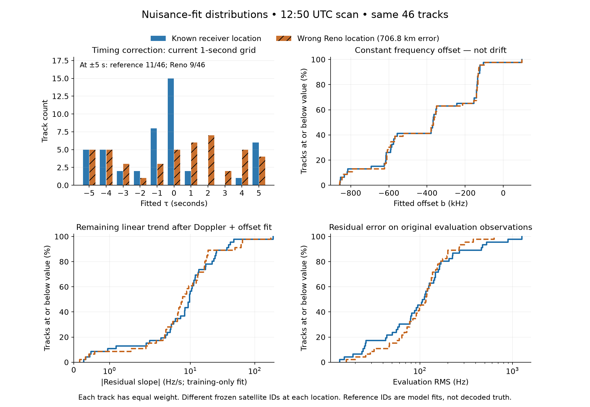
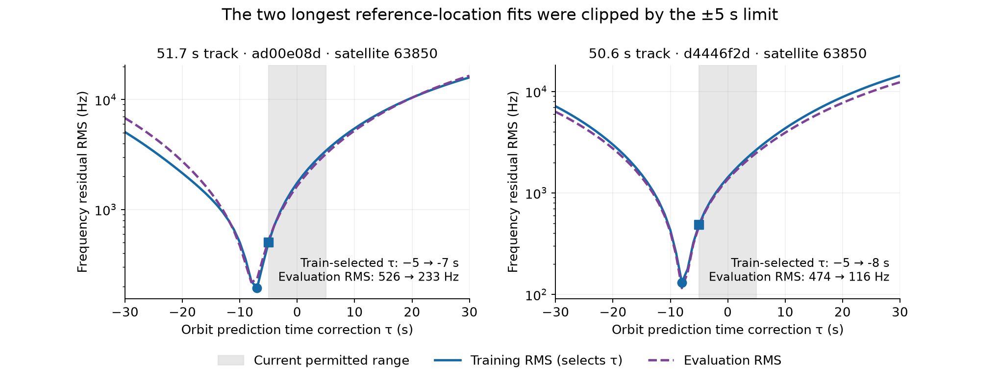

# Timing boundary and nuisance distributions

## Scope

Paired diagnostic of the **same 46 tracks in the 2026-09-26 12:50 scan** (`scan-fw-d86e8f23c0624bac`). Compare the known receiver location against the published wrong Reno location (706.761 km error). Each branch retains its own satellite IDs from the preceding analysis. No Sacramento location or identity is used. Reference-based results do not enter an inference search.

“Correct” here means **correct receiver coordinates**, not independently authenticated satellite identities. Identities were selected using the original evaluation observations, so neither these scores nor the diagnostic drift experiments constitute independent validation. Tracks overlap and are correlated; 46 tracks are not 46 independent scans. Distribution plots use equal track weights, not occupied-second weights.

## The actual bounds and fit

The production prediction bank and evaluator both default to `np.arange(-5.0, 6.0)`: **11 timing values, -5 through +5 seconds in 1-second steps**. Satellite propagation is evaluated at `capture_start + observation_time + tau`. Negative tau uses an earlier orbital epoch. The constant `+507` seen in interpolation indexing merely accounts for the bank's -507-second origin; it is **not** a fitted 507-second correction.

The fitted model is:

`measured_frequency(t) ≈ Doppler(location, satellite, t + tau) + b`

- `tau`: fitted independently per track; it can absorb timestamp, orbit, geometry, or other model error. It is not an identified receiver-clock error.
- `b`: constant frequency offset, fitted as the mean training residual for each candidate/tau; no explicit finite magnitude bound in this fit. It is **not frequency drift** and is not a clean oscillator calibration: carrier/channel offsets and modelling errors can also contribute.
- Production does not fit a linear frequency-drift parameter here. For diagnosis, we additionally regress the remaining residual on time using **training observations only**, keeping identity, location, and the baseline selected tau fixed. This slope is in Hz/s, not clock-drift ppm. Its value can reflect orbital/model/association errors, not only oscillator drift.

Boundary hits mean a constrained minimum occurred at -5 or +5. A hit alone does not prove the unconstrained optimum lies outside; a wider check is necessary.

## Paired distributions at the original ±5-second bound

| Metric | Known receiver location | Incorrect Reno location |
|---|---:|---:|
| Median absolute timing correction | 1 s | 3 s |
| Timing correction within ±1 s | 25/46 | 14/46 |
| At either timing boundary | 11/46 (23.9%) | 9/46 (19.6%) |
| Median absolute constant frequency offset | 368.6 kHz | 365.8 kHz |
| Median absolute residual slope | 9.69 Hz/s | 7.49 Hz/s |
| 90th-percentile absolute residual slope | 30.99 Hz/s | 33.91 Hz/s |
| Median absolute linear trend across observed track span | 193 Hz | 190 Hz |
| Median evaluation RMS | 108.71 Hz | 116.00 Hz |

For the 11 tracks spanning at least 30 seconds, median absolute residual slope is **7.06 Hz/s at reference versus 6.88 Hz/s at wrong Reno**. The two longest reference tracks have signed residual slopes -9.23 and +7.06 Hz/s, approximately -478 and +357 Hz across their respective spans. They overlap almost completely, yet have opposite slope signs under the clipped fits: these slopes should not be interpreted as a measured common receiver-oscillator drift.

The constant-offset and residual-slope distributions overlap heavily. Correct-site fits more frequently have small timing corrections, but boundary counts alone do not distinguish correct and incorrect location hypotheses. No classifier threshold is derived from this one selected failure.

## Wider timing diagnostic: ±30 seconds, same 1-second grid

Freeze the locations and satellite identities, refit constant offset and tau on training observations, then report the original evaluation observations. This is not a new full-catalogue location search.

| Reference-location track | Original tau | Expanded tau | Original evaluation RMS | Expanded evaluation RMS |
|---|---:|---:|---:|---:|
| 51.72 s, `ad00e08d`, ID 63850 | -5 s | -7 s | 525.62 Hz | 233.26 Hz |
| 50.59 s, `d4446f2d`, ID 63850 | -5 s | -8 s | 474.21 Hz | 115.66 Hz |

Both training and evaluation error improve substantially: **these two fits really were clipped**. On those same tracks, wrong-Reno fits retain tau -4 and -5 s and evaluation RMS 196.12 and 101.03 Hz. Expanding reference timing reduces the unfair constraint on that explanation but does not by itself make its residual smaller than the wrong-location fit.

Across all tracks, 7/46 reference fits and 5/46 wrong-Reno fits select tau outside ±5 s; none hits ±30 s. Selected expanded timing ranges are -11 to +15 s at reference and -7 to +11 s at wrong Reno. Wider fitting does **not** universally improve evaluation error: three short reference tracks (about 6–11 s) worsen despite lower training error. This is a warning against freely widening nuisance flexibility on weak tracks.

Median reference evaluation RMS changes little (108.71→108.54 Hz), while its 90th percentile improves 363.35→229.73 Hz. Those are descriptive statistics from this selected case, not independent validation metrics.

## What this supports

1. The ±5-second boundary can penalize plausible reference-location explanations, and boundary-triggered timing diagnostics are justified.
2. The timing correction is an effective model parameter, not proof that a receiver clock is seven or eight seconds wrong. Per-satellite orbit errors or other mismodelling remain plausible explanations, not established causes.
3. Large/small constant offset or residual drift alone does not distinguish these correct-coordinate and incorrect-coordinate fits.
4. A linear residual term can lower errors at **both** locations. With tau held fixed, adding a training-fitted slope improves evaluation RMS on 30/46 reference tracks and 29/46 wrong-Reno tracks. Median evaluation RMS falls to 70.30 and 74.48 Hz respectively. More flexibility is not automatically stronger localization evidence.
5. No production bound, prior, candidate inventory, or public contract was changed. Independent-prior searches would need their own frozen wider-timing test before claiming location-error improvement.

## Verification and artifacts

`analyze_nuisance.py` reconstructs the identical evidence and causal TLE snapshot through public ports, propagates the union of already-selected satellite IDs only, and evaluates each branch's own frozen ID. It asserts exact selected tau and constant offset/evaluation RMS parity within 1e-6 against the preceding reference audit and immutable Reno document. All **92 track/site baseline RMS checks matched exactly**. `nuisance_results.json` records the full 61-point profiles, fits, drift diagnostics, and evidence/source hashes.

Three focused tests pass: analytic offset-versus-drift separation and training-only isolation; detection of a known clipped timing minimum; and rejection of empty partitions. `plot_nuisance.py` produces the static figures and `nuisance_summary.json`. No new RF collection or production mutation occurred.
