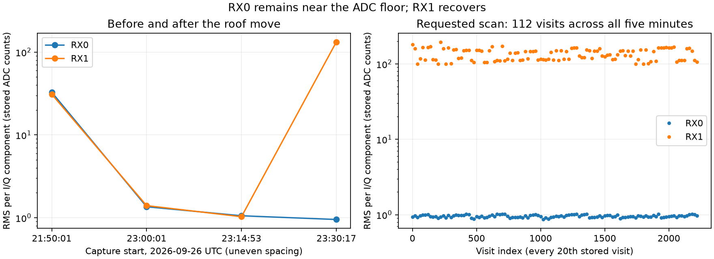

# RX0 floor investigation: scan-fw-2e6b78f0cd0cbbbc

**Repair verification, 2026-09-27:** after the operator repaired coax issues,
both receivers recovered substantial input and strong known-pilot responses.
See [the follow-up](repair-verification.md). The original investigation below
describes the pre-repair recording.

RX0 contains changing, very low-amplitude samples, but essentially no convincing
known-pilot evidence. The imbalance exists in the raw capture, before the UI or
tracking stage. The leading hypothesis is a loss of the external RF/noise input
to RX0 (LNB power, cable, connector, or input selection/path). The available data
does not distinguish these causes or prove a failed receiver.

## Evidence

The radio is `.20`, serial `1040005e0b100007100010000bf33a5d4d`. The scan runs
approximately 23:30:18–23:35:18 UTC on 2026-09-26. Its manifest digest is
`sha256:008a7b873a386e254da5897cdbc15c6641a99667c7f9074e92a407005d999867`.

The audit reads every twentieth raw visit: 112 visits distributed across all
five minutes and all four lower-edge frequency targets, totaling 33.6 million
complex samples per receiver. Both compressed and uncompressed chunk hashes
pass. This is a sample of the raw recording, not full-payload verification.
RMS values below are per real I/Q component in stored ADC counts, including DC;
they are not calibrated input power. Component standard deviations independently
confirm the amplitude difference, so it is not a DC-offset artifact.

| RF channel | Sampled visits | RX0 median RMS | RX1 median RMS | Median RX1/RX0 power difference |
|---|---:|---:|---:|---:|
| 1 | 33 | 0.979 | 160.802 | 44.17 dB |
| 2 | 22 | 0.937 | 149.587 | 44.05 dB |
| 3 | 30 | 0.971 | 113.990 | 41.62 dB |
| 4 | 27 | 0.927 | 107.365 | 41.24 dB |

RX0 is neither missing nor entirely zero: approximately 41–43% of individual
I/Q components are zero and sampled peaks reach only 5–6 counts. RX1 peaks reach
1,010 counts. RX0 I/Q standard deviations span approximately 0.80–1.05 counts;
RX1 spans 99–196 counts. This is consistent with RX0 recording a very low noise
floor. A direction-dependent lack of satellites alone is a less satisfactory
explanation for the broadband 41–44 dB discrepancy across all four targets.

All 2,222 persisted analysis visit files were read and their compressed and
uncompressed hashes checked against the metrics manifest. Each receiver has
2,222 analyzed probes. RX0 has 11 passing probes (15 candidates), versus RX1's
1,105 passing probes (2,697 candidates), at the 0.025 fractional-margin gate.
Maximum margins are 0.0474 and 0.8333 respectively; median best margins are
0.00971 and 0.02175. The sparse, predominantly borderline RX0 passes do not
establish a useful signal or a satellite detection; no null-distribution or
trajectory validation was performed on those passes.

The acquisition receipt records both receivers `[0, 1]`, manual 40 dB gain,
2.5 MS/s, zero missing transport samples, zero dropped device events, zero
unreceived tail samples, and completed status. The valid duty is 88.88%, below
its 90% target due to transition-invalid intervals; those intervals are common
to both receivers and do not explain the RX0-only amplitude collapse.

## Earlier recordings

Every eightieth raw visit was checked in each of three earlier sessions (28
visits each), with both payload hashes verified. All request manual 40 dB gain.

| Start UTC | Session suffix | Rate | RX0 median RMS | RX1 median RMS |
|---|---|---:|---:|---:|
| 21:50:02 | e24a267710fdd336 | 10 MS/s | 32.78 | 30.97 |
| 23:00:02 | ed1fe3d3ccf5fd45 | 10 MS/s | 1.36 | 1.40 |
| 23:14:53 | ce1f8e4ca49fce5c | 5 MS/s | 1.06 | 1.03 |
| 23:30:18 | 2e6b78f0cd0cbbbc | 2.5 MS/s | 0.95 | 132.50 |

Both channels had comparable amplitudes at 21:50. Both were near the floor in
the two next available captures, and only RX1 recovered in the requested scan.
The exact failure instant is not established. Rates/bandwidths vary between
some captures, so absolute cross-session amplitudes are not a controlled power
comparison. The 21:50-to-23:00 collapse occurs at the same 10 MS/s rate; the
within-session receiver imbalance at 23:30 is also independent of that caveat.

## Configuration and remaining uncertainty

The installed acquisition release is
`125801e38feac6fdda36bba898ca76ef90877653`.
Its PPU `hardware/iio_persistent_hop.py:156` calls
`configure_source_locked_receiver_geometry`; `hardware/iio.py:958` sets manual
gain for every enabled receiver and rejects a readback that does not exactly
match both requested gains, gain modes, rate, bandwidth, and channel layout.
This weakens the hypothesis that ordinary host configuration simply forgot RX0.
It does not independently prove the analog path or exclude a firmware fault or
changes after configuration. The restoration receipt describes post-session
settings, not a measurement of gain throughout the capture.

A read-only SSH settings inspection was attempted, but strict host verification
failed: the radio presented a key different from the saved key. No credentials
were sent past the failed verification, no host-key record was changed, and no
live gain, RF-port, or LNB-power state was established by that attempt.

The roof pose document explicitly says the physical connector RX1/RX2 to
software RX0/RX1 mapping is provisional. Do not label this as the west-antenna
failure without confirming the cable mapping.

First inspect RX0's LNB supply/bias path, coax and adapters, and physical input
connection. If these do not identify the fault, a separately authorized,
controlled cable-swap comparison would distinguish a fault following the
external chain from one remaining with the receiver input. Such a comparison
must preserve/record the connector mapping and use an explicitly authorized
bounded capture; none was started here. Current host identity should also be
verified before using SSH to inspect RF-port selection and gain settings.

## Reproduction and scope

`investigate.py` reads only the existing local corpus and prints the complete
audit to stdout. Run with the repository Python and sufficient read access to
the production storage, redirecting to `evidence.json`; then run `plot.py`.
The audit and plot completed successfully. No production implementation,
recordings, analysis products, services, radio settings, or golden fixtures were
changed. This report directory is the only workspace addition from this audit.
