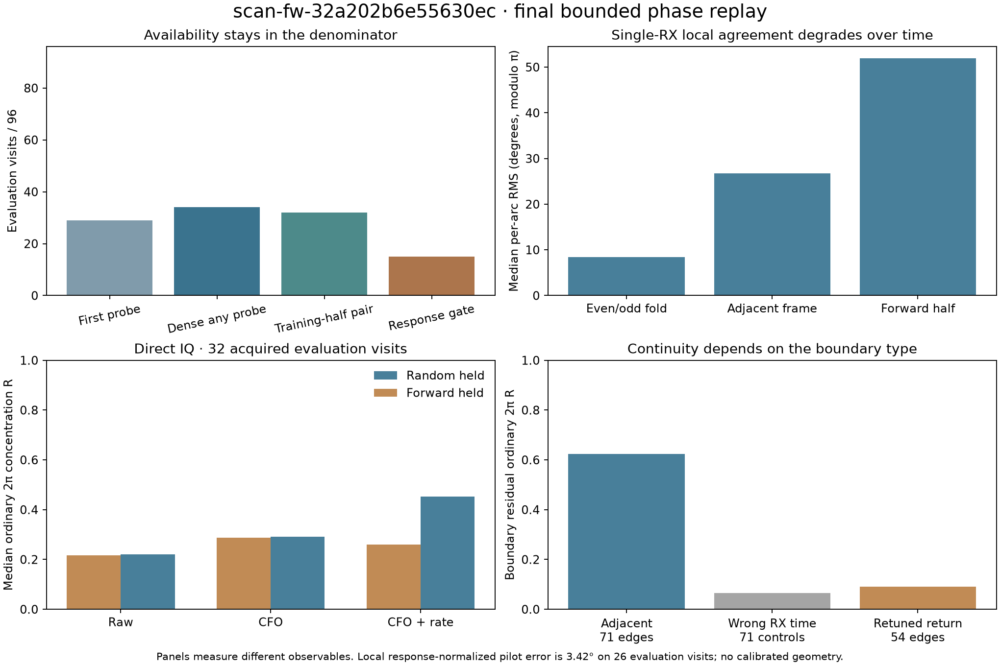
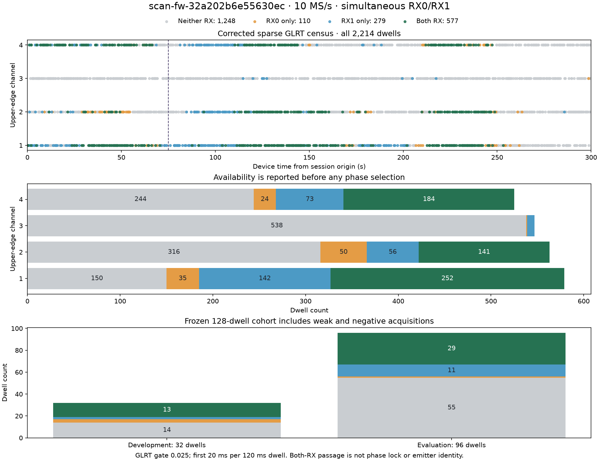
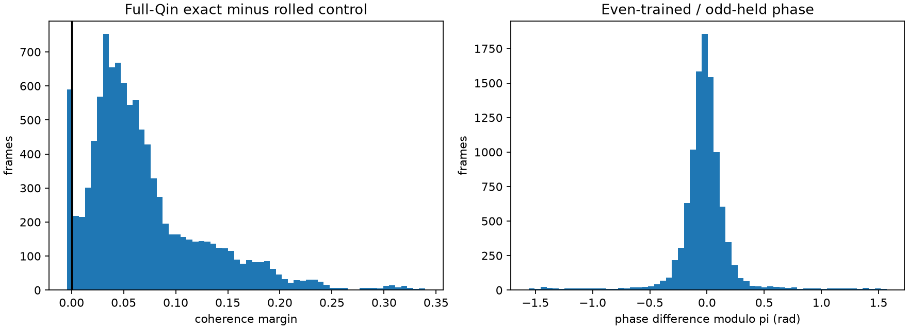
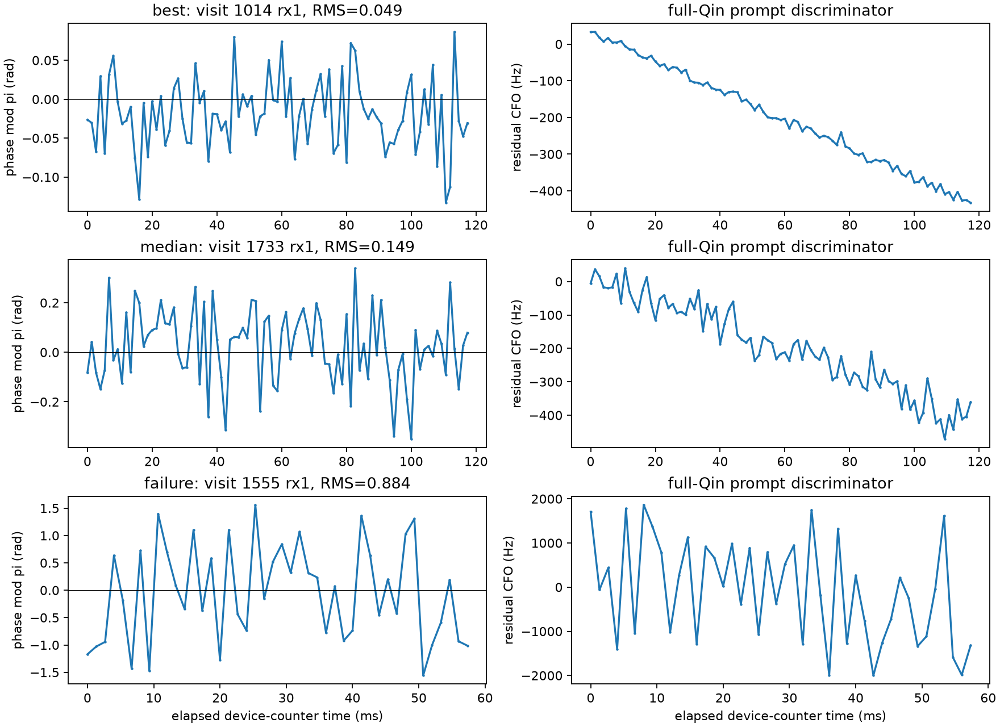
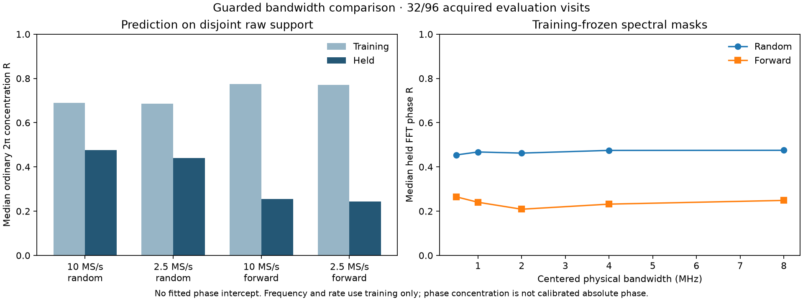

# Phase recovery on scan-fw-32a202b6e55630ec

**Local phase is measurable, but this recording does not support a continuous absolute phase track through retunes.** Corrected dense acquisition improves coverage; response-normalized dual-RX extraction gives the strongest local held result. Full-dwell PNT V1/V2 do not qualify a phase lock. Adjacent unchanged-target boundaries retain some structure, while returns after tuning elsewhere fail.

This report completes a bounded replay of the 30-method ledger using SOL workers and a coordinator review. The full 128-visit cohort was processed for capture/acquisition, frame extraction, ordinary/modulo-π/V1/V2 tracking, PSS/SSS and the primary dense broadband comparisons. Expensive historical feedback/batch/semi-coherent/V3/V4 variants use the explicitly labeled frozen development subset. Those rows are not full-cohort efficacy claims. No new RF collection or production change was made.

## Main results

- **Capture:** all 2,214 chunks and the full 2.6568-billion-row stream pass integrity checks. No known timestamp-word signature, clipping or repeated 100k-row block was found. This excludes the tested defect, not every possible RF impairment.
- **Acquisition:** six 20 ms probes per dwell give simultaneous dual-RX detections in **49/128 visits**, versus **42/128** with only the first probe. Evaluation coverage rises from **29/96 to 34/96**. Only **46/128** have a paired acquisition in the training half and are eligible for the dense forward broadband comparison.
- **Frame-local Qin:** 10,301 extracted frames on 124 acquired receiver arcs. Evaluation median per-arc even/odd phase disagreement is **8.5° modulo π**; adjacent prediction is **26.7°**, and the forward-half baseline is **51.9°**. Fold agreement is not absolute-phase truth.
- **Actual full-dwell tracking:** ordinary 2π resets **2284** times and modulo-π resets **668** times. PNT V1 and V2 each yield **0 phase locks on 124 acquired arcs**; 2 arcs return no result. The smaller modulo-π wrap interval explains part of its lower error.
- **Response-normalized phase:** **26 evaluation visits** have second-half pilot checks, with median error **3.42°**. **15/96** evaluation visits pass the broadband support gate. These are different denominators; the phase error is conditional on an available pilot check.
- **Direct IQ / FFT / bandwidth:** random reconstruction improves after CFO correction, but forward phase remains weak. Guarded native random/forward median R is **0.477/0.255**; matched derived-2.5-MS/s gives **0.440/0.244**.
- **Across visits:** adjacent-boundary causal R is **0.624** with **33.08°** median development-calibrated error on 71 evaluation edges. Actual retuned returns give **R=0.090**, **76.13°** median error on 54 evaluation returns. The evidence does not support absolute phase, satellite identity or geometry.

## Approach / report / outcome

The [historical review](HISTORICAL_REVIEW.md) gives previous outcomes and original report links. The table below gives this recording's replay outcomes. Counts are visits unless explicitly labeled receiver arcs, windows, frames or edges. R is circular concentration, not Pearson correlation; different phase symmetries and normalization conventions must not be ranked on one common scale.

| Approach | Replay report / scope | Outcome |
| --- | --- | --- |
| 01. Integrated CFO boundary bridging | [552 candidate adjacent boundaries; 99 CFO-compatible; 71 evaluation](cross-dwell/REPORT.md) | Some adjacent-boundary continuity; no unique cross-retune phase bridge. |
| 02. Frame-local Qin phase | [128 visits; 124/256 receiver arcs acquired; 86/192 evaluation arcs](frame-methods/REPORT.md) | Strong local fold agreement; it does not establish continuity between frames. |
| 03. Adjacent-frame correlation | [128 visits; 124/256 receiver arcs acquired; 86/192 evaluation arcs](frame-methods/REPORT.md) | Adjacent constant-increment prediction is substantially worse than within-frame agreement. |
| 04. Prompt phase versus integrated linear Doppler | [8 frozen development visits / 16 receiver cases; 9 acquired](frame-methods/actual-05-14-smoke.json) | Actual integrated linear CFO: 126/632 exact phase transitions accepted versus 124/632 rolled-control; no useful exact continuity advantage. |
| 05. Five-state phase feedback | [8 frozen development visits / 16 receiver cases; 9 acquired](frame-methods/actual-05-14-smoke.json) | Actual phase-feedback on/off replay changes final rate by median 102.48 Hz/s; computational completion is not a phase lock or truth-frequency improvement. |
| 06. Ordinary 2pi long tracking | [128 visits; 124/256 receiver arcs acquired; 86/192 evaluation arcs](frame-methods/fullspan/fullspan-trackers.json) | Actual full-span ordinary tracker: 2284 resets; 122 numerical completions, 2 no-results. No continuous long-track phase established. |
| 07. Full Qin phase slope | [10,301 frames on 124 acquired receiver arcs](frame-methods/REPORT.md) | Full 300-symbol/eight-tone Qin supports local frequency measurement; absolute CFO truth and emitter identity remain unavailable. |
| 08. Offline binary-pi batch fit | [8 development visits: 8 complete / 8 insufficient receiver cases](frame-methods/actual-08-smoke.json) | Historical channel/delay separation and binary-π batch core ran; median fitted residual about .777 rad is weak and uses future data. |
| 09. Causal modulo-pi filter | [128 visits; 124/256 receiver arcs acquired; 86/192 evaluation arcs](frame-methods/fullspan/fullspan-trackers.json) | Modulo-π tracker reduces resets to 668; the shorter wrap interval is not proof of unambiguous 2π phase. |
| 10. Five-state modulo-pi PNT | [128 visits; 124/256 receiver arcs acquired; 86/192 evaluation arcs](frame-methods/fullspan/fullspan-trackers.json) | PNT V1 and V2 each produce zero inner phase locks; 122 numerical completions and 2 no-results per kernel. |
| 11. Production multi-window qualification | [116 acquired arcs with ≥75 ms raw support](frame-methods/fullspan/fullspan-trackers.json) | Zero inner phase locks; a pipeline requiring that gate cannot pass. No outer-gate success is imputed; shorter arcs are duration-ineligible. |
| 12. Short segments versus long GLRT lines | [Actual 50/75/80/100/120 ms bounded spans plus full-cohort local folds](frame-methods/REPORT.md) | Short local observations exist, but the forward-half phase baseline deteriorates to near-uniform modulo-π error. Multi-second uninterrupted GLRT lines cannot be reproduced inside a 120 ms dwell. |
| 13. Scanner retune-bounded tracking | [128 visits; 124/256 receiver arcs acquired; 86/192 evaluation arcs](frame-methods/fullspan/fullspan-trackers.json) | Every arc remains within its original dwell. Acquisition duration reaches 120 ms, but qualified continuous PNT phase span remains zero. |
| 14. Semi-coherent pooling | [9 development arcs: 20/50 ms 9 each; 100 ms 8 eligible](frame-methods/actual-05-14-smoke.json) | Actual semi-coherent line pooling: median even/odd frequency differences 25/0/0 Hz; rate differences 600/500/400 Hz/s. Same grid bin is not zero uncertainty; phase is a per-frame nuisance. |
| 15. Capture/reset mechanism | [All 2,214 chunks / 2.6568 billion dual-RX rows](capture-audit/REPORT.md) | Hashes pass; zero known counter-word matches, clipped rows or repeated 100k-row blocks. Retune failures remain despite absence of this contamination signature. |
| 16. Robust jump and phase-gated filters | [124 cached arcs; exact V2/phase-gated comparison bounded to development states](frame-methods/row16-root/REPORT.md) | On matched evaluation frames, robust jump median per-arc frequency RMS 43.61 Hz versus trailing-20-ms line 47.53 Hz. Offline smoothing uses future times; this is frequency consistency, not phase continuity. |
| 17. V3 phase-safe tracking | [14 actual V3 development spans at 75/120 ms](frame-methods/REPORT.md) | 10 numerical completions, 4 no-results after independent alignment; bounded acquisition ablation, not a 128-visit V3 efficacy claim. |
| 18. V4 seed/control correction | [16 development receiver cases: 8 processed, 7 not acquired, 1 short](frame-methods/v4-smoke.json) | Actual seeded V4: zero phase-qualified modes; experimental uncalibrated thresholds unchanged. |
| 19. PSS/SSS carrier phase | [128 visits / 256 receiver cases; independent PSS 4, conditioned 73, SSS 17](sync-spectral/REPORT.md) | Correct physical GLRT seed improves PSS timing availability. Carrier prediction remains weak: conditioned PSS held RMS .279 cycles; independent SSS .282 cycles. |
| 20. PSS timing phase / weighting | [48 evaluation receiver cases with GLRT-conditioned PSS timing](sync-spectral/REPORT.md) | Equal-weight timing held RMS about .802 μs; score and robust weighting do not rescue carrier continuity. 125/250 ms uninterrupted windows are unavailable. |
| 21. Dual-RX pilot double difference | [42 sparse-acquired primary visits; 2 multimode evaluation visits](dual-rx/method21-22-shared-residual.json) | Actual simultaneous-IQ two-mode DD: at 23 ms R=.584 versus shifted-RX .055, but 47/95 ms controls remain strong. Two candidate modes are not proven distinct emitters. |
| 22. Double-difference window/common-frame tests | [42 sparse-acquired visits; 29 evaluation; 23/47/95 ms](dual-rx/method21-22-shared-residual.json) | Single-pair exact/control median frame R: .884/.543, .662/.425, .555/.324. Longer windows reduce coherence; frame-center coincidence is not required for the simultaneous-IQ variant. |
| 23. Response-normalized disjoint-band phase | [128 visits; 46 training-half acquired; 40 completed; 21 broadband-supported](dual-rx/method23-dense-relative-phase-summary.json) | Best local held result: 26 evaluation visits have held pilot checks, median 3.42°. Only 15/96 evaluation visits pass the broadband support gate. Response normalization removes instrument/channel terms; this is not raw geometric phase. |
| 24. Direct dual-RX IQ | [46 training-half-acquired visits; 32 evaluation](dual-rx/dense-direct/method24-corrected-summary.json) | Random-held R raw/CFO/CFO+rate=0.221/0.292/0.452; forward=0.216/0.288/0.259. Local correction helps reconstruction but does not establish future phase. |
| 25. Aggregate and per-bin FFT | [46 training-half-acquired visits; 32 evaluation](sync-spectral/guarded-spectral-dense-summary.json) | Full FFT/direct Parseval error ~7.3e-17 rad. Held common-bin and phase-only results remain close to direct IQ; equivalent transforms do not add independent evidence. |
| 26. Bandwidth | [Same 32 acquired evaluation visits and identical guarded splits](sync-spectral/guarded-spectral-dense-summary.json) | Native 10 / derived 2.5 MS/s random-held R=0.477/0.440; forward=0.255/0.244. Narrowing bandwidth does not rescue continuity. |
| 27. Absolute phase across a track | [177 touched visits; 75 retuned returns; 54 evaluation returns after CFO gate](cross-dwell/REPORT.md) | Actual retuned-return prediction fails: R=.090 and median absolute error 76.13°. Absolute phase across a track remains unresolved; not every visit of every track was extracted. |
| 28. Global-time adjacent-boundary transport | [99 admitted adjacent edges; 71 evaluation / 56 overlapping-edge groups](cross-dwell/REPORT.md) | Historical joint R=.636; raw-disjoint joint=.634; left-only causal=.624. Median development-calibrated error 33.08°; shifted-RX control R=.065. |
| 29. Cross-track replication | [Evaluation CH1/CH2/CH4 edges: 33/17/21](cross-dwell/REPORT.md) | Causal R=.500/.648/.835 by channel. CH3 has no admitted edge. These are within-recording repetitions, not independent recording replications or named satellites. |
| 30. Phase-assisted association | [22 development and 56 evaluation edge groups; 33 TLE reviews available](cross-dwell/REPORT.md) | Development-frozen circular pairing model beats uniform reset by 21.74 log-likelihood units on evaluation groups. This supports local pairing evidence; missing qualified baseline/phase reference prevents geometric identification or TLE reranking. |

## Visual evidence

## What the fixes changed

The saved sparse product was already produced by corrected release `2c30eaf5…`; numerical parity with replay base `e1a24b20…` was checked. It is not legacy evidence. The bounded legacy/corrected comparison and mechanism ablations are in [acquisition](acquisition/README.md). On eight frozen diagnostic visits, tuning-only, wider coverage, fallback and 22-candidate shortlist each found at least one passing candidate in five visits; they retained 14/13/15/18 passing candidates respectively. Wider coverage cost more without another recovered visit. These are diagnostic counts, not calibrated false-alarm rates.

Raw and RF-valid input are identical for the tested timestamp-word defect on this scan. No zero filling, deletion or invented capture repair was applied. Correct physical CFO coordinates were essential: display aliases cannot be used for coherent mixing or PSS conditioning.

## Validation and practical limits

The 128 visits were chosen from metadata: four targets × eight common session-time bins × four hash-ranked visits. The first two bins are development (32); the remaining six are evaluation (96). Failed acquisitions stay in the denominator. Source samples, acquisition candidates, code and configurations are retained in the reproduction artifacts.

The final spectral results use shared random partitions at both rates, raw-disjoint windows with FIR guards, training-only alias/frequency/rate fits, and training-frozen masks. Earlier spectral and direct files with incorrect operation order, future-fit leakage or overlapping transform support are superseded; see [review log](REVIEW.md). Random reconstruction and forward prediction remain separate.

The full-span trackers use the earliest qualifying dense probe and only the remaining actual raw support. An acquisition consumes 20 ms, so earlier innovations are acquisition-conditioned diagnostics, not online forecasts. Response-normalized results remove learned instrument/channel terms. Neither a fitted phase intercept nor a response correction is a measured electrical baseline.

The shared-source double-difference experiment has only two frequency-separated candidate visits. Shifted-receiver and deranged controls prevent interpreting a near-zero difference as automatic two-emitter or geometric evidence. The 23/47/95 ms results do not provide independent visit-level replication.

Cross-dwell selection inventories all 552 same-target candidate boundaries, then uses 99 with phase-blind CFO-compatible sparse support. Retuned-return testing uses 177 visits touched by that analysis; it is a bounded subset, not every visit in all 45 tracklets. Overlapping edges are grouped. Existing TLE reviews are available, but a qualified electrical baseline and a stitched phase reference are not. The absolute UTC bracket is 364.64 ms; device counters govern relative time.

The report-owned regression suite passes **23 tests**; the acquisition package also records 109 focused checks. The final numerical outputs are not a detector false-alarm calibration. [Test receipt](test-results.xml), [machine-readable ledger](method-summary.csv), [reproduction guide](REPRODUCE.md), [exclusion counts](exclusions.csv), and [artifact hashes](artifact-manifest.json) are included.
