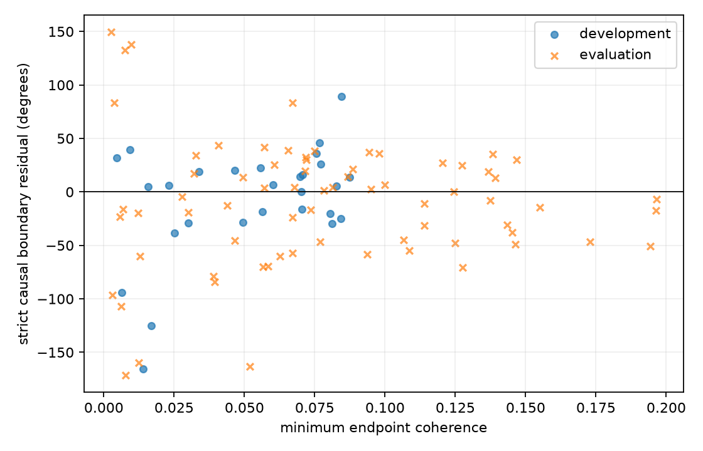

# Cross-dwell phase transport

The full ledger contains 552 same-target metadata boundaries. Exactly 108 had
passing sparse basins on both receivers in both dwells. A phase-blind CFO
continuity gate rejected nine more edges beyond half a symbol-rate ambiguity,
leaving 99 (28 development, 71 evaluation); all 453 rejections retain reasons.

Each qualified edge was read from its digest-verified raw chunk. RX1 was mixed
sample by sample using the phase-blind absolute RX1-minus-RX0 CFO seed before
forming 16,384-sample (1.6384 ms) tapered cross-products. Time uses one integer
device-counter origin. The causal lane selects -1/0/+1 symbol aliases using
left-dwell training error alone (5/89/5 edges respectively). No phase reset or
boundary phase was selected.

The historical joint degree-two frequency integral excludes the crossing
increment but fits both dwell interiors; it is retained only as a diagnostic
because adjacent increments share endpoint windows. Its evaluation boundary
resultant is R=0.636. A strict joint variant also removes every interior
increment whose raw support touches or overlaps either held endpoint and gives
R=0.634, showing the joint diagnostic is not driven by endpoint leakage. The
strict causal result fits only left-dwell increments
whose raw-window union ends before the held endpoint window begins. Its
evaluation resultant is R=0.624 across 71 edges and 56 overlap groups. A
zero-centered pairing bias of 1.75 degrees was frozen on 28 development edges;
evaluation median absolute residual remained 33.08 degrees. The wrong-alias
control has evaluation R=0.078 and a 4,093-sample wrong-receiver-time control,
chosen away from the 20 ms probe recurrence, has R=0.065. Median minimum
endpoint coherence is only 0.072. Calibration therefore does
not establish a common emitter or resolved absolute phase.

For an explicitly group-accounted pairing diagnostic, one deterministic edge
per overlap group gives 22 development and 56 evaluation observations. The
development-only circular model has center 7.78 degrees and concentration
kappa=1.84 (R=0.671). Without refitting on evaluation, its log likelihood ratio
against uniform phase is 21.74 nats (log10 ratio 9.44); evaluation group R is
0.621. This supports a repeatable zero-centered receiver-pairing effect on
adjacent dwells. The low endpoint coherence, 33-degree error, and failed retuned
contrast prevent interpreting that effect as an emitter identity or absolute
carrier-phase bridge.

The verified phase-blind tracking authority contains all 45 candidate tracklet
families (33 reviewed). Membership is frozen independently of phase, but the
present boundary association only establishes local CFO compatibility, so no
tracklet is promoted to an identity.

An actual retuned-revisit contrast uses 75 non-adjacent same-target returns
drawn from the 177 unique visits already touched by the adjacent-edge analysis,
with intervening different targets. Four fail the same phase-blind CFO gate.
The 54 evaluation returns that remain have R=0.090, median absolute wrapped
error 76.13 degrees, and median endpoint coherence 0.060. Phase transport does
not survive a retuned revisit.

No qualified electrical baseline and UTC authority support a geometry result
for this scan. The 33 reviewed tracklet families do not by themselves supply
those missing inputs. Geometry and satellite identity are not inferred.
Retuned revisits and overlapping edge groups remain separate rows;
group counts prevent treating shared dwell endpoints as independent evidence.

Final machine-readable results are preserved here as [adjacent edges](results-v5.jsonl) and [retuned returns](retuned-results.jsonl); `summary.json` contains the development/evaluation aggregates. Earlier bulk scratch `results.jsonl` variants are superseded.
