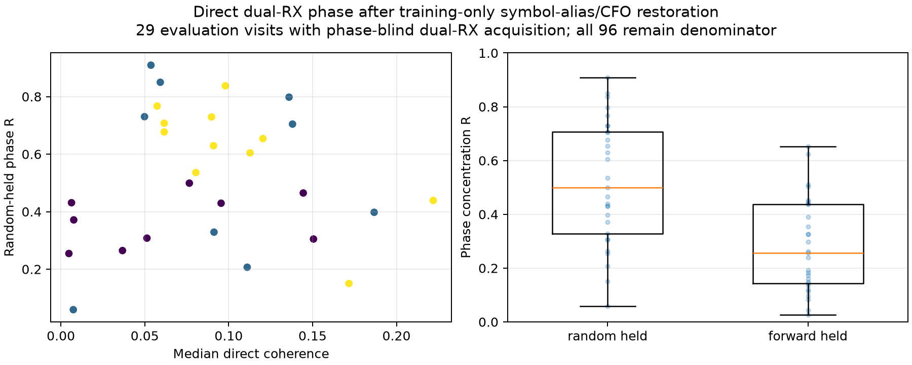
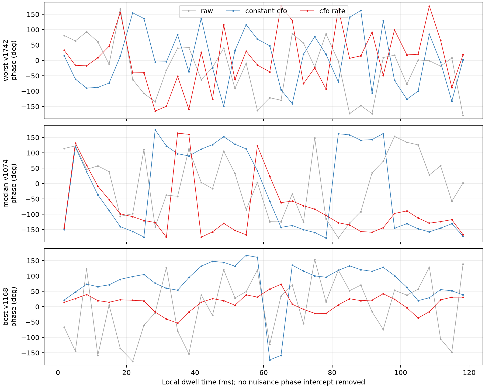
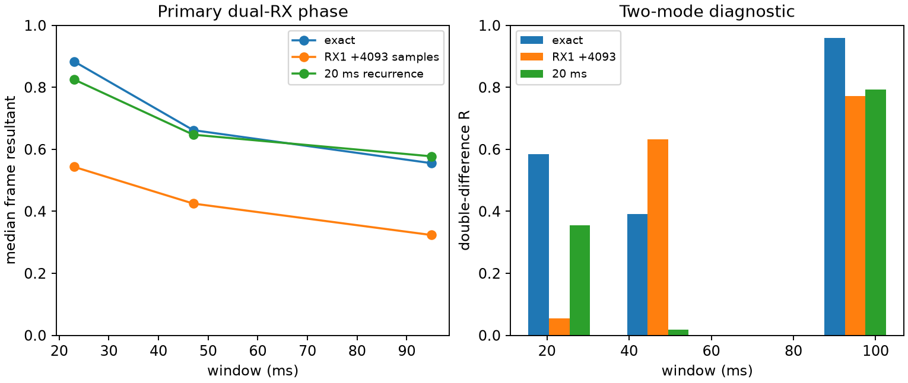

# Dual-RX local phase replay (package F)

## Final dense-acquisition update

The final primary comparison uses 46 visits acquired on both receivers in the training half, including 32 evaluation visits. Direct-IQ evaluation median random-held R is 0.221 raw, 0.292 with the rate disabled, and 0.452 with CFO plus rate; forward-held R is 0.216, 0.288, and 0.259. The rate-disabled ablation uses the joint fit's frequency; it is not a separately optimized constant-frequency estimator. See [dense direct results](dense-direct/method24-corrected-summary.json).

The actual response-normalization method completes on 40 of those 46 visits, with six numerical exceptions; 21 pass broadband support. In evaluation, 29 complete, 15 pass support, and 26 have held pilot checks with median 3.42° error. The 26 available pilot checks and 15 supported visits are different denominators. This local normalized phase is not an electrical-baseline or geometric measurement. See [dense response results](method23-dense-relative-phase-summary.json).

The sparse 42-visit direct comparison and the actual shared-residual/two-mode experiments below remain separately scoped diagnostics. Their counts do not replace the final dense primary comparison above.

The direct-IQ method completed on the frozen 128-visit cohort. Forty-two
visits (29 of 96 evaluation visits) had a phase-blind, comparison-gate-passing
candidate on both receivers in the corrected sparse acquisition census. The
other 86 visits remain acquisition failures in the end-to-end denominator.

The corrected direct replay uses the historical physical window of 32,768
native 10 MS/s samples. It pairs the highest corrected exact-minus-control
candidate per receiver without reading phase, takes the difference between
their absolute tuner-baseband CFO coordinates, and resolves nine possible
OFDM-symbol aliases on development/training support. Mixing occurs sample by
sample before integration. A synthetic 650 kHz receiver-offset test verifies
that order of operations. No evaluation intercept is fitted.

On the 29 paired evaluation visits, median random-held phase concentration was
R=0.222 raw, 0.313 after constant CFO, and 0.499 after CFO plus rate. The strict
forward-time fits use only the first half for alias, CFO, rate, and phase gauge;
their medians were R=0.224, 0.296, and 0.256 respectively. Median corrected
coherence was 0.0898 versus 0.00675 for the frozen 13 ms wrong-time control.
The random improvement did not survive causal forecasting. These are
conditional estimator measurements, not 128-visit yields or a calibrated
success gate.

Best, median, and worst evaluation traces are selected deterministically by
random-held CFO-plus-rate R (visit index breaks ties). They retain the zero
physical phase reference; the plot removes no nuisance phase intercept.

The earlier `method24-summary.json` is retained as a provenance-bearing raw
zero-CFO baseline. Its fitted columns are invalid because it integrated before
restoring the large inter-receiver CFO; they are excluded from conclusions.

The sparse-census exact-Qin seed replay found common phase-blind frame
coordinates in 33 of the 42 dual-RX acquired visits across the complete 120 ms
dwell, yielding 2,937 receiver products (2,225 in evaluation visits). Receiver
CFOs are restored at each common physical sample before forming the raw product.
A separate complex response for each target and pilot tone was trained only on
development visits. On locked evaluation frames, an exploratory two-group
pilot-tone split agreed with R=0.932 and 26.23 degree circular RMS. This is a
pilot-tone prototype, not the historical method-23 kernel, and does not
establish raw absolute carrier phase or geometric phase. The compact
observation file preserves each device counter, receiver residual CFO,
exact/control margin, eight complex tone products, and raw differential phase
for later cross-dwell work.

The actual production response-normalized method-23 kernel completed on 36
visits and passed its internal support gate on 21. In evaluation, 15 of 26
completed visits passed. Median held-band R was 0.806 with 41.0 degree RMS;
median tracked coherence was 0.0790 versus 0.00302 at wrong time, retaining
9.10 MHz median physical bandwidth. Its broadband frequency holdout is valid,
but the sparse schedule supplies only one pilot probe, so the kernel could not
form second-half pilot held rows.

An incremental dense replay over 97 published dense visits completed
28 production-kernel evaluations, 15 of which passed support. Twenty-five had
a genuine second-half pilot holdout, with median held RMS 4.22 degrees. Forty-six
dense visits had no paired acquisition wholly in the training half and were
excluded from causal fitting. This snapshot is explicitly incremental; rerun
`run_dense_relative_phase.py` after all 128 dense products publish.

The historical simultaneous-IQ shared-residual extractor was also run directly
on fixed 23, 47, and 95 ms windows. Candidate epochs and CFO references are
translated into each IQ slice, and every fitted phase is transported to the
declared physical midpoint before comparison. This produced 336 primary rows
with no extraction failures. On evaluation visits, the median within-window
frame resultant was 0.884, 0.662, and 0.555 at 23, 47, and 95 ms. A strong
control shifts RX1 alone by 4,093 native samples (0.4093 ms), without retuning
the epoch or frequency; its medians were 0.543, 0.425, and 0.324. Separate
equal-support IQ intervals displaced by 20 ms gave 0.825, 0.647, and 0.578,
but 20 ms is a recurrence-sensitive offset and is retained only as a
sensitivity check. The high exact R alone is not treated as a pass criterion.

A phase-blind multimode screen found two plausible frequency-separated visits
(1074 and 1711). The same historical extractor produced 16 common-time
two-mode rows. Their double-difference R values were 0.584 (10 windows), 0.392
(4), and 0.960 (2), compared with 20 ms controls of 0.355, 0.018, and 0.793.
The strong RX1-only control gave double-difference R of 0.055, 0.632, and
0.772 at the same durations. Only the 23 ms diagnostic separates clearly.
The samples are too small, the deranged-window controls are not uniformly low,
and frequency-separated modes may still be one source or multipath. These are
diagnostic method-21 executions, not a two-emitter detection claim. The
separate production method-23 attempt failed because the sparse probe-0
interface did not cover its held-half broadband centers; that failure does not
show that two-source RF is absent.

Inputs are bound to source manifest
`sha256:b381f62da5b5490e43790b69e2947919ad9fee6441b642ac04e7af1be487993a`,
selection `sha256:b73c0d5322a6a70c6ee851ee80ad99ef62ca13b190ae4bdeb35ce95ce2030115`,
and cache index
`sha256:535885ebcb6a27212ec6da74555770871b21aa4aba4317c9f644ed87856834d9`.
Capture audit classified all selected rows RF-valid after a full 2.6568-billion
row census and verified every compressed and decompressed chunk digest.
