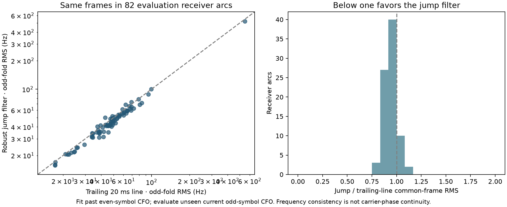

# Robust-filter replay on common support

The actual historical trailing-line, robust-jump, phase-gated-jump, V2 innovation and offline-smoother kernels are imported from `tools/report_d3_pilot_filter_prototypes.py`. The full cached lane trains on past even-symbol frame CFO and scores current odd-symbol CFO. Training support is a binary admission flag, matching the historical adapter; raw coherence is not passed as the support flag. Scored forecasts begin after the 20 ms acquisition is available.

There are 86 evaluation receiver arcs and 82 with shared predictions for both causal methods. Median per-arc common-frame RMS is 47.53 Hz for the trailing line and 43.61 Hz for the robust jump filter. These are consistency errors against noisy odd-fold frequency observations, not truth CFO. The offline smoother uses future times and is reported separately in the JSON.

The exact V2 and phase-gated comparison is limited to the bounded actual tracker checkpoints on development visits. It is not promoted to a full evaluation-cohort claim. All per-arc own-mask and common-mask counts remain in `results.json`; empty common support is not a zero error.

