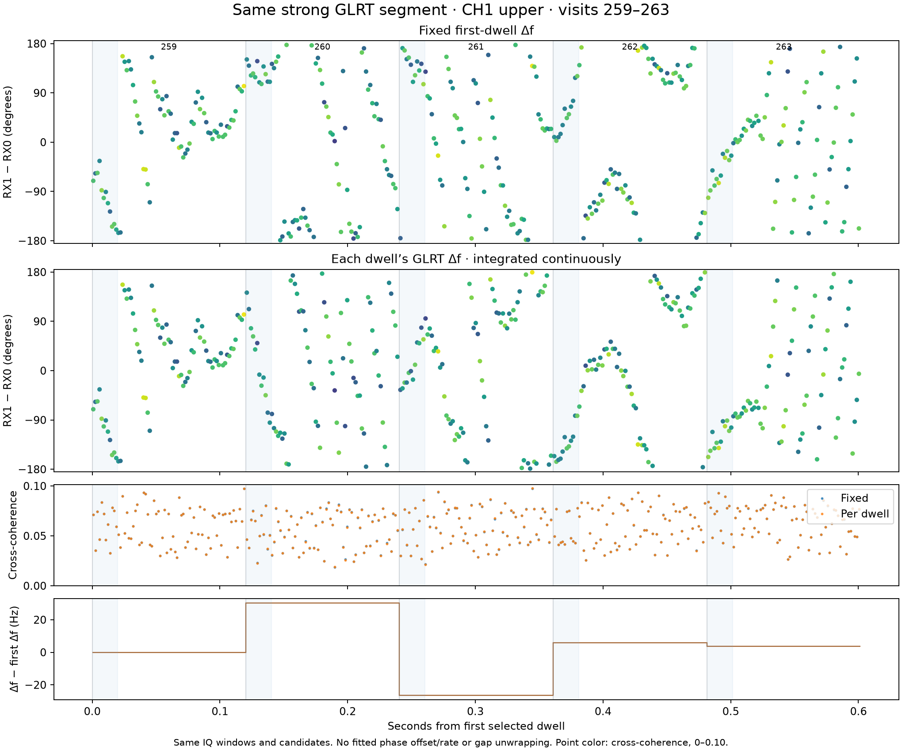

# Per-dwell GLRT frequency correction

The same selected visits, candidates and IQ windows are used in both lanes. The per-dwell RX1-minus-RX0 physical GLRT frequencies are 682434.861, 682465.068, 682408.474, 682440.652 and 682438.443 Hz for visits 259–263 respectively. No alias is reselected from phase.

The correction is exp(-j 2π integral Δf(t) dt). In dwell k starting at t_k, its phase in cycles is A_k + Δf_k (t − t_k), with A_0=0 and A_k=A_(k−1)+Δf_(k−1)(t_k−t_(k−1)). This keeps the correction continuous. The preceding dwell's frequency is held across each short unobserved gap; this is an explicit transport assumption, not a measured gap phase. Applying exp(-j 2π Δf_k t) independently would introduce artificial boundary phase changes.

Median window cross-coherence changes only from 0.060959 to 0.061019. Phase trajectories change substantially because even a 30 Hz difference accumulates 3.6 cycles over 120 ms. Per-dwell correction does not consistently flatten the phase: dwell 260's unweighted phase concentration falls from 0.369 to 0.027, while dwell 263's rises from 0.267 to 0.341. These descriptive concentrations are not a phase-truth score.

Each GLRT estimate comes from the first 20 ms and is extended over that dwell's entire 120 ms. This is a retrospective comparison: the estimate is applied back to the start of its own acquisition window. No claim of online prediction is made. The observable remains broadband IQ cross-phase, rather than isolated track-pilot phase.

Verification: all source chunk hashes pass; fixed-lane phases match the previous plot within 1e-5 degrees; both lanes agree in the first dwell; integrated boundary correction continuity is checked. [Samples](dwell-cfo-comparison.csv), [metrics](dwell-cfo-summary.json), and [script](vary_dwell_cfo.py) are retained.
