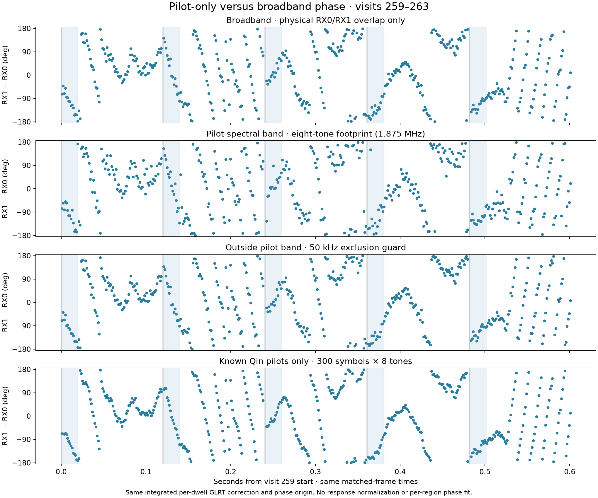
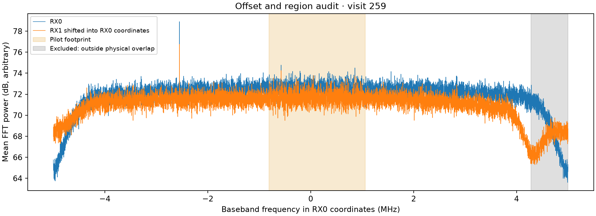

# Known-pilot phase versus broadband phase

The same five selected dwells (259–263, CH1 upper) yield 445 complete matched frames. Of these, 371 start after the first 20 ms used by sparse GLRT. Selection, GLRT candidates, fractional timing and per-dwell frequency corrections are unchanged. No phase intercept, differential drift or channel response is fitted away in the region comparison.

## Results

On the 371 post-acquisition frames, the known-Qin versus common-broadband phase disagreement has circular concentration **0.9743**, wrapped RMS **15.81°**, and mean circular offset **−8.82°**. The offset is retained, not calibrated away. Known-Qin versus the spectrum outside the pilot footprint gives **R=0.9687**, **16.40° RMS**, **−7.70°** mean offset. Thus the measured variation appears both in the known pilots and outside their nominal spectral footprint.

Median known-pilot RX channel-vector coherence is **0.9601**. Median sample/spectral coherence is **0.0692** for the common broadband, **0.0702** for the pilot band, and **0.0666** outside it. The channel-vector and sample coherences have different denominators and processing gains: their ratio is not a signal-to-noise improvement factor. Known-pilot exact/control power ratios have medians **16.56 (RX0)** and **25.09 (RX1)**, using rolled-symbol controls and the same residual correction.

These are descriptive agreement measurements on one selected segment, not independent phase truth, emitter identity, a detector false-alarm calibration or a successful continuous phase lock.

## What is pilot-only here?

Two distinct restrictions are shown. The spectral pilot band covers the eight-tone footprint in the repository template: eight contiguous tones spaced 234,375 Hz, including a half-tone-width margin on each edge, totaling **1.875 MHz**. It can contain unrelated signal energy. The known-Qin lane instead demodulates the actual **300 symbols × eight tones**, removes their known complex symbols, and averages each tone into an RX channel estimate. Phase is arg(sum(conj(h0) h1)).

Both receivers use RX0's exact same fractional frame timing and common baseband mixer after RX1's integrated per-dwell correction. A per-frame residual frequency is estimated from RX0 alone and applied equally to both pilot matrices before coherent averaging. This improves common pilot integration; it cannot independently force the RX1-minus-RX0 phase flat. The matched broadband windows cover those same symbols with a Hann taper. Different pilot and broadband weightings are retained as part of the estimator comparison. Frames are not bridged across device-counter gaps.

## Broadband offset audit

The sign and phase integration in the prior plot were correct. For Δf=f_RX1−f_RX0, multiply RX1 by exp(−j 2π integral Δf dt). Then an RX0 frequency f pairs with the **original RX1 frequency f+Δf**. Both frequencies must exist inside their respective sampled bands; FFT wraparound cannot create physical overlap.

**The earlier single-track plots did not enforce that common-band mask.** Their full sampled-band sum included edge frequencies without a physical counterpart after mixing, which could dilute coherence or perturb phase. This comparison fixes that omission, using a 40 kHz Nyquist-edge guard in each receiver. It also explicitly distinguishes broadband from non-pilot broadband; earlier broadband plots included pilot energy.

For visit 259:

| Quantity | Baseband coordinates |
| --- | --- |
| RX0 GLRT pilot center | +125,593.562 Hz |
| RX1 GLRT pilot center | +808,028.423 Hz |
| RX1-minus-RX0 correction | +682,434.861 Hz |
| Pilot footprint, original RX0 | −0.811906 to +1.063094 MHz |
| Pilot footprint, original RX1 | −0.129472 to +1.745528 MHz |
| Physically common band, RX0 coordinates | −4.960000 to +4.277565 MHz |

The common interval is approximately **9.2376 MHz** wide. The non-pilot lane excludes the pilot footprint plus another 50 kHz on each side. The nominal +312.5 kHz pilot/tuner coordinate is common to both receivers and cancels in their difference; it must not be added a second time. Absolute GLRT coordinates are used, not canonical display aliases.

An independent broadband cross-ambiguity search over GLRT seed ±900 kHz, with delay search ±8 samples, locates the following frequency branches on the first half of each dwell:

| Visit | GLRT Δf (Hz) | Broadband fitted Δf (Hz), at its ~29.9 ms reference |
| --- | ---: | ---: |
| 259 | 682434.861 | 682402.656 |
| 260 | 682465.068 | 682438.016 |
| 261 | 682408.474 | 682396.438 |
| 262 | 682440.652 | 682450.170 |
| 263 | 682438.443 | 682451.648 |

This supports a locally correlating branch near 682.4 kHz rather than blindly treating a GLRT alias as physical authority. It does not establish an exact hardware offset or a durable carrier model: the broadband model's second-half corrected coherence is only 0.0032–0.0197. Its fitted offsets/rates are therefore retained as an audit, **not substituted into the plotted comparison**. GLRT-versus-broadband differences are also evaluated at different reference times. Estimated delays are within 0.03 samples; no delay or response correction is applied to the plots.

## Reproduction and checks

Run [audit_offsets.py](audit_offsets.py), then [compare_pilot_regions.py](compare_pilot_regions.py) with the pinned scientific runtime and replay src on PYTHONPATH, as in the parent reproduction guide. Sources pass SHA-256 checks. Three synthetic regression tests pass: correction sign preserves injected phase; positive Δf excludes the upper wrapped band; known-Qin demodulation preserves an injected receiver phase. No production component was modified.

Artifacts: [frame samples](pilot-region-comparison.csv), [per-dwell region metrics and geometry](pilot-region-summary.json), [independent offset audit](offset-audit.json), [test receipt](region-tests.xml).
