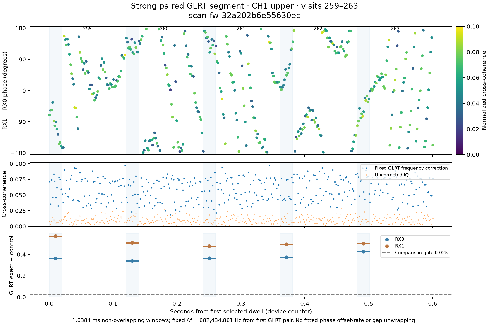

# One strong paired-GLRT track segment

Selected CH1 upper, visits 259–263: 5 consecutive dwells over 0.601575 s. This is the longest qualifying continuous candidate segment under the declared phase-blind rule, not a satellite identification or the full orbital track. Every visit has passing RX0 and RX1 sparse GLRT support. Selection and original candidate coordinates are in [selection.json](selection.json).

The plotted observable is arg(sum(w · conj(RX0) · RX1 · exp(-j 2π Δf t))), in degrees modulo 360. Δf=682434.861324057 Hz is fixed from the first selected RX1-minus-RX0 physical GLRT coordinates. The same device-counter time origin and correction are used throughout all five dwells. There is no phase-outcome alias search, fitted intercept, rate removal, response normalization, or unwrap across gaps. CSV also retains uncorrected phase and coherence. GLRT frequencies can have symbol-rate ambiguities; this shows the declared branch rather than claiming absolute geometric phase.

All saved IQ in each selected 120 ms dwell is plotted using non-overlapping 16,384-sample Hann-squared averages. Blue shading marks the first 20 ms actually probed by sparse GLRT; that acquisition is not evidence that the remaining 100 ms stays locked. Vertical lines mark dwell starts, with no lines joining phase points across boundaries. Same-target consecutive visits contain short unobserved device-counter gaps; this selection has no intervening different-target dwell. Low-coherence points are retained and their phase is less informative.

Raw chunk SHA-256 hashes were verified before extraction. [Numerical samples](phase-vs-time.csv) and [reproduction script](plot_track.py) are included. This broadband cross-phase can include other energy in the captured band; GLRT association alone does not isolate a unique emitter.
