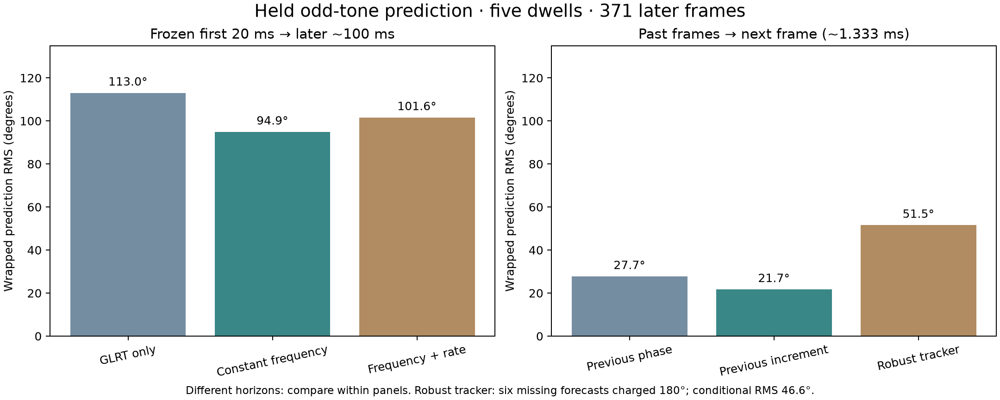

# SOL phase-recovery improvements: implementation and tests

All three delegated SOL workstreams completed on the same five GLRT-selected dwells (259–263). The shared cache contains 445 frames: 70 early training frames, 371 later frames, and four split-crossing exclusions. Production code and recording data are unchanged.

**The best tested short-horizon predictor is the simple previous-frame phase increment. None of the tested models establishes a stable 100 ms phase forecast or geometric satellite phase.**

| Approach | Validation horizon | Wrapped phase RMS | Outcome |
| --- | --- | ---: | --- |
| GLRT correction + fixed training phase | up to ~100 ms | 113.00° | Baseline; phase continues moving. |
| Joint differential constant frequency | up to ~100 ms | 94.88° | Improves on GLRT baseline, but remains weak. |
| Joint differential frequency + rate | up to ~100 ms | 101.57° | Worse than constant frequency; extra curvature does not generalize. |
| Previous even-tone phase | ~1.333 ms | 27.72° | Simple causal baseline. |
| Previous two-frame phase increment | ~1.333 ms | 21.68° | Best tested next-frame predictor; no long-horizon claim. |
| Robust recent-history tracker | ~1.333 ms | 51.54° | 46.55° on 365 forecasts; six missing forecasts penalized at 180°. |

Each differential tracker fits even-index tones and scores odd-index tones without fitting their held phase offsets. Frozen forecasts use only the first 20 ms. Rolling forecasts are issued before incorporating the current frame; current jumps therefore count as prediction errors. Short-horizon scores do not qualify prediction across dwell gaps. The 180° missing-forecast penalty is an explicit scoring convention, not a measured error.

## Response and delay result

Training-only fixed per-tone normalization changes held summed phase by only **0.19–0.77° RMS**. Corrected tone agreement is **0.9735–0.9817**. Fixed relative tone response therefore does not explain the larger common phase trajectory. Tone-slope delay estimates range from −9.88 to +4.80 ns but are ambiguous modulo 4.2667 μs; they are not a physical baseline calibration.

[Response report and figure](response/REPORT.md) · [tracker implementation, metrics and predictions](tracker/REPORT.md)

## Independent review

The 16-tap fractional interpolation support does not change the split; the nearest safe margin is 3.20 μs. Root review caught and corrected current-observation gating of rolling forecasts. The independent validator also caught and corrected missing forecast-denominator serialization. The final results retain rejected and missing cases.

The current pilot preprocessing estimates a shared per-frame residual from all RX0 tones. Even/odd validation therefore holds out differential phase from the tracker, but is not a fully independent raw-frequency holdout. The comparison is descriptive on this selected segment; no held-data hyperparameter search was performed. Uncertainty estimates based on recent residual scatter are diagnostic, not established calibrated confidence intervals.

The capture identifies one dual-channel Pluto and a configured LNB frequency. It does not establish antenna baseline, shared LNB/LO topology, cable calibration, satellite identity or look direction. Those quantities are needed to decide how slow geometric phase should be. Existing weak broadband delay fits cannot supply them.

[Independent validation report](validation/REPORT.md) · [frozen cache metadata](pilot-cache.json) · [execution scope](EXECUTION.md)

## Practical next step

Keep the simple previous-increment predictor as the baseline. Before adding tracker complexity, repeat this fixed comparison on other preselected segments and obtain the actual antenna/LO/clock configuration. A smooth-looking corrected trace alone should not be treated as recovered satellite geometry. Implementation and regression tests are retained; see [combined test receipt](tests.xml).
