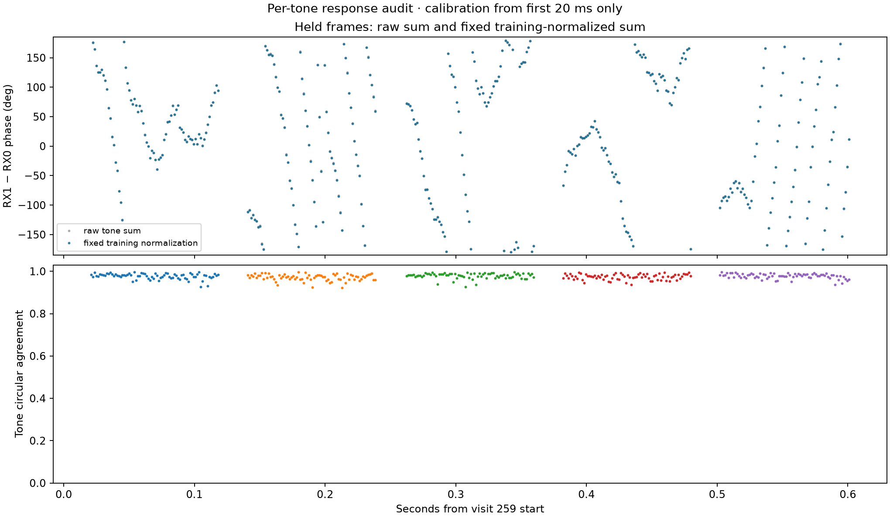

# Fixed per-tone response and delay audit

This experiment estimates one relative phase correction for each of the eight
known Qin tones from frames whose complete support lies in the first 20 ms of a
dwell.  It freezes that correction before evaluating frames whose support starts
after 20 ms.  Four boundary-crossing frames are used by neither set.  The common
training phase is deliberately retained as a gauge, so the correction does not
claim to recover geometric phase truth.

## Result

All five dwells show high held-time agreement among the separately corrected
tones: median circular agreement is 0.9735–0.9817.  Yet the correction changes
the raw coherent tone-sum phase by only 0.19–0.77 degrees wrapped RMS, depending
on dwell.  The training relative tone phases are also modest (approximately
within ±11 degrees).  Fixed per-tone response normalization therefore does not
materially flatten or alter the observed held-time phase trajectory.  It is a
useful consistency check, but it does not explain the large phase evolution.

The phase slope across tones gives principal delays from −9.88 to +4.80 ns.
These values are not unique: the tones are uniformly spaced by 234,375 Hz, so
the same tone phases recur for delays separated by 4.2667 microseconds.  The
independent broadband offset audit found delays within about 0.03 sample
(roughly 3 ns at 10 MHz), but its held-time corrected coherence was only
0.0032–0.0197.  Neither result qualifies as a hardware or propagation delay
measurement.

## Method and limits

For each frame and tone the differential product is `conj(h0) * h1`.  A weighted
circular mean over the 14 training frames per dwell estimates each tone's fixed
phase.  Only its phase relative to the aggregate training phase is removed;
magnitudes are unchanged.  The resulting calibration is applied unchanged to
74, 74, 74, 74, and 75 held frames in visits 259–263.

The plot and CSV preserve both the raw and normalized phases.  The normalization
can remove a stable receiver/tone response, including the principal appearance
of a delay, but cannot distinguish that response from propagation or resolve
the delay aliases.  It never uses held-time phase to set an offset.

Artifacts: `response-frames.csv`, `response-summary.json`,
`response-comparison.png`/`.svg`, and `response-tests.xml`.  Four synthetic tests
cover injected delay removal, retention of changing frame phase, common-phase
gauge invariance, held-set leakage, and the delay alias interval.
