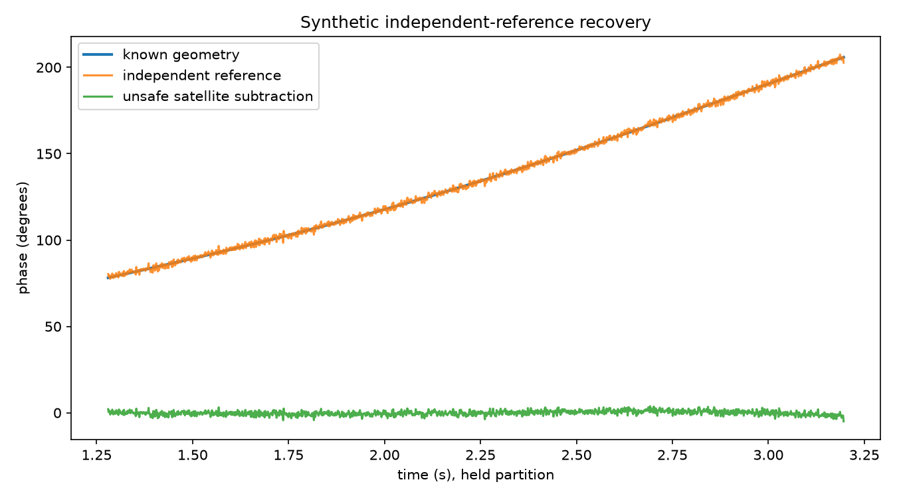
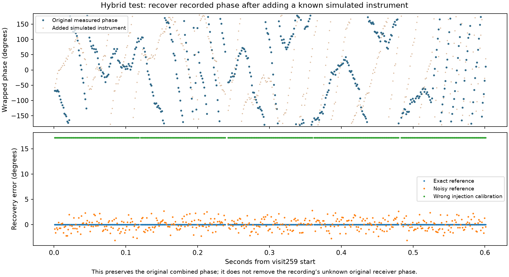

# Recovery prototypes: what succeeds and what remains unknown

Three SOL workstreams implemented and tested independent-reference calibration, reversible tracking, and observability controls. Root reviewed calibration bias, missing-reference validity, phase coordinates, and added a hybrid injection replay on the real cached measurements. No RF collection or production change was made.

**Independent-reference calibration preserves and recovers known geometric phase in simulation. The existing recording still has no established independent instrumental reference, so its geometric phase has not been recovered.**

| Experiment | Result | Meaning |
| --- | --- | --- |
| Synthetic independent reference, known injection path | **1.125° absolute wrapped RMS** on 1,438 supported held frames | Known geometry recovered without fitting its phase offset or slope |
| Same synthetic signal without calibration | 102.816° RMS | Instrument phase obscures geometry |
| Fit and subtract the target's smooth phase | 135.558° RMS; true 127.660° excursion reduced to 8.779° | A flat residual can erase the desired signal |
| Target-only drift outside calibrated path | 100.892° RMS | A reference does not remove non-common propagation or untraversed hardware effects |
| Inject known artificial instrument into real cached pilot products, exact reference | 5.65e-15° RMS on 371 held frames | Original measured phase preserved to numerical precision; its original unknown instrument remains |
| Same injection replay, 0.05 rad reference phase noise per tone | **1.106° RMS** | Reference noise propagates into recovered phase |
| Same injection replay, injection calibration wrong by 0.3 rad | 17.189° bias and RMS | Reference-path bias is not silently fitted away |
| Same injection replay, every tenth reference missing | 335/371 supported; supported results numerically exact | Missing reference stays unsupported, with no interpolation across missing samples |
| Reversible processing of five real dwells | Maximum complex reconstruction error **2.29e-16** on 435/445 frames | Removed corrections can be retained and restored; first two frames per dwell have no causal prediction |

## Known-truth recovery

The independent reference observes the same simulated receiver terms and a known differential injection path. Dividing by its instrument estimate preserves the target geometry. The estimator never receives the true geometric phase. Primary scores compare directly with truth without alignment to held truth. The deliberately unsafe comparator fits the target itself and uses future data; it is a negative demonstration, not an admissible predictor.

The 750 Hz synthetic phasors can cancel a simultaneous common 682.4 kHz phase term algebraically modulo 2π, but cannot identify its true frequency or missing cycles at that cadence. A real implementation requires correctly timestamped reference observations in the same processing coordinates, usually with coarse frequency removal before frame averaging. The two-sample reference delay is known delivery/timestamp alignment, requiring buffering; it is not stale reference phase extrapolation.

[Reference implementation, assumptions and data](reference/REPORT.md)

## Injection replay on the real data

This experiment starts with the existing 445 pilot-frame products, adds a known frequency/drift and frequency-dependent phase, and supplies a synthetic independent reference. It tests recovery of the original measured phase, **not the unknown true satellite geometry**. The 70 training and 371 held masks are unchanged; four boundary-crossing frames remain excluded. Exact reference recovery, deliberately noisy reference, wrong injection phase and missing references are separately reported. All known correction information is independent of the target phase.

[Reproduction script](injection_replay.py) · [configuration and numerical outcomes](injection-replay.json)

## Reversible tracking

The prototype stores the known GLRT derotation and each causal tracking correction. Complex multiplication restores the declared frame-reference phase coordinate to numerical precision. Reporting only the residual would discard meaningful phase: here it differs from the declared input by 104.34° wrapped RMS.

This identity cannot recover a raw pre-derotation IQ average: sample-level frequency mixing and averaging do not commute. Nor does frame-center add-back determine the unobserved integer cycles. The cached within-dwell phase-change column is explicitly labeled a processing-coordinate diagnostic; stable physical hardware alone does not make it geometric if the prior GLRT correction already removed some geometric frequency.

[Reversible implementation, CSV and figure](reversible/REPORT.md)

## Independent validation and remaining information

The observability controls demonstrate that adding an arbitrary smooth function to geometry and subtracting it from instrument phase leaves the satellite measurement unchanged. The independent reference breaks that ambiguity only for terms shared with its calibrated path. Unknown injection-path phase, LNB stages bypassed by reference injection, and target-specific multipath remain limitations.

The bounded recording-artifact audit found no injected reference or independently calibrated path phase. Common sample-reference fields in existing analysis are coordinate origins, not an independent physical reference. Antenna baseline and LNB/LO/clock arrangement remain unspecified in the available artifacts. Recovering geometric phase from this recording alone is therefore not demonstrated.

[Independent observability report](validation/REPORT.md) · [combined regression receipt](tests.xml) · [execution scope](EXECUTION.md)

The next physical step, if authorized separately, is to establish the actual receive-chain topology and a known reference path traversing the relevant stages. These prototypes are ready to test that reference rather than fitting a calibration from the satellite trajectory itself.
