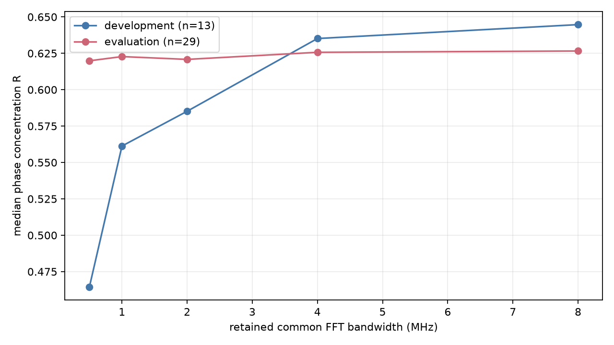

# Sync and spectral replay

## Final guarded spectral update

The authoritative spectral result is [dense v5](guarded-spectral-dense-summary.json): 46 training-half acquired visits, including 32 evaluation visits. Native random/forward held median R is 0.477/0.255. Windows have disjoint native sample support and FIR guards; both bandwidths use identical partitions, training-only physical CFO/alias selection, and frozen training-frequency masks. Full-FFT versus direct-IQ phase agrees to about 7.34e-17 rad. This is numerical equivalence, not independent phase evidence. See the [final paired-bandwidth figure](guarded-spectral-dense-summary.png).

Earlier spectral variants below are retained as diagnostic history and are superseded by v5 where their acquisition coverage, alias selection, or transform support differs. The PSS/SSS results below retain their full 128-visit scope.

All 128 sealed visits were attempted at native 10 MS/s. The source cache is
bound by `sha256:535885ebcb6a27212ec6da74555770871b21aa4aba4317c9f644ed87856834d9`;
all source masks are RF-valid.

The PSS replay used one continuous 62.5 ms prefix per receiver. Independent
blind timing searched -1.2 to +1.2 MHz in 100 kHz steps; the separately labelled
conditioned lane used the receiver's physical pilot-relative raw CFO (the
canonical display alias is never used as a mixer coordinate).
Independent PSS qualified 4/256 receiver visits and conditioned PSS 73/255 (one
receiver lacked a complete GLRT basin). These are candidate timing branches,
not identity evidence. On evaluation visits with qualified windows, independent
PSS inter-frame phase had median increment concentration R=0.046 and conditioned
PSS R=0.150. Conditioned alternating-frame fits had evaluation median held RMS
0.279 cycles and equal-weight timing held RMS 0.802 microseconds; weighting did
not establish carrier continuity.
The published SSS equations 38--40 sequence is locally ported and checked against
frozen reference-oracle states. Blind SSS and separately labelled PSS-timed SSS
are replayed using the captured upper-edge eight-tone slice. Independent SSS
qualified 17/256 receiver visits (evaluation 16); evaluation median inter-frame
increment R was 0.135 and held carrier RMS was 0.282 cycles. PSS-timed SSS
existed for 73 receiver visits. Thus neither
the independent nor PSS-conditioned SSS lane supplies coherent carrier phase.
No 125/250 ms interval was synthesized across a retune or gap.

The spectral replay required both receivers to pass the historical 0.025 GLRT
comparison gate: 42/128 visits were supported and 86 were retained as explicit
unsupported rows. Windows are 32,768 native samples (3.2768 ms). Mixer frequency
is the phase-blind RX1-minus-RX0 absolute CFO. Every efficacy statistic fits its
frequency and rate nuisance terms on training windows only, using both seeded
random and first-half-to-second-half forward splits.

Evaluation median direct/FFT Parseval phase discrepancy was `7.33e-17` rad.
Native random train/held median R was 0.703/0.507; forward train/held was
0.782/0.205. The large forward collapse rejects a stable extrapolating phase
model despite stronger interleaved holdout coherence.
For the matched 2.5 MS/s comparison each receiver was first mixed by its own
absolute CFO, then passed through the same 257-tap anti-alias FIR and decimated;
the first estimator window begins beyond the 128-native-sample half-filter guard.
Evaluation random train/held R was 0.729/0.470 and forward train/held was
0.775/0.215. This comparison uses matched physical pilot-relative content.

The bandwidth curve reports each retained common FFT-bin width separately; it
does not hide arbitrary-bin behavior behind the full-band aggregate.

Numerical evidence is checkpointed in bulk scratch as `results-v3.jsonl`,
`pss-held.jsonl`, and `pss-sss-v3.jsonl`. Earlier spectral/PSS files are superseded
because they either decimated before per-receiver recentering or reused fitted
nuisance terms on held windows. Reference PSS, bandwidth, FIR, Parseval, and SSS
template tests pass; report scripts pass Ruff.
