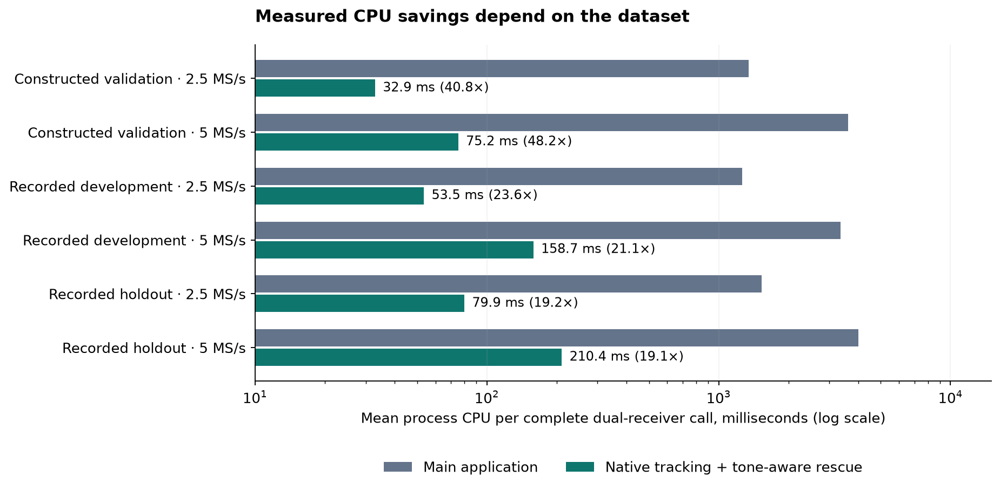
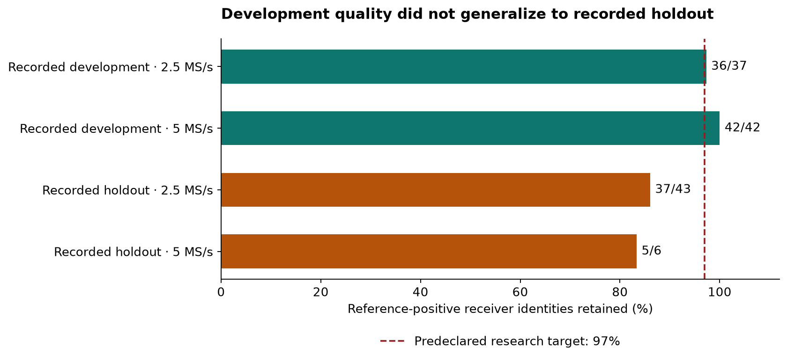
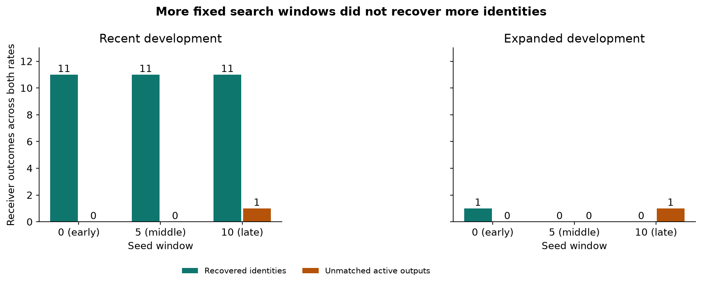
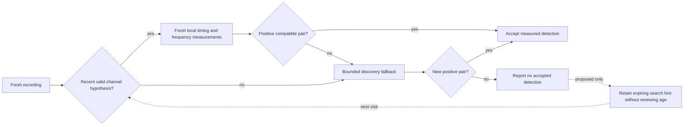

# DS5 GLRT compute and adaptive tracking: consolidated research report

**Status at publication: large CPU reductions are measured, but a 10× replacement with only a small quality loss is not qualified.** The strongest recorded development compromise retained 78/79 reference receiver identities at 21–24× less CPU. Its separately selected recorded holdout retained only 37/43 and 5/6 identities, failing the predeclared quality gates despite about 19× less CPU. No production detector or ARM implementation is promoted by this report.

This report consolidates the server-side experiments, rejected approaches, dataset design, numerical checks, tracking prototypes, and results through the expanded proposal diagnostic. The requested next experiment—retaining a short-lived dormant hypothesis after a negative visit—has **not been implemented or validated**.

The benchmarked application is from research checkout `a887eec1560606dc7f4ffcbc5bbded1bd798f1c8`, with the untracked research sources archived alongside this report. Remote `main` has subsequently evolved: **these are historical benchmark results, not measurements of its current scanner**. See [publication and reproduction details](#publication-and-reproduction).

## What the 40× result means

The main application processes eleven overlapping 20 ms windows for each of two receivers in a 120 ms recording. At ten retained hypotheses per window, that is 22 acquisitions and up to 220 GLRT scores. Acquisition consumed 81–93% of measured application CPU; the shared coarse grid alone consumed about 44–69%. The fast detector reduces search breadth, uses native C/FP32 FFTW processing, and confirms recent channel hypotheses on fresh samples. Selective rescue spends some of the saved CPU on additional acquisition.

| Mechanism | Main application | Fast research path | Consequence |
|---|---|---|---|
| Acquisition | Broad search in every probe | One candidate per native probe; reuse where eligible | Weak/secondary basins can be missed |
| Tracking | Repeated broad acquisition | Two fresh confirmations of a predicted timing/frequency | Drift or wrong identity requires fallback |
| Computation | Python/NumPy plus native acquisition kernels | Native point scoring, FP32 FFTW, reduced packing | Numerical and support behavior need qualification |
| Recovery | Broad inventory throughout | Bounded Python proposal plus native confirmation | Fixed-window rescue can miss intermittent signals |
| Statistic | Symbols 2–65 on every frame | Original native profile alternates early/late regions | This is not initially identical GLRT evidence |

The original 1,515 → 16 ms and 4,071 → 33 ms table was a real small-study measurement of **different detector workloads**, not a 100× optimization preserving the full scanner response. The later 40.8×/48.2× figures concern the tone-aware rescue candidate on constructed validation. Recorded development needed more rescue work and achieved 23.55×/21.12×. The gains must not be multiplied across experiments. Cache reuse alone added approximately 1.31×/1.36× over native blind detection in a separate development comparison.

Complete-call CPU includes conversion, controller, acquisition and confirmation work; file IO, one-time initialization, hashing and serialization are excluded. These are server measurements, not ARM predictions or guaranteed real-time latency.

## The decisive quality result

| Tone-aware rescue cohort | Rate | Mean CPU: application → candidate | CPU saving | Reference identities retained | Quality interpretation |
|---|---|---:|---:|---:|---|
| Constructed validation, 13 cases/rate | 2.5 MS/s | 1343.76 → 32.94 ms | 40.80× | 17/18 | Required injected-truth gates pass; reference statistic differs |
| Constructed validation, 13 cases/rate | 5 MS/s | 3624.72 → 75.25 ms | 48.17× | 18/19 | Required injected-truth gates pass; reference statistic differs |
| Recorded development, 32 visits/rate | 2.5 MS/s | 1259.19 → 53.46 ms | 23.55× | 36/37 | Exploratory 3% reference-loss band passes |
| Recorded development, 32 visits/rate | 5 MS/s | 3351.18 → 158.69 ms | 21.12× | 42/42 | No reference identity loss in this cohort |
| Recorded holdout, 64 visits/rate | 2.5 MS/s | 1535.44 → 79.95 ms | 19.21× | 37/43 | Fails retention; rescue adds two unmatched outputs |
| Recorded holdout, 64 visits/rate | 5 MS/s | 4009.18 → 210.42 ms | 19.05× | 5/6 | Fails retention and loses one associated visit |

The constructed validation has 38 truth-associated positive receiver outcomes, ten correct negatives, and four inactive weak pilots counted as report-only misses. It reaches **zero native rescue confirmation calls**, so it does not independently validate successful rescue. Agreement with the main detector is also not physical ground truth: different symbol support can produce a scientifically meaningful disagreement.

The holdout's unmatched receiver decisions are 9 at 2.5 MS/s and 41 at 5 MS/s; the native baseline already has 7 and 41 respectively. These are reference-relative extras/mismatches, **not established physical false alarms**. A reference-positive visit can still contain a lost receiver identity, so visit presence is not an adequate substitute for receiver-level retention.

Real-time behavior remains a separate failure: 28/32 recorded development candidate calls at 5 MS/s exceed the 120 ms input duration; all 64 holdout calls at that rate exceed it. The holdout maximum is 419.44 ms. More cores can reduce latency without reducing aggregate CPU.

Sources: [development rescue](../2026_09_27_ds5_cached_tracking/native_tone_rescue/REPORT.md), [constructed validation](../2026_09_27_ds5_cached_tracking/tone_validation/REPORT.md), [recorded holdout](../2026_09_27_ds5_cached_tracking/tone_recorded_holdout/REPORT.md).

## Evaluation and datasets

The work moved from component timing to whole-application comparisons, then to causal channel reuse and independent data. Most recent campaigns use CPU0, one numerical-library thread, rotated method order and separately maintained state. Each experiment's own receipt defines its exact timing scope; early synthetic/native-component results use a much cheaper baseline than the full application.

| Dataset | Purpose and coverage | Current status |
|---|---|---|
| Original selected DS5 development | 128 visits across two already exposed sessions, plus earlier controls | Development; no independent-validation claim |
| New-data corpus and adversarial transfer | FP32/SIMD and cache transfer experiments; 320 receiver cases in SIMD validation | Exposed development/control evidence |
| Recent full-scanner development | 64 visits, two sessions, 32/rate | Repeatedly used to develop candidate policies |
| Original constructed controls | 42 cases / 84 receiver policies | Includes known pilots, noise and tone challenges |
| Mirrored negative audit | 12 parent cases in original/swapped orientation / 48 receiver checks | Detects receiver-order and tone acceptance failures |
| Diagnostic and reserved constructed split | 26 cases per split: weak pilots, regional support and interference | Reserved split consumed; no longer unopened |
| Original recorded holdout | 128 visits, two separately selected sessions excluded from earlier selection | Consumed; failed quality, cannot be reused as fresh validation |
| Expanded development | First 32 visits from each original development block; opposite rate/edge combinations | 64 exposed visits; adds later-window misses, but no 5 MS/s reference positives |

Keep recordings with unknown truth distinct from constructed negatives. Reference association uses the experiment's fixed timing/frequency criteria (typically 2 μs / 8 kHz); preserve acquired/scored CFO separately from physical tracking CFO. Source counters are integers to avoid precision loss beyond 2⁵³. Channel state is keyed by session, receiver, channel, edge, rate, tuning and calibration. Fresh evidence, expiry, forced discovery and failed-confirmation fallback are required.

The recent recorded holdout gates were fixed before processing: complete run, ≥10× aggregate CPU improvement per rate, ≥97% reference receiver retention per rate, no lost reference-positive visit, and no extra unmatched decisions introduced by rescue relative to the native baseline. These are research acceptance criteria, not a calibrated field error-rate guarantee. No new RF collection was required; QNAP paths were not modified.

## Experiment ledger: improvements and rejected approaches

This table summarizes the principal lines of work. The [complete document catalog](CATALOG.md) links every archived research Markdown document, including designs, reviews, qualification notes, test plans, audits and historical stopping decisions. Result receipts and code are retained in their original experiment directories.

| Experiment family | Measured outcome or finding | Disposition |
|---|---|---|
| Initial server evaluation / small GLRT benchmark | Established reference/control datasets and the workload gap behind the early timing table | Historical starting point; [speed study](../2026_09_26_ds5_glrt_speed/README.md), [server evaluation](../2026_09_26_ds5_server_eval/README.md) |
| Known-channel native point ports, strided ingress | Full-aperture point calls about 0.17/0.32 ms; much faster than native blind calls, with caller-supplied timing | Useful primitive; not a full-traffic 10× result; [report](../2026_09_27_ds5_cached_tracking/native/REPORT.md) |
| Rank-seeded acquisition | 1.94× but retained only 8/36 positives | Rejected; [acquisition variants](../2026_09_27_ds5_cached_tracking/acquisition/REPORT.md) |
| FP32/FFTW and SIMD | About 1.41× versus original packed FP64 on broad validation; SIMD increment near 1.0006× overall | Useful modest compute saving, not 10×; [validation](../2026_09_27_ds5_cached_tracking/server_simd_validation/REPORT.md) |
| Blind-search cadence | 1 s / 5 s scheduling gave modeled 2.56× / 7.84×, with many visits explicitly unmeasured | Coverage reduction, not equivalent acceleration; [report](../2026_09_27_ds5_cached_tracking/cadence/REPORT.md) |
| Cheap scouts | Retaining all reference positives routes 87–90% of visits; cost removes benefit | Rejected; [report](../2026_09_27_ds5_cached_tracking/scout/REPORT.md) |
| Multi-track bank | Retained 118/129 identities and cost more than blind processing | Rejected; [report](../2026_09_27_ds5_cached_tracking/multitrack/REPORT.md) |
| Lag-4 phase CFO | Retained 31/36, wrong aliases and failed cost gates | Rejected; [report](../2026_09_27_ds5_cached_tracking/phase_cfo/REPORT.md) |
| Lag-3 proposals | Primitive exceeds budget; injected-coordinate coverage also fails | Rejected implementation; [cost](../2026_09_27_ds5_cached_tracking/lag3_proposal/REPORT.md), [coordinates](../2026_09_27_ds5_cached_tracking/lag3_validation/REPORT.md) |
| Fractional coefficient transpose | Numerical gates pass, but coefficient construction makes it slower | Rejected; [report](../2026_09_27_ds5_cached_tracking/coeff/REPORT.md) |
| Main-scanner profiling / coarse alternatives | Acquisition dominates; generic short-FIR/FFT alternatives slower | Directs effort toward acquisition; [profile](../2026_09_27_ds5_cached_tracking/application_profile/REPORT.md), [alternatives](../2026_09_27_ds5_cached_tracking/application_coarse_alternatives/REPORT.md) |
| Main-scanner early exit | 3.87× / 1.76× on two positive examples, little benefit on negatives | Useful decision-only tradeoff; [report](../2026_09_27_ds5_cached_tracking/application_early_exit/REPORT.md) |
| Parallel full-scanner calls | 22 workers: 8.20× / 10.69× latency improvement, 43% / 29% more CPU | Latency option, not less CPU; [report](../2026_09_27_ds5_cached_tracking/application_parallel/REPORT.md) |
| TG11 native blind/tracked | 100–167× on recent development, only 67/79 reference identities | Fast but insufficient quality; [report](../2026_09_27_ds5_cached_tracking/native_tradeoff/REPORT.md) |
| Two native candidates | Candidate zero unchanged in 2,904 observations; no recovery of original K1 misses | More breadth did not fix coverage; [report](../2026_09_27_ds5_cached_tracking/native_candidates/REPORT.md) |
| Canonical/raw rescue and tone controls | Raw rescue activates pure-tone controls; consistent timing alone does not reject persistent tones | Rejected; [canonical](../2026_09_27_ds5_cached_tracking/canonical_tracking/REPORT.md), [raw rescue](../2026_09_27_ds5_cached_tracking/native_rescue/REPORT.md) |
| Supplied reference points / support guard | Strong supplied coordinates can score; tiny CFO admission roundoff corrected without relaxing physical innovation | Feasibility, not causal acquisition; [points](../2026_09_27_ds5_cached_tracking/native_reference_points/REPORT.md), [guard](../2026_09_27_ds5_cached_tracking/native_guided_boundary/REPORT.md) |
| Tone-aware rescue | 78/79 development identities; 40× constructed timing; fails recorded holdout | Most developed compromise, not qualified; see decisive results above |
| Early-symbol native scorer | 37 generated/import tests; 144/144 supplied development points agree with current-research application tolerances | Numerical building block; [report](../2026_09_27_ds5_cached_tracking/native_early_profile/REPORT.md) |
| Early confirmation before caching | 132 control checks pass; development retention falls to 65/79 | Stricter acceptance loses two signals; [report](../2026_09_27_ds5_cached_tracking/early_confirmed_tracking/REPORT.md) |
| Three-integer local confirmation | Restores 67/79, mean 14.09/26.45 ms candidate CPU; one unmatched output returns | Useful local timing search; saved-reference replay, not new paired speedup; [report](../2026_09_27_ds5_cached_tracking/early_local_tracking/REPORT.md) |
| Expanded primary replay | 9/13 identities at 2.5 MS/s despite 107× CPU savings; no 5 MS/s reference positives | Reveals temporal coverage weakness; [report](../2026_09_27_ds5_cached_tracking/expanded_development/REPORT.md) |
| Distributed proposals | 171 recent + 318 expanded searches; extra fixed windows add cost and unmatched outputs | Does not resolve later-window misses; [recent](../2026_09_27_ds5_cached_tracking/distributed_proposal/REPORT.md), [expanded](../2026_09_27_ds5_cached_tracking/expanded_proposals/REPORT.md) |

## Why searching more fixed windows was insufficient

The recent cohort made all three seed windows look equally promising: each recovered the same eleven inactive receiver identities. The expanded cohort had four inactive reference misses; only the early seed recovered one, while middle/late seeds recovered none. Three remaining misses never reached native confirmation because all Python proposals in those seed windows failed the unchanged margin gate. A late-window search added one unmatched output in each cohort.

Expanded-cohort search cost was about 70 ms per inactive receiver at 2.5 MS/s and 188–197 ms at 5 MS/s, before primary processing. The cost on quiet traffic makes indiscriminately adding searches a poor route to the 10× CPU target. The expanded 5 MS/s set has no reference positives and cannot establish sensitivity.

## Can we reuse a signal already found on a channel?

**Yes, as a fresh-evidence search prior. The additional dormant-hypothesis benefit is still untested.** Existing causal tracking already verifies old timing/frequency on fresh samples. The new finding is that immediate deletion after one negative visit can discard useful proposal information for an intermittent signal.

In expanded development, channel 3 RX1 is detected at visit 1678. An intervening negative at visit 1680 clears the track; visits 1681, 1688 and 1689 then miss. Their reference inventories remain about 1.07–4.13 μs and 1.1–4.6 kHz from the earlier actual candidate measurement, at ages 0.40–1.48 s. These are post-hoc opportunities, not measured cache recoveries. They do not authorize copying stale scores or using reference coordinates at runtime.

The next candidate should retain a dormant proposal separately from accepted state, expire it from the last real positive, search a bounded timing neighborhood, and require new receiver-local tone-aware evidence and compatible nonoverlapping observations. It must preserve receiver/channel/tuning/calibration isolation, frequency-domain distinctions, negative behavior and discovery fallback. Compare whole-call cost with the current rescue approach on both development cohorts, then freeze a candidate for fresh, disjoint recorded qualification.

Other options remain available: GPU/batched coarse search; faster full-response acquisition kernels; tighter prior-driven timing/CFO grids; decimation with measured sensitivity loss; selective expensive audit; and reduced revisit coverage with explicit detection-latency accounting. ARM-specific vectorization, fixed point and hardware accelerators are deferred. The [option portfolio](../2026_09_27_ds5_cached_tracking/TRADEOFF_OPTIONS.md) separates measured results from untested ideas.

## Failures, tests and provenance

Failed scientific gates remain failures. Historical files stating “holdout unopened” describe their experiment's time; both reserved constructed validation and original recorded holdout have since been consumed. No gate was retroactively relaxed to declare success.

The archive also preserves operational mistakes: incorrect timing-helper wiring, missing summary flags, a wrong reporting import, and the stripped `sha256:` prefix in the expanded dataset adapter. Corrected runs use separate adapters and receipts. Some initial runs failed after detector calls but before saving the summary; those attempts are not counted as independent replications. The first early-symbol check imported the deployment checkout accidentally; corrected checks assert the research checkout's module origin.

Tests are reported at the scope actually run: e.g. 543 tests plus 11 subtests at an earlier milestone, 37 early-symbol scorer tests, 132 original/mirrored receiver policies, and later component-specific tests. This publication does not claim that every historical environment-dependent test was rerun. Publication validation checks archived hashes, chart sources, links and figures without opening IQ or rerunning detector campaigns.

## Publication and reproduction

- Start with this report, the [complete document catalog](CATALOG.md), and [chart data with source hashes](chart_data.json).
- Three research trees are archived: `2026_09_26_ds5_glrt_speed`, `2026_09_26_ds5_server_eval`, and `2026_09_27_ds5_cached_tracking`. The [archive inventory](archive_inventory.json) lists every included/excluded file, byte count, SHA-256 and disposition.
- Reports, designs, Python/C/header sources, component tests, result JSON/JSONL, manifests and source/build locks are included unchanged. Raw IQ arrays, generated binaries and caches are excluded; their hashes and metadata remain available. No golden fixture is modified.
- [Source snapshots](source_snapshots.json) preserve 32 additional referenced code files from the research/deployment checkouts, all matching at least one recorded hash. They are reference artifacts, not imported production modules. System libraries, compilers and native shared objects are not bundled.
- Rebuild the three PNG/SVG figures and document catalog with `python build_figures.py` (requires NumPy and Matplotlib). This reads JSON only and does not need radio hardware, IQ or a database.
- Full numerical reproduction requires the matching raw corpus, recorded native build dependencies and historical source environment. Absolute paths in original locks remain historical; relocate deliberately and verify hashes. Importing scripts directly against newer `main` is not a reproduction of these results.
- This publication changes documentation/research artifacts only. It does not deploy or replace the runtime detector. The original 10× goal remains active and unqualified on detection quality.
