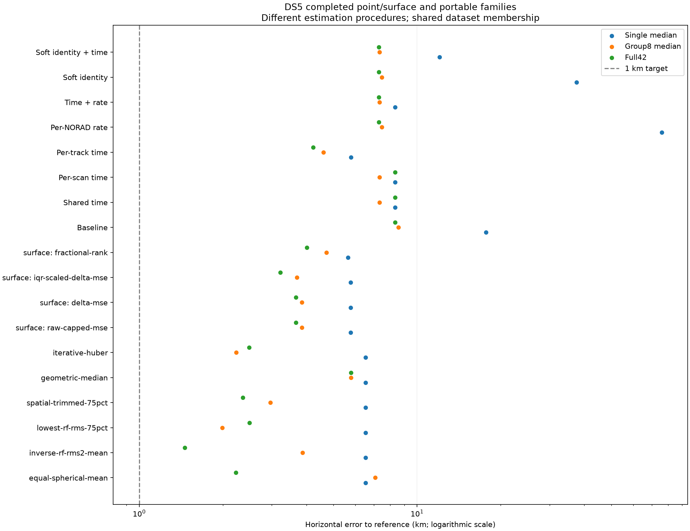

# DS5 positioning results and DS6 transfer shortlist

The [complete model catalogue](MODELS.md) describes all 24 registered methods,
their fitted parameters, prototype experiments, historical exclusions, and the
DS6 results available so far. The [complete numerical table](comparison-table.md)
contains all 18 completed point/surface/portable methods, with exact and geometry
coverage reported separately below.

The completed DS5 comparison does **not demonstrate sub-kilometre positioning**.
The lowest full42 error among the completed families is **1.459 km**, obtained
by inverse-RF-RMS-squared averaging of per-scan positions. The lowest group8
median is **1.990 km**, obtained by retaining the lowest-RF-RMS 75% of per-scan
positions. These are different winners: neither method uniformly wins all scopes.

All eight portable methods are now complete: **416/416** method/unit fits.
Both earlier failed fits were successfully retried. The ten point/surface methods
have **520/520** outputs. Both exact full42 aggregates were also evaluated, with
crossfit direct replay passing over 42 session receipts and 25 geographic cells.
The exact families have not been evaluated over every single/group8/rate unit.

## Dataset and evaluation

DS5 has 42 recordings starting within September 26, 2026, 07:00:00–13:59:09 UTC
(midnight–06:59:09 Pacific). Its evaluation units are 42 individual scans, five
chronological nonoverlapping groups of eight, the complete 42-scan set, and four
rate-specific sets. Two remainder scans belong to full42 but not a group8 unit.
Groups of eight are input units, not chronological validation folds.

Common comparison coordinates (37.84903264307456, -122.4856541910174) are used to score frozen
outputs, not to select satellite identities or positions. DS5 has been used for
development and method selection; it is not an untouched test set. Reported
errors are horizontal distances to that reference, not uncertainty bounds.
The same dataset inventory does not make different families' losses or observation
weighting identical. Portable methods fit raw tracks, while point aggregators
combine already selected per-scan locations.

Audit correction: the older portable command examples supplied
(37.848639396, -122.4752910122), approximately 0.91 km from the reference used
by the existing fast/exact DS5 reports. Portable outputs were rescored against
the latter common reference without changing any inference. Both score files
are preserved. This is a declared historical evaluation reference, not newly
verified surveyed ground truth; DS5 lacks an immutable capture-time pose binding.
Absolute accuracy claims are conditional on that reference being correct.

## Main comparison

| Method | Single median km | Group8 median km | Full42 km |
|---|---:|---:|---:|
| Equal per-scan position mean | 6.525 | 7.064 | 2.229 |
| Inverse-RF-RMS² position mean | 6.525 | 3.868 | **1.459** |
| Lowest-RF-RMS 75% position mean | 6.525 | **1.990** | 2.497 |
| Spatially trimmed 75% mean | 6.525 | 2.962 | 2.362 |
| Huber position aggregation | 6.525 | 2.235 | 2.484 |
| IQR-scaled surface fusion | 5.771 | 3.697 | 3.223 |
| Portable baseline | 17.727 | 8.579 | 8.329 |
| Shared global time | 8.329 | 7.330 | 8.329 |
| Regularized per-scan time | 8.329 | 7.330 | 8.329 |
| Independent per-track time | 5.791 | 4.599 | 4.231 |
| Per-NORAD orbit rate | 75.929 | 7.463 | 7.286 |
| Global time + per-NORAD rate | 8.329 | 7.330 | 7.286 |
| Soft satellite identity | 37.541 | 7.463 | 7.286 |
| Soft identity + global time | 12.038 | 7.330 | 7.286 |

The full 18-method table is in [comparison-table.md](comparison-table.md), with
[CSV](comparison.csv), [JSON](comparison.json), and the figure below. The source
reports retain per-rate results, p90, qualification and individual unit outputs.

## Exact methods and remaining work

| Exact full42 method | Error km | Search outcome |
|---|---:|---|
| Cell-batched reassociation | 4.910 | East +4 km, north 0 km; grid edge |
| Exact crossfit | 4.104 | East -2 km, north +4 km; grid edge |

These are **truncated coarse searches**, not converged solutions. The local
grid spacing was 2 km; edge winners require translating/expanding the grid before
claiming a resolved optimum. Their objectives have different weighting and
selection contracts and should not be compared numerically as the same loss.
See [exact report](../2026_09_27_ds5_exact_summary/REPORT.md).

The proposed multi-basin 1 km→125 m refinement and multi-scan drift experiment
remain unfinished. A bounded one-scan drift experiment on 2,169 observations from
58 tracks slightly worsened held-out residual RMS (235.891→236.096 Hz); it does
not establish an accuracy improvement. Repeated position errors in portable
results are not evidence of precise agreement: discrete/bounded searches can
select identical coordinates across model variants.

## Rate, dwell, geometry, and robustness

Rate counts are 14/10/9/9 scans at 2.5/5/7.5/10 MS/s. Rates were not randomized
as an accuracy experiment, so rate comparisons can be confounded by time and
satellite geometry. Total valid exposure is nearly constant (264.96–266.64 s).
The exposure terciles in the original report are not different configured dwell
durations. The separate metadata audit found configured 120/240/360 ms settings
but realized valid visits of 120 ms; configuration cannot substitute for measured
support. Scheduler receiver activity is not proof of detected common signal.

The inverse-RMS full winner has a group8 median of 3.868 km and p90 of 5.286 km;
the trimmed group8 winner has p90 8.451 km. A low full-dataset error therefore
does not imply consistently accurate shorter windows. Point estimates come from
bounded upstream searches; numerical qualification is not a calibrated confidence
claim. DS5 has no capture-time geometry bindings for its radio, so the four
geometry-dependent arms were explicitly not applicable (208 unit/method rows).

## Frozen DS6 shortlist

Carry forward inverse-RF-RMS² position averaging (full winner), lowest-RF-RMS
75% averaging (group8 winner), and independent per-track timing (portable winner),
with portable baseline and shared global timing controls. Keep DS5 method settings
fixed initially and report single/group8/full performance separately. Do not
choose variants using DS6 reference error. Exact coarse edge winners are not
promoted before their search limitation is resolved.

DS6 is the existing frozen 43-recording roof dataset, not newly collected RF.
It has a different operator-supplied reference location and explicit pose
attachments. The coordinate is not surveyed ground truth. Inference must exclude
that coordinate, retain the declared geographic prior, and use it only after
outputs are frozen for scoring. Direction/geometry models, if subsequently run,
must be separate labelled ablations because the physical-to-software RX mapping
and RF baseline remain provisional.

The two fast transfers have now completed on DS6 without retuning: inverse-RMS²
averaging gives **1.978 km full43 / 3.018 km group8 median**, and lowest-RMS 75%
averaging gives **2.680 km / 3.437 km**. All DS6 source searches stopped at their
400-point budget. See the [DS6 transfer report](../2026_09_27_ds6_fast_transfer/REPORT.md).
The three raw-track transfer arms are separate ongoing work and have no final
accuracy result in this report.

## Reproduction and supporting artifacts

- [DS5 definition](../2026_09_26_ds5_since_local_midnight/README.md)
- [Point/surface results](../2026_09_26_ds5_all_methods/FAST_WAVE_REPORT.md)
- [Portable results](../2026_09_26_ds5_all_methods/PORTABLE_REPORT.md)
- [Geometry applicability](../2026_09_26_ds5_all_methods/GEOMETRY_WAVE_REPORT.md)
- [Exact aggregation commands](../2026_09_27_ds5_exact_summary/COMMANDS.sh)
- `build_report.py` regenerates this directory's comparison CSV, JSON and PNG
  from the completed source summary CSV files; `SHA256SUMS` binds those artifacts.
- Detailed sealed inference and postseal scores remain under
  `/srv/bulk/leo/experiments/ds5-all-methods/` and
  `/srv/bulk/leo/experiments/ds5-exact-summary/`.
