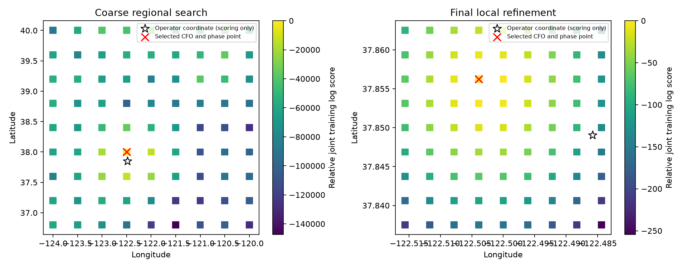

# DS6: all-track CFO with exact phase joins and shared scan timing

**The final selected development-scan position is 1.783 km from the operator
coordinate. Phase does not change the selected point. The sub-kilometre DS6
goal remains unachieved.** This is the first all-track comparison in this
sequence; it replaces neither production positioning nor independent validation.

## What changed

The public preparation path reconstructs **60 tracks / 2,869 observations**
for `scan-fw-4c56320fb5ca6994`, rather than restricting geographic inference to
two tracks. Both receivers participate. All observations in the same visit
receive one partition across receivers and tracks; existing phase training/held
assignments are preserved, with other visits assigned by a deterministic hash.
Search ranks positions using training data only. Held scores are reported
without selecting the position.

The phase report's default trajectory configuration and the position solver's
three-second/six-observation configuration generate different track IDs. None
of the four old RX0 recurring-pair track IDs matches a prepared position track
ID. An ID-only join would discard phase; treating IDs as interchangeable would
be wrong. The new adapter joins through **exact acquisition candidate IDs**,
then checks observation times to one nanosecond. It does not use nearest CFO
or an approximate epoch match. Only the short six-visit pair joins the prepared
RX0 position model on both sources. The longer pair is not silently added.

`inputs.json` saves numerical track observations, exact candidates, phase joins,
partitions and source/catalogue digests. The preparation script uses a
digest-verified cached public TrackingInput and the public preparation/trajectory
interfaces. Orbit propagators are reloaded through the archive reader because
their native objects cannot be serialized.

## Model and fair comparison

The scan uses one shared orbit-time offset, marginalized over -5..+5 seconds
at one-second increments. Candidate identity and one constant CFO offset are
marginalized separately per track. The model uses a 100 Hz CFO scale and
1 MHz constant-offset prior. Reconstructed CFOs use the canonical 11.2 GHz
normalization. Both receivers' residuals may be correlated, so multiplying
track scores is a **composite likelihood**, not a calibrated posterior.

The optional phase factor uses the exact joined pair, a nominal ±80 mm
east-west baseline, channel RF approximation, kappa=1 per dwell and an
analytically marginalized constant pair phase. Baseline sign is marginalized.
The top six CFO candidates per source and time offset receive the phase factor;
unretained mass remains neutral rather than being renormalized into extra
confidence. No independently calibrated RF baseline or antenna model is claimed.
The script explicitly refuses multiple pairs until their factor-graph dependence
is handled. CFO and phase share acquisition conditioning.

11,116 catalogue candidates are propagated on one-second nodes and Doppler and
baseline projections are interpolated at observation-plus-offset times. A
check against exact propagation at five off-grid epochs and a fixed regional
observer gives 2,689 visible candidate/epoch comparisons: **1.140 Hz RMS,
9.708 Hz maximum absolute error**. This is not a global bound, and exact
propagation confirmation is needed before a precision-location claim.

## Geographic results

Both arms evaluate the same points. The first grid is the preceding 9-by-9
regional grid. Three successive 9-by-9 local grids refine the selected point,
using the union of CFO and joint winning centers if they differ. Grid radii
shrink by four each stage. Coordinates are loaded only by `summarize.py`,
after the selected points are saved; they do not center or rank search nodes.

| Stage | CFO and CFO+phase selected latitude, longitude | Error after selection |
|---|---|---:|
| Regional | 38.000000, -122.500000 | 16.831 km |
| Local 1 | 37.850000, -122.500000 | 1.255 km |
| Local 2 | 37.850000, -122.500000 | 1.255 km |
| Local 3 (final) | 37.856250, -122.503906 | **1.783 km** |

There are **324 evaluated nodes** across the four stages (including repeated
centers). Final grid spacing is approximately 347 m north/south and 343 m
east/west at this latitude. This grid spacing is not positioning accuracy.
The shared MAP timing hypothesis at the final point is -1 second.

The final training score improves over the intermediate point, but its true
coordinate error worsens. The intermediate 1.255 km result must not be selected
because it happens to be closer to the reference. Held CFO score likewise
worsens from about -11151.18 to -11199.60 during final refinement. This shows
remaining model/association error despite finer grid resolution.

Phase leaves every winning point unchanged. Its positive contribution to the
joint held score is a density relative to uniform phase, not a held CFO gain
or evidence of better geographic accuracy. Neither arm is a validated DS6-wide
location estimator: only this previously studied scan was searched here.

## Verification and next action

Three tests pass: shared-time marginalization agrees with an explicit mixture,
conflicting tracks cannot each choose their own timing offset, and whole-visit
partitions/exact candidate joins are consistent. Preparation also checks source
digests and exact candidate support times. The interpolation diagnostic and
all intermediate geographic outputs are retained.

The previous goal turn was progress through pair-only orbit inference. This
turn resolves a real integration mismatch and produces an all-track location
comparison at sub-kilometre grid spacing. The next experiment should test exact
propagation and finer shared timing, then examine robust CFO/clock modelling
and candidate ambiguity. The small phase factor must demonstrate held predictive
and geographic benefit rather than being amplified to force a desired answer.
Random whole-scan evaluation across DS6 remains necessary; no goal-completion
claim follows from this single development result.

Reproduce with repository `src` on `PYTHONPATH`, the pinned scientific runtime
and one BLAS thread: `python prepare.py`, `python score.py`, then
`python score.py --stage 1`, `--stage 2`, and `--stage 3`.
Run `python check_interpolation.py`, `python summarize.py`, and
`python -m pytest test_score.py -q`. The reader cache path and SHA-256 are
explicit in the preparation source. Original IQ, production products and DS6
membership are unchanged.
