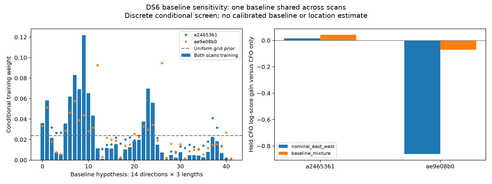

# DS6 baseline-geometry sensitivity

Allowing uncertainty in baseline geometry removes most of the phase-induced
held-CFO prediction loss, but does not establish a net improvement over CFO
alone. The training weights remain broad and favor the shortest tested length.
This is not a calibrated baseline estimate or a sub-kilometre position result.

The frozen DS6 authority records nominal mount separation of 80 mm, but leaves
`phase_center_baseline_enu_m` unset. It explicitly says that RX1/RX2 pointing
west/east does not establish a directed RF phase-centre baseline. Physical to
software receiver mapping is also provisional. The preceding nominal east-west
phase calculations therefore rest on a modelling assumption, not a measured
RF baseline. This audit does not alter the pose authority or dataset metadata.

## Shared-baseline comparison

The sensitivity grid contains 42 directed vectors: lengths 4, 8 and 12 cm,
each with twelve horizontal azimuths in 30° steps and two vertical endpoints.
All receive equal prior weight. This is an illustrative discrete prior, not
hardware tolerance, a measured distribution, or continuous 3D coverage. It
omits intermediate elevations. One physical baseline is shared across both
scans; their timing offsets remain independent.

The matched nominal comparator integrates only the two directions of an 8 cm
east-west baseline, also shared across scans. Both arms retain the same 10%
uniform-contamination phase model, two training phase visits per source pair,
full eligible satellite-pair catalogue, CFO likelihood and held visits.

| Model | 5 MS/s held CFO gain | 7.5 MS/s held CFO gain | Joint held CFO gain |
|---|---:|---:|---:|
| Shared nominal 8 cm east-west | +0.01605 | -0.86182 | -0.84528 |
| Shared 42-baseline mixture | +0.04220 | -0.07107 | -0.02982 |

Gains are natural-log predictive-density differences versus CFO only. They
are not location errors or satellite-identification accuracy. Individual-scan
predictions condition on training evidence from both scans and only that scan's
held CFO. The joint score predicts both held sets together, so its gain need
not equal the sum of the individual gains.



Training mass by length is 62.24% at 4 cm, 28.77% at 8 cm and 8.98% at 12 cm.
The single largest weight is only 12.19%, at the 4 cm westward vector; the
entropy-equivalent number of hypotheses is 23.78 of 42. Its boundary length
and broad direction weights prevent reporting a resolved physical baseline.
Neither the maximum-weight vector nor a favorable direction is selected using
held prediction or the operator location.

A no-geometric-phase control was evaluated analytically after the screen.
The mixture's training log evidence exceeds that control by 1.094, a modest
conditional difference that does not yield a held-CFO benefit. Consequently
the result supports neither a measured 4 cm baseline nor a claim that the
observed phase contains no geometry. It shows that the nominal RF geometry
assumption materially affects the association update.

## Scientific scope and accounting

The experiment uses the previous marginalized pilot likelihoods at κ=16,
including receiver rate/common-phase uncertainty within windows and a DD
slope integrated over ±0.2 Hz within each training visit. Independent constant
source-pair response offsets are integrated between visits. Only original
training visits supply phase; held phase values are not used.

All 10,858,467 eligible pair/time hypotheses are scored for each baseline.
Visibility means above the horizon at at least one training CFO epoch. No
shortlist excludes weak alternative identities. Integer scan timing spans
-5 to +5 seconds. Original differential-CFO scales, Student-t4 offsets and
whole-visit masks remain fixed. The observer is the earlier CFO-derived point
at assumed zero altitude; the operator coordinate is not read by fitting.
Runtime was 74.2 seconds and uses saved measurements plus causal orbit data.

The exact nominal per-group training and joint-CFO factors reproduce the prior
association calculation within 1e-9 log units. Differences in the table versus
that report arise because baseline direction is now shared across scans instead
of independently integrated within each scan. The two arms in this report are
the matched comparison for baseline uncertainty.

## Implication for the DS6 goal

Treating 80 mm mount spacing as a precise directed RF baseline is not justified
by the recorded metadata. Marginalizing a coarse baseline grid reduces harm
but does not supply the missing geographic information. A stronger phase weight
or the training-favored short vector must not be adopted as a calibration.
No new position is fitted, and phase-assisted sub-kilometre accuracy across
DS6 remains unverified.

Further recording-only inference needs more independent source trajectories
and held visits to distinguish baseline geometry from receiver-response and
association errors. The present two-scan, four-pair evidence does not resolve
that distinction. Operator coordinates remain reserved for post-fit geographic
scoring; fitting baseline against them would not establish blind recovery.

## Verification and reproduction

Three tests pass: grid lengths and directed-vector symmetry including the
nominal baseline; shared-baseline marginalization with target-only held data;
and exact real candidate counts, artifact bindings and reproduction of prior
nominal factors. No source IQ, authority file or production service is changed.

With the scientific Python environment and repository `src` on `PYTHONPATH`:

```sh
python reports/2026_09_27_ds6_baseline_sensitivity/run.py
python reports/2026_09_27_ds6_baseline_sensitivity/summarize.py
python -m pytest reports/2026_09_27_ds6_baseline_sensitivity/test_baseline.py -q
```

`SHA256SUMS` seals the code, protocol, outputs and report, excluding bytecode.
