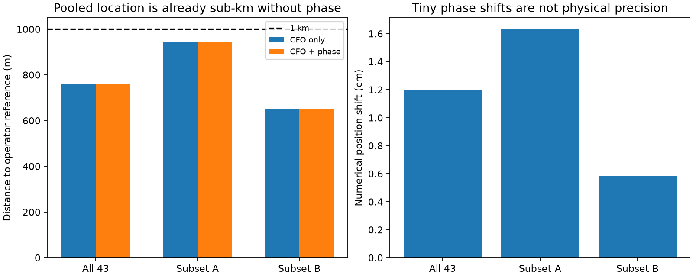

# DS6 full-cohort phase integration

The stationary pooled estimates are below 1 km with phase included, but the
matched frequency-only fits achieve essentially identical results. This is
not evidence that phase produced the sub-kilometre accuracy.

| Fit | Scans | Scans with phase factors | CFO-only error | CFO + phase error | Numerical shift |
|---|---:|---:|---:|---:|---:|
| All | 43 | 3 | 761.865 m | 761.877 m | 1.20 cm |
| A | 22 | 2 | 941.251 m | 941.262 m | 1.63 cm |
| B | 21 | 1 | 649.804 m | 649.803 m | 0.59 cm |

These centimetre differences are numerical outputs, not demonstrated physical
precision. The phase effect is too small to credit with useful location
improvement. Held-frequency gains are also tiny: +0.00160, +0.00451 and
+0.00435 log units respectively. The objective remains active because the
useful contribution of phase has not been established.

**Additional numerical limitation:** a separate local offset-convergence
audit reports that the inherited 12-step Student-t frequency-offset profiler
does not converge for every candidate. Across fixed individual-scan baseline
locations, longer iteration changes training evidence by 82.622 log units,
far larger than the phase gains here. Those audit locations differ from this
pooled fit, so the number is not a correction to this table. These results
retain the old profiler and must remain provisional until a matched full
stationary-offset refit is validated. Hashes of the inspected audit summaries
are recorded in `offset-audit-provenance.json`; this experiment does not claim
to validate their replacement solver.

## Experiment

The full-DS6 frequency model uses one stationary position, independent scan
clocks, training-profiled track frequency offsets and a Student-t4 likelihood
with fixed 100 Hz scale. It includes corrected causal orbital-element
freshness and frozen candidate proposals. The inherited A/B partition is a
seeded complementary whole-scan split, not two independent experiments on
newly collected data. Both inherit a development-derived search center.

The three validated phase recordings contribute five candidate-pair factors.
All other recordings contribute frequency evidence only. Within each fit,
one 42-vector baseline prior is shared across its available phase recordings.
Phase inputs use only original training visits. The phase model's CFO
likelihood is subtracted from its joint likelihood before adding the correction
to the full cohort, preventing duplicate use of frequency observations.

Both arms start from the same previous CFO training-selected solution and
refit position and clocks with identical optimizer bounds and tolerances.
This is a warm-start local comparison in the existing basin; it is not a new
global search. Both arms converged. No operator reference enters fitting;
`summarize.py` reads it only after all six fits are complete. The reference is
operator supplied, with no surveyed uncertainty or altitude. Pooled accuracy
must not be presented as accuracy of each individual recording.

## Verification and provenance

The loader validates the baseline protocol and all 142 frozen dependency
hashes. It reproduces the earlier training score before refitting. A new test
compares the phase model's frequency contribution with the corresponding
full-cohort scan models at the same physical location and clocks, agreeing
within 1e-6 log units. This checks catalogue, track likelihood and coordinate
consistency before using the joint-minus-CFO correction. The second test
checks completed fits, unchanged scan partitions and phase membership.
Both tests passed; the four inherited full-cohort baseline tests also passed.

The baseline's sealed inputs and source dependencies are published with this
integration so that its source imports and frozen-hash checks are reproducible.
They are inherited work, not newly recomputed independent baseline estimates.
The earlier baseline exact-propagation audits and the three-scan phase audits
remain relevant numerical checks, but these tiny new shifts have not been
validated as physical precision by exact reoptimization or surveyed truth.

Run `run.py --fit all`, `run.py --fit A`, and `run.py --fit B` in a fresh output
directory preserving the report-relative dependencies, then `summarize.py`.
The saved protocols deliberately refuse replacement. Fits require access to
the same causal local TLE archive; no new RF or IQ replay is required.

## What remains

The present phase data do not materially distinguish nearby geographic
locations once the frequency model has selected candidate identities. More
useful phase evidence would need longer validated geometric evolution,
better separation of time-varying receiver response from geometry, or stronger
phase-supported candidate discrimination. Simply adding a negligible phase
factor to a successful pooled CFO estimate does not demonstrate that recovery.
