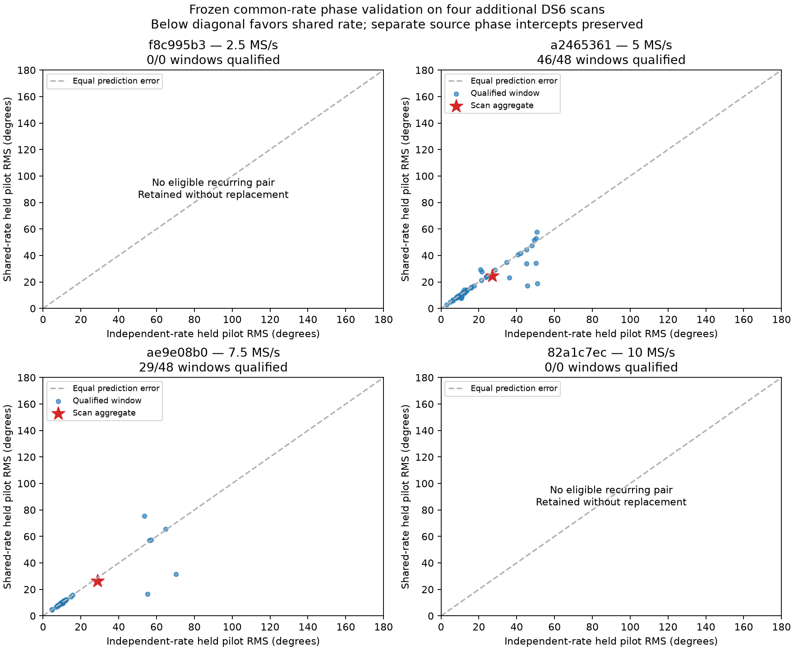
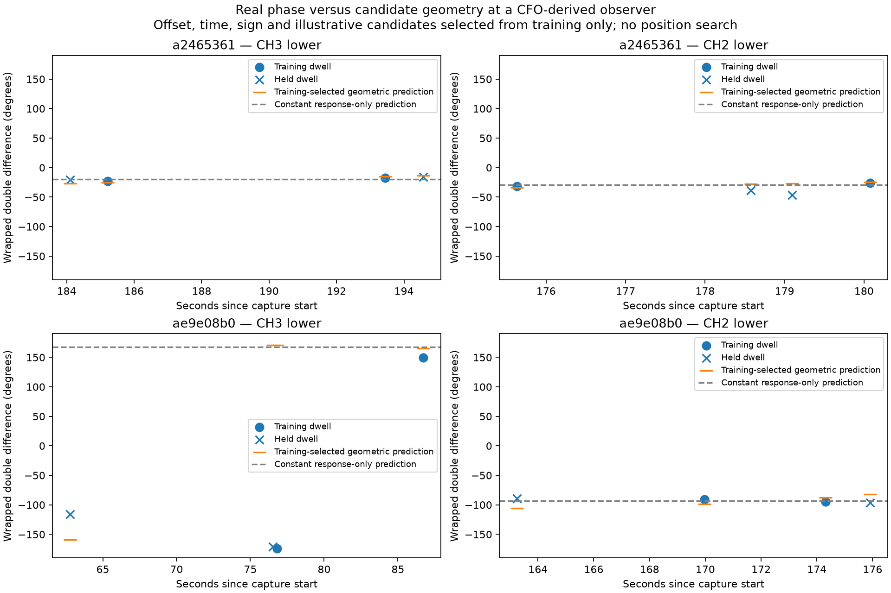

# DS6: frozen common-rate validation on four additional scans

The common receiver-rate phase fit improves held-pilot prediction on both
evaluable new scans, but two of four frozen scans lack a recurring joint track
pair. **The predeclared promotion criterion fails.** A separate orbital-geometry
check gives no phase-based association gain and slightly worse held phase
prediction than a constant response model. Sub-kilometre positioning from phase
is still unproven; the earlier 809 m development result remains CFO-derived.

## Frozen selection and estimator

`protocol.json` was saved before reading raw IQ. It chooses one recording at
each DS6 sample rate by hash seed 2026092711, excluding the ten scans used in
the earlier phase replay. Membership and processing availability come from
the frozen DS6 inventory. No unsuccessful selection is replaced. These scans
are new to this phase replay; this does not claim they have never appeared in
other analyses.

The estimator source hashes were frozen. Both arms fit unit pilot phasors on
training samples, preserving independent phase intercepts for the two sources.
One arm fits independent rates; the other fits a single common receiver rate
within each 7 ms window. Both use the ±375 Hz principal pilot alias interval.
The shared rate does not subtract the source phase difference.

The exact three-second/six-observation positioning track reconstruction supplies
RX0 candidate IDs. Joint RX1 signal support is checked separately. Up to two
disjoint source-track pairs are chosen by metadata support, before viewing
phase. Each pair contributes two training and two held whole visits, selected
by hash. Six windows begin at 0, 21, 42, 63, 84 and 105 ms. Pilot fit,
qualification and evaluation blocks remain disjoint. Each capture's numerical
all-track inputs, candidate IDs, whole-visit partitions, causal TLE digest and
source digests are retained for subsequent positioning experiments.

## Results on actual recorded IQ

| Scan suffix | Capture start UTC | Rate | Selected / qualified dwells | Qualified windows | Independent-rate RMS | Shared-rate RMS |
|---|---|---:|---:|---:|---:|---:|
| `f8c995b3` | Sep 27 00:30:02 | 2.5 MS/s | 0 / 0 | — | unavailable | unavailable |
| `a2465361` | Sep 27 00:10:23 | 5 MS/s | 8 / 8 | 46 / 48 | 27.020° | 24.780° |
| `ae9e08b0` | Sep 27 00:20:02 | 7.5 MS/s | 8 / 8 | 29 / 48 | 28.719° | 26.382° |
| `82a1c7ec` | Sep 26 23:40:01 | 10 MS/s | 0 / 0 | — | unavailable | unavailable |

RMS is held-pilot phase prediction error: squared error is averaged within
each qualified window, then equally across windows. It is not a geographic
error, a source-angle uncertainty, or a pooled-pilot statistic. The source
intercepts and rates are estimated only from the fitting blocks. Every
qualified window contributes to both arms. Whole-visit training/held labels
are reserved for the later orbital prediction test; both kinds of visit still
have disjoint fitting/evaluation samples for this extraction comparison.

The 2.5 MS/s scan has three exact track-pair groups, each appearing in only one
eligible visit. The 10 MS/s scan has no such joint pair under the frozen gates.
Their absence is not evidence that those sample rates cannot recover phase:
capture time, sky activity and track support differ too.

All 16 additional RX1 misalignment controls fail qualification, and no sampled
rows clip at the checked int16 limits. The public read-only reader verified
compressed and uncompressed IQ chunk digests. No new RF was acquired.



Points below the diagonal favor the common rate. The two available scans show
about 16% lower mean squared error. Median multi-window dwell coherence improves
from 0.963 to 0.993 at 5 MS/s and from 0.9936 to 0.9941 at 7.5 MS/s. Single-window
dwells are excluded from that coherence statistic.

The frozen rule requires improvement on at least three of four scans plus an
improvement in equal-scan mean squared error. Only two scans are evaluable, so
the result does not pass. Descriptive whole-visit bootstrap intervals for the
shared-minus-independent MSE also include zero: [−0.08396, +0.00376] rad² and
[−0.11399, +0.00354] rad². There are only eight physical visits per evaluable
scan; these intervals do not establish population-level precision.

## Does the recovered phase carry the expected orbital geometry?

This is a **post-validation exploratory diagnostic**, separate from the frozen
estimator decision. It conditions on the previous development scan's CFO-derived
observer, not the operator-supplied receiver coordinate. It does not search for
a position. Each of the two new scans contributes two disjoint track pairs,
one at channel 2 lower and one at channel 3 lower.

For each of eight source tracks, all 11,116 eligible labelled Starlink entries
in the digest-bound causal TLE snapshot are propagated at exact observation
epochs. A robust Student-t4 CFO likelihood with fixed 100 Hz scale and a
training-only fitted constant offset selects six candidates per track/time.
Held CFO uses those same frozen offsets. Scan timing is shared over −5 through
+5 seconds in one-second increments; this conditional diagnostic has not been
checked on a finer time grid. Candidate pairs and nominal ±80 mm east-west
baseline signs are marginalized.

The phase model gives each pair its own uniformly marginalized response offset,
because the two channels should not be assumed to have the same receiver
response. It predicts the remaining phase variation from candidate geometry.
Each dwell receives the existing conservative von Mises concentration of 1.
The response-only null uses the identical CFO hypotheses and offsets but sets
orbital phase variation to zero. Four held dwells per scan test the prediction.

| Scan | Geometry held phase log score | Response-only held phase log score | Geometry minus response-only | Phase change in held CFO score |
|---|---:|---:|---:|---:|
| `a2465361` | 2.214099 | 2.228806 | −0.014707 | zero within 1e−12 |
| `ae9e08b0` | 1.738653 | 1.767616 | −0.028963 | zero within 1e−12 |

Phase scores are relative to uniform phase; higher is better. Both models
predict phase better than uniform, but including orbital variation does not
improve prediction. Predictable phase alone therefore does not demonstrate
useful distance information.



Orange marks illustrate one hypothesis chosen from training data only; the
table scores marginalize candidate, time, sign and response uncertainty. Blue
circles are training dwells, crosses are held dwells. Phase is wrapped, so a
jump at ±180° is not a discontinuity in the physical signal. Gray lines show
the constant response-only prediction. These curves expose mismatches that a
within-dwell coherence score cannot reveal.

The fixed CFO likelihood concentrates numerically on a single candidate pair
and timing bin in both scans (−4 s and −1 s). Phase consequently has almost no
remaining candidate weight to redistribute. The selected pairs are different
satellites, so the absent gain is not caused by pairing each source with the
same satellite. These conditional probabilities are not calibrated satellite
identity confidence: the fixed noise scale, correlated residuals, candidate
truncation and coarse timing grid can make them overconfident. The nominal
RF baseline also remains uncalibrated.

## Consequence for the DS6 positioning goal

Keep the common-rate estimator experimental. It has shown promising real-data
noise reduction in two additional scans, but neither the coverage criterion
nor an orbital-information test has succeeded. Do not increase phase weight
until a training-only uncertainty model survives held prediction.

The next model audit should check CFO residual scale/time resolution and phase
precision jointly. Fixed 100 Hz CFO noise and concentration-1 phase noise put
very different amounts of confidence in the two observables. Those scales must
be estimated or validated from disjoint measurement evidence, not adjusted to
reach the supplied receiver coordinate. Then a joint geographic likelihood
can test phase with candidate/time/response uncertainty preserved. Free pair
offsets also discard constant geometric phase, so a defensible shared receiver
response or independently identifiable baseline model is still needed for
strong absolute-distance information.

## Reproduction and verification

With the repository `src` on `PYTHONPATH` and the scientific NumPy/SciPy/
Matplotlib runtime, the recorded execution order was:

```text
python plan.py freeze
python plan.py prepare
python replay.py --scan 0
python replay.py --scan 1
python replay.py --scan 2
python replay.py --scan 3
python summarize.py
python geometry.py
python geometry_plot.py
python -m pytest test_validation.py test_geometry.py -q
```

The freeze command refuses to overwrite the protocol. Preparation reuses only
matching frozen plans; replay refuses to silently overwrite partial output.
Preparation/replay require the existing `/srv/bulk/leo` corpus; geometry also
requires `/var/lib/leo/tle`. Summary and plots use saved JSON. Source IQ remains
untouched. Artifact seals are listed in `SHA256SUMS`.

Eight tests cover frozen scan/source selection, exact candidate membership,
whole-visit partitions, complete support accounting, matched phase comparison,
unavailable-scan retention, correct equal-window aggregation, response-only
independence from CFO prediction, held-data isolation and phase-wrap invariance.
The small synthetic aggregation/likelihood tests check mechanics; all reported
scan measurements and figures use actual recordings.
