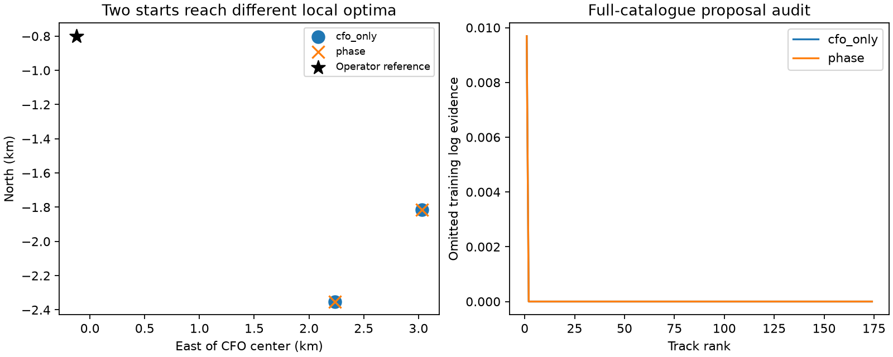

# Continuous DS6 location and timing with phase

Continuous timing and position fitting did not recover sub-kilometre accuracy
on this three-scan cohort. CFO alone and CFO plus phase both select a local
solution about 3.31 km from the operator reference.

| Model | Reference distance | Held frequency log score | Maximum propagation interpolation error |
|---|---:|---:|---:|
| CFO only | 3312.408 m | -22159.66486 | 0.018963 Hz |
| CFO + phase | 3312.459 m | -22159.66102 | 0.018951 Hz |

The numerical location shift is 0.066 m and held prediction improves by
0.00384 log units. These tiny changes do not establish physical centimetre
precision or meaningful phase-assisted geographic improvement. In particular,
orbit/model uncertainty and numerical optimizer precision are not calibrated
at this scale. Exact propagation at the fitted coordinates gives the same
qualitative held-score comparison.

## Matched experiment

The model retains the previous prototype's 174 tracks, 8,101 frequency
observations, five disjoint phase pairs and frozen training/held visit masks.
Each frequency observation appears exactly once. Phase couples candidate
identities through the marginalized pilot likelihood; an uncertain physical
baseline is shared across scans using the same 42-vector prior. Both models
profile three independent continuous scan timing offsets and one shared
stationary location. Timing is now profiled rather than integrated on a grid;
this change applies to both arms.

The protocol freezes two starts (the earlier grid winner and the original
CFO center, with training-selected clocks), bounds of +/-12 km and +/-5 s,
and identical optimizer tolerances. No reference coordinate is read by fitting
or the catalogue audit. Each arm completed both starts with reported optimizer
convergence and no boundary hit. The starts reach different local optima;
the higher training score wins. This is a local fit, not proof of a global
optimum. Both arms choose the same basin.

The clock offsets at the phase winner are -0.36390, -0.91181 and -0.95750 s
for the 2.5, 7.5 and 10 MS/s scans. The fourth expansion scan remains excluded
for its previously documented lack of qualifying phase training/held coverage.
No recording is replaced. The operator location is an unsurveyed reference,
not a source of calibration or optimizer selection.

## Candidate and numerical audit

Quarter-second position/velocity banks support continuous interpolation
during fitting. Exact propagation at each selected solution differs from the
interpolated CFO by less than 0.019 Hz. Training evidence changes by about
0.00058 log units when using exact propagation at those coordinates. This is
a point audit, not an exact reoptimization or bound on location error.

The full causal catalogue was rescored at both selected locations and clocks,
for every one of the 174 tracks, using training observations only. The weakest
shortlist retained 99.0357% of training candidate mass. Summed omitted CFO
evidence is only 0.009690 log units at either winner. For paired factors, the
positive 0.19 contamination floor and maximum possible phase factor give a
conservative bound on omitted joint evidence. The resulting total phase-arm
bound is also 0.009690 log units; the omitted mass is outside the phase pairs
to numerical precision. This does not establish catalogue completeness around
other locations or guarantee that a missed search basin is unimportant.

The test suite checks agreement with stored grid factors at fixed clocks,
held-observation isolation from the training objective, completed fit selection
and exact-propagation checks, and full 174-track coverage accounting. Four
tests passed.

## Implication

Removing the coarse timing grid and resolving an interior local optimum did
not produce a useful phase contribution. Candidate truncation at that optimum
is too small to explain a kilometre-scale difference without additional
evidence. Important remaining assumptions include correlated RX errors,
unmodelled frequency biases, uncertain orbit elements and uncertain baseline
geometry. The next integration should assess the joint phase factor across
the full stationary DS6 cohort and independent whole-scan subsets; a favourable
pooled CFO position alone must not be credited to phase.

Reproduce with `run.py --arm cfo_only`, `run.py --arm phase`, then the matching
`audit.py --arm ...` commands, followed by `summarize.py`. The frozen protocol,
parent hashes, completed fit outputs and coverage outputs are included.
