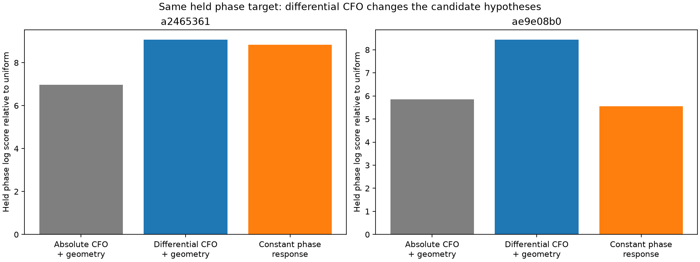
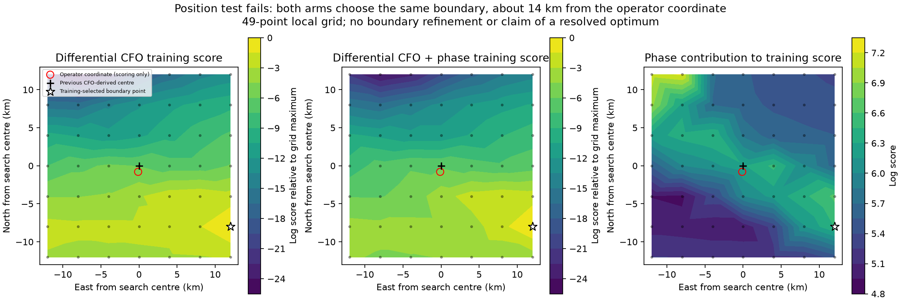

# DS6: differential CFO improves conditional phase prediction, but fails positioning

Subtracting the CFOs of two jointly detected sources changes the satellite
hypotheses and improves held phase prediction on both studied scans. Orbital
phase beats a constant response by **0.25 and 2.90 log units** under this
conditional test. However, a two-scan position search with and without phase
selects the same boundary point, **14.10 km from the operator coordinate**.
The result is unresolved and does not meet the sub-kilometre objective.

This experiment is a development test on the two evaluable scans from the
previous four-scan phase validation. It uses saved numerical CFO observations,
saved real-IQ phase estimates and causal TLEs. It collects no RF and performs
no new IQ replay. Satellite identities and RF phase-centre baseline remain
unverified. The earlier 809 m CFO-derived result on another development scan
is not replaced by this failed position model.

## Why difference the source CFOs?

If two source measurements have the form
`CFO_A = Doppler_A + receiver_offset + source_offset_A` and similarly for B,
then B minus A removes a common receiver frequency offset. Source frequency
offsets still require a fitted constant difference. A common time-varying drift
also cancels when the two measurements have exactly the same effective epoch.

The same subtraction removes the common part of geometric Doppler. Thus it can
improve robustness to receiver drift while losing absolute position information.
It must be tested as a model change, not added to the original CFO likelihood
as if it were independent new data.

The absolute and differential arms here use identical paired visits, source
candidate unions, phase observations and frozen training/held assignments.
The absolute arm fits separate source offsets with the previously learned
per-track Student-t4 scales. The differential arm fits one B-minus-A offset
with a training-derived Student-t4 MAD scale. Neither fits held measurements.
The Cartesian products of both source candidate lists are retained, including
same-satellite possibilities; no distinct-satellite identity is forced.

Candidate lists are unions of the prior fixed/learned CFO shortlists. This
restricts the differential arm to hypotheses proposed by the earlier absolute
CFO models and is an important limitation. It is not a full-catalogue pair search.

## Timing audit: same dwell does not mean identical support centre

The initial exact-simultaneity assertion failed before scoring. The public
trajectory projection timestamps each candidate at its own pilot support centre,
and those centres differ between modes. The original `protocol.json` is retained
as the failed premise; `protocol-v2.json` defines the corrected experiment.

| Scan suffix | Paired CFO visits across two groups | Largest centre separation |
|---|---:|---:|
| `a2465361` | 39 | 0.758 ms |
| `ae9e08b0` | 101 | 0.935 ms |

The corrected join requires the same receiver, RF channel, physical visit and
whole-visit partition, with centres within one 750 Hz pilot period. **Each
orbital prediction uses its source's own timestamp.** The average timestamp is
used only for presentation. No interpolation or timestamp replacement occurs.

A constant receiver offset cancels exactly. A drift with slope L leaves
approximately `L × (t_B − t_A)`. For illustration, 1000 Hz/s would leave less
than 0.936 Hz for these joins; that is a sensitivity calculation, not a measured
upper bound on actual drift. Earlier per-source orbital calculations already
used their individual support epochs; this corrected an assumption in this new
differencing experiment.

## Conditional phase prediction

At the previous scan's CFO-derived observer, both arms marginalize scan timing
over −5 to +5 s at quarter-second spacing. Each physical track pair has its own
integrated circular phase-response offset and log-uniform concentration prior
over 0.1 to 10000. The nominal east-west baseline magnitude is 80 mm; its sign
is shared between pairs within a scan. The source phases come from the frozen
common-rate estimator. There are two phase-training and two held dwells per
pair, four held phase dwells per scan.

| Scan | Absolute-CFO hypotheses + geometry | Differential-CFO hypotheses + geometry | Constant phase response | Differential geometry minus constant |
|---|---:|---:|---:|---:|
| `a2465361` | 6.973359 | 9.079474 | 8.825926 | **+0.253548** |
| `ae9e08b0` | 5.859307 | 8.446165 | 5.546262 | **+2.899902** |

These are log predictive densities on the **same held phase observations**,
relative to uniform phase; higher is better. They can be compared across arms.
Absolute-CFO and differential-CFO held scores have different observation
dimensions and must not be compared directly.

The matched absolute arm differs from the prior full-track experiment because
it uses only common visits and the full Cartesian candidate union. The table
therefore isolates the present matched comparison; it does not attribute every
change from earlier reports to receiver-drift cancellation.

Training-selected candidate pairs also change:

| Scan / channel | Absolute-CFO MAP pair | Differential-CFO MAP pair |
|---|---|---|
| `a2465361` / CH3 | 63815, 59342 | 59741, 63815 |
| `a2465361` / CH2 | 63815, 67919 | 63815, 67919 |
| `ae9e08b0` / CH3 | 67930, 100475 | 56289, 67930 |
| `ae9e08b0` / CH2 | 100484, 59330 | 57361, 59005 |

These catalogue numbers label hypotheses, not verified satellite associations.
The last differential pair has about 16 effective candidate pairs at the MAP
timing, so quoting its single MAP pair hides substantial ambiguity. Phase's
change in held differential-CFO prediction is +0.049 log units on the first
scan and −0.174 on the second: association prediction does not improve uniformly.

Differential scales are 107 and 63 Hz for the first scan and 229 and 2382 Hz
for the second. The badly modelled CH2 source still leaves a very large residual
scale after differencing. This does not identify common receiver drift as the
sole explanation for that track's structured model error.

## Direct position test

`position.py` searches jointly over the two scans. Each scan has its own time
offset; **one baseline sign is shared across both scans**. Candidate, pair
response and concentration uncertainty are integrated. CFO offsets fit training
observations at every position; differential scales and candidate unions remain
frozen from the reference-point training experiment.

The predeclared search starts with a 7×7 local grid, ±12 km east/north at 4 km
spacing, centred on the previous CFO-derived position. An interior winner would
receive two refinements to 250 m spacing. CFO-only and CFO-plus-phase select
points independently using training scores. No supplied receiver coordinate
enters fitting or selection; `summarize.py` reads it only after the completed
search artifact exists.

Both arms choose **12 km east, 8 km south** of the search centre:
37.78430437°, −122.34769202°. This is on the initial grid boundary, so neither
arm is refined or reported as a resolved optimum. Post-selection comparison
with the operator coordinate gives **14,103.94 m** for both. That coordinate is
operator supplied, not surveyed ground truth.

The maps show all 49 evaluated points. Phase changes the training likelihood,
but not the selected grid point. The search ran in about 18 seconds. It is a
failed conditional local position experiment, not evidence for a global minimum
or phase-based sub-kilometre accuracy.

## What the result changes

Differential CFO provides more promising conditional orbital phase predictions
than the earlier absolute-CFO candidate weights. That is useful evidence about
the model, but the geographic test fails. Better held phase prediction alone is
not a geographic accuracy certificate.

The next model should preserve useful absolute-frequency information while
allowing a shared receiver drift, rather than discard that information entirely.
Candidate proposals also need to be made directly from differential observations
to test whether the old absolute-CFO shortlist excludes valid hypotheses.
Those changes must retain phase response/baseline uncertainty and be evaluated
on position and held measurements. This report does not promote the differential
model as a replacement positioning pipeline.

## Reproduction and checks

Run `run.py`, `position.py`, `summarize.py`, then
`python -m pytest test_differential.py test_position.py -q` with the repository
`src` on `PYTHONPATH` and the existing scientific runtime. The TLE archive is
read-only. Numerical input and result artifacts are sealed in `SHA256SUMS`.

Eight tests check common-offset cancellation, retention of source-specific
frequency changes, centroid-gap drift sensitivity, candidate-axis ordering and
sign, same-visit join constraints, matched bank support, explicit joint timing/
baseline-sign integration, agreement with the previous likelihood, and honest
training-maxima/boundary reporting. Synthetic tests exercise the algebra;
all reported measurements and location results use real DS6 recordings.
